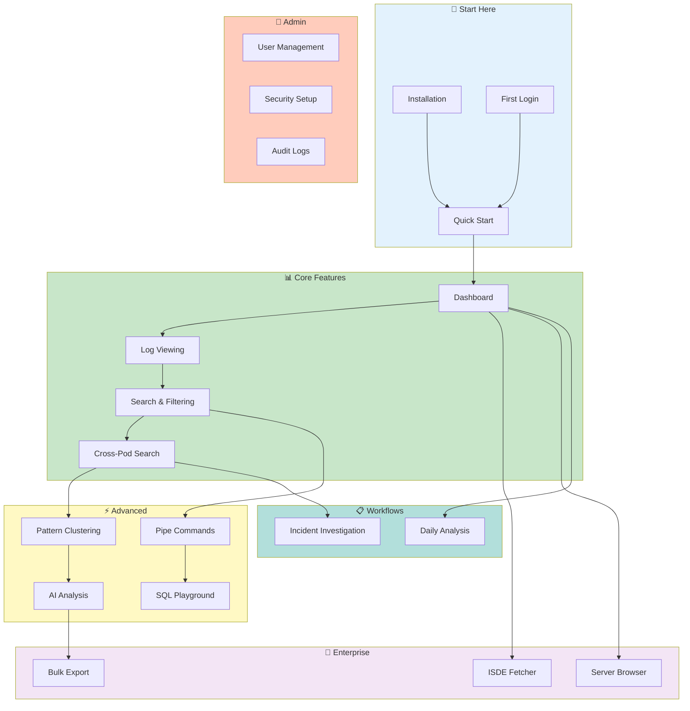

# 🚀 VKInsight User Guide

Complete documentation for VKInsight - the Kubernetes Pod Log Analyzer.


---

## 💡 Why VKInsight?

**Kubernetes debugging is painful.** You're drowning in logs from 50+ pods across multiple namespaces. Finding that critical error means hours of `kubectl logs | grep` across terminals. And when the P1 hits at 2am, you need answers in minutes—not hours.

**VKInsight gives you a single pane of glass for all your pod logs:**

| Challenge | VKInsight Solution |
|-----------|-------------------|
| Searching 50+ pods manually | **Cross-Pod Search** - Query all pods in one click (6-8x faster) |
| "Which pod had that error?" | **Pattern Clustering** - ML auto-groups similar errors |
| Slow `grep` on large files | **DuckDB + ripgrep** - 20-35x faster time filtering |
| Tracing requests across services | **Trace Visualization** - Sequence diagrams from trace IDs |
| Repetitive log noise | **Smart Squash** - Collapse 100 identical lines into one |
| Need SQL on logs | **DuckDB SQL Playground** - Query logs with familiar SQL |
| Manual root cause analysis | **AI Analysis (OCA)** - Intelligent root cause detection |
| SSH into servers for logs | **Server Browser** - Browse remote servers from your browser |
| Fetching debug data manually | **ISDE Fetcher** - One-click debug data retrieval |
| Personal or team deployment | **Flexible Deployment** - Single-user (Windows/Mac) or multi-user (Linux) |

### Who Benefits

| Role | Key Value |
|------|-----------|
| **SRE / On-Call** | Resolve P1s faster with AI-powered root cause analysis |
| **DevOps Engineer** | Debug deployments without SSH terminal juggling |
| **Support Engineer** | Analyze customer issues 50% faster |
| **Platform Team** | Monitor cluster health with pattern trending |

### vs. Alternatives

| Capability | kubectl + grep | ELK/Splunk | **VKInsight** |
|------------|:---:|:---:|:---:|
| Setup time | 0 min | 2-3 weeks | **5 min** |
| Cross-pod search | Manual (50 terminals) | Yes | **One click** |
| AI root cause | None | Plugins | **Built-in (OCA)** |
| Pattern clustering | Manual | Config needed | **Automatic (ML)** |
| Infrastructure | None | 3+ servers | **None** |
| Cost | Free | $$$$$ | **Free** |

### Time to Value

| Metric | Value |
|--------|-------|
| **Setup** | 5 minutes (pip install or Docker) |
| **First Analysis** | 10 minutes |
| **Time to Master** | 4-6 hours |
| **Incident Time Saved** | 6x faster than manual |

---

## 📑 Table of Contents

- [Why VKInsight?](#-why-vkinsight)
- [Quick Start](#-quick-start)
- [Start Based on Your Role](#-start-based-on-your-role)
- [Key Features](#-key-features)
- [Documentation Map](#-documentation-map)
- [Documentation](#-documentation)
- [Learning Path](#-learning-path)
- [Getting Help](#-getting-help)
- [Quick Reference](#-quick-reference)

---

## 🚀 Quick Start

| I want to... | Go to... |
|--------------|----------|
| **Get started quickly** | [Quick Start Guide](getting-started/quick-start.md) |
| **Install VKInsight** | [Installation Guide](getting-started/installation.md) |
| **Learn core features** | [Core Features](core-features/) |
| **Use advanced features** | [Advanced Features](advanced/) |
| **Find keyboard shortcuts** | [Keyboard Shortcuts](reference/keyboard-shortcuts.md) |
| **Troubleshoot issues** | [Common Issues](troubleshooting/common-issues.md) |

---

## 🎯 Start Based on Your Role

| Role | Start Here | Time |
|------|-----------|------|
| **SRE / On-Call** | [Incident Investigation](workflows/incident-investigation.md) | 15 min |
| **Platform Engineer** | [Quick Start](getting-started/quick-start.md) → [Admin Setup](admin/dashboard.md) | 30 min |
| **DevOps** | [Installation](getting-started/installation.md) → [Configuration](reference/configuration.md) | 45 min |
| **Data Analyst** | [SQL Playground](advanced/sql-playground.md) + [Pipe Commands](advanced/pipe-commands.md) | 20 min |
| **New User** | [Quick Start](getting-started/quick-start.md) → [Log Viewing](core-features/log-viewing.md) | 15 min |

> **First time?** Start with the [Quick Start Guide](getting-started/quick-start.md) - you'll be analyzing logs in 10 minutes.

---

## ⚡ Key Features

### **Core Analysis**
| Feature | Description | Guide |
|---------|-------------|-------|
| 🔍 **Cross-Pod Search** | Search all pods simultaneously with DuckDB speed | [Guide](core-features/cross-pod-search.md) |
| 📊 **Pattern Clustering** | Auto-group similar log messages using Drain3 | [Guide](advanced/pattern-clustering.md) |
| 🎯 **Single Pod View** | Deep dive into individual pod logs | [Guide](core-features/single-pod-view.md) |
| 🔄 **Smart Squash** | Collapse repetitive lines with time tracking | [Guide](core-features/smart-squash.md) |

### **Advanced Capabilities**
| Feature | Description | Guide |
|---------|-------------|-------|
| 🤖 **AI Analysis** | Intelligent root cause detection with OCA | [Guide](advanced/ai-analysis.md) |
| 🔧 **Pipe Commands** | Unix-style processing (grep, awk, jq, stats) | [Guide](advanced/pipe-commands.md) |
| 📈 **SQL Playground** | Query logs with DuckDB SQL | [Guide](advanced/sql-playground.md) |
| 🌐 **Trace Visualization** | Service-to-service request flow diagrams | [Guide](advanced/trace-visualization.md) |

### **Enterprise Features**
| Feature | Description | Guide |
|---------|-------------|-------|
| 🖥️ **Server Browser** | Remote server file browsing via SSH/SFTP | [Guide](enterprise/server-browser.md) |
| 📥 **ISDE Fetcher** | Fetch debug data directly from ISDE servers | [Guide](enterprise/isde-fetcher.md) |
| ⭐ **Bookmarks** | Save important findings with pod context | [Guide](core-features/bookmarks.md) |

---

## 🗺️ Documentation Map



<details>
<summary>📱 Text version (for mobile/accessibility)</summary>

**Learning Path:**
1. **Start Here** → Quick Start, Installation, First Login
2. **Core Features** → Dashboard, Log Viewing, Search, Cross-Pod Search
3. **Advanced** → Pattern Clustering, AI Analysis, Pipe Commands, SQL
4. **Enterprise** → ISDE Fetcher, Server Browser, Bulk Export
5. **Admin** → User Management, Security Setup, Audit Logs
6. **Workflows** → Incident Investigation, Daily Analysis

</details>

---

## 📚 Documentation

### 🚀 Getting Started (5 guides)
New to VKInsight? Start here:
- [Quick Start](getting-started/quick-start.md) - Get analyzing in 15 minutes
- [Installation](getting-started/installation.md) - System requirements and setup
- [First Login](getting-started/first-login.md) - Authentication and initial configuration
- [Loading Data](getting-started/loading-data.md) - Import logs from various sources
- [Profile Setup](getting-started/profile.md) - Configure your preferences

### 📊 Core Features (12 guides)
Essential log analysis capabilities:
- [Dashboard](core-features/dashboard.md) - Overview metrics and KPIs
- [Pod Analytics](core-features/pod-analytics.md) - Application and Istio log analysis
- [Log Viewing](core-features/log-viewing.md) - Browse and inspect logs
- [Search & Filtering](core-features/search-filtering.md) - Find what you need
- [Cross-Pod Search](core-features/cross-pod-search.md) - Search across all pods
- [Single Pod View](core-features/single-pod-view.md) - Focused pod analysis
- [Time Navigation](core-features/time-navigation.md) - Filter by time range
- [Smart Squash](core-features/smart-squash.md) - Collapse repetitive lines
- [Bookmarks](core-features/bookmarks.md) - Save important findings
- [Pod Overlap](core-features/pod-overlap.md) - Time coverage analysis
- [Log Availability](core-features/log-availability.md) - Data completeness
- [Multi-Container](core-features/multi-container.md) - Envoy sidecar support

### ⚡ Advanced Features (7 guides)
Power user capabilities:
- [Pattern Clustering](advanced/pattern-clustering.md) - Auto-group similar logs
- [AI Analysis](advanced/ai-analysis.md) - Intelligent log insights
- [Pipe Commands](advanced/pipe-commands.md) - Unix-style processing
- [JSON Workbench](advanced/json-workbench.md) - JSON viewing and diff
- [SQL Playground](advanced/sql-playground.md) - Query with DuckDB
- [Network Graph](advanced/network-graph.md) - Visualize service connections
- [Trace Visualization](advanced/trace-visualization.md) - Request flow diagrams

### 🏢 Enterprise Features (5 guides)
Production deployment capabilities:
- [ISDE Fetcher](enterprise/isde-fetcher.md) - Fetch Oracle debug data
- [Server Browser](enterprise/server-browser.md) - Remote file access
- [Resource Inspector](enterprise/resource-inspector.md) - Kubernetes resource analysis
- [Bulk Export](enterprise/bulk-export.md) - Export filtered logs
- [Bulk Export Viewer](enterprise/bulk-export-viewer.md) - View export configurations

### 📋 Workflows (2 guides)
Step-by-step guides for common tasks:
- [Incident Investigation](workflows/incident-investigation.md) - P1 response playbook
- [Daily Analysis](workflows/daily-analysis.md) - SRE morning routine

### 🔐 Administration (4 guides)
For system administrators:
- [Admin Dashboard](admin/dashboard.md) - System health overview
- [User Management](admin/user-management.md) - Manage users and roles
- [Security Setup](admin/security-setup.md) - 2FA and backup codes
- [Audit Logs](admin/audit-logs.md) - Track user activities

### 📖 Reference (7 guides)
Quick lookup:
- [Feature Selection Guide](reference/feature-selection-guide.md) - Which tool to use
- [Keyboard Shortcuts](reference/keyboard-shortcuts.md) - Speed up your workflow
- [Pipe Commands Reference](reference/pipe-command-ref.md) - grep, awk, jq syntax
- [Configuration](reference/configuration.md) - App settings
- [Quick Filters](reference/quick-filters.md) - Pre-configured patterns
- [Error Messages](reference/error-messages.md) - Troubleshoot errors
- [Service Mapping](reference/service-mapping.md) - Pod-to-service mapping

### 🗓️ Roadmap (1 guide)
Planned enhancements:
- [Bookmarks Roadmap](roadmap/bookmarks-roadmap.md) - Bookmark feature enhancements

### 🔧 Troubleshooting (2 guides)
Problem solving:
- [Common Issues](troubleshooting/common-issues.md) - Frequent problems and solutions
- [Performance](troubleshooting/performance.md) - Optimization tips

---

## 🗺️ Learning Path

```
┌─────────────────────────────────────────────────────────────────┐
│  🚀 START HERE                                                  │
│  ┌─────────────┐  ┌─────────────┐  ┌─────────────┐             │
│  │ Quick Start │→ │ First Login │→ │ Loading Data│             │
│  └─────────────┘  └─────────────┘  └─────────────┘             │
└─────────────────────────────────────────────────────────────────┘
                              ↓
┌─────────────────────────────────────────────────────────────────┐
│  📊 CORE FEATURES                                               │
│  ┌───────────┐  ┌─────────────┐  ┌──────────────┐              │
│  │ Dashboard │→ │ Log Viewing │→ │ Search/Filter│              │
│  └───────────┘  └─────────────┘  └──────────────┘              │
│                                          ↓                      │
│  ┌───────────────┐  ┌─────────────┐  ┌───────────┐             │
│  │Cross-Pod Search│→ │ Smart Squash│→ │ Bookmarks │             │
│  └───────────────┘  └─────────────┘  └───────────┘             │
└─────────────────────────────────────────────────────────────────┘
                              ↓
┌─────────────────────────────────────────────────────────────────┐
│  ⚡ ADVANCED                                                    │
│  ┌──────────────┐  ┌─────────────┐  ┌───────────────┐          │
│  │ AI Analysis  │  │Pipe Commands│  │ SQL Playground│          │
│  └──────────────┘  └─────────────┘  └───────────────┘          │
│  ┌───────────────────┐  ┌──────────────────┐                   │
│  │ Pattern Clustering│  │ Trace Visualization│                  │
│  └───────────────────┘  └──────────────────┘                   │
└─────────────────────────────────────────────────────────────────┘
                              ↓
┌─────────────────────────────────────────────────────────────────┐
│  🏢 ENTERPRISE                                                  │
│  ┌──────────────┐  ┌───────────────┐  ┌─────────────┐          │
│  │ ISDE Fetcher │  │ Server Browser│  │ Bulk Export │          │
│  └──────────────┘  └───────────────┘  └─────────────┘          │
└─────────────────────────────────────────────────────────────────┘
```

---

## 📊 Documentation Statistics

| Section | Guides | Description |
|---------|--------|-------------|
| Getting Started | 5 | Installation and setup |
| Core Features | 12 | Essential capabilities |
| Advanced | 7 | Power user features |
| Enterprise | 5 | Production deployment |
| Workflows | 2 | Step-by-step guides |
| Administration | 4 | System management |
| Reference | 7 | Quick lookup |
| Roadmap | 1 | Planned features |
| Troubleshooting | 2 | Problem solving |
| **Total** | **45+** | Complete user guide |

---

## 🆘 Getting Help

| Need | Where to Go |
|------|-------------|
| **Quick answers** | [FAQ](../FAQ.md) |
| **Common problems** | [Troubleshooting](troubleshooting/common-issues.md) |
| **Performance issues** | [Performance Guide](troubleshooting/performance.md) |
| **Term definitions** | [Glossary](../GLOSSARY.md) |
| **Feature request** | [GitHub Issues](https://github.com/vgitk/VKInsight-Documentation/issues) |
| **Documentation feedback** | vivek.f.kumar@oracle.com |

---

## ⌨️ Quick Reference

### Essential Keyboard Shortcuts

| Shortcut | Action |
|----------|--------|
| `Ctrl+F` | Focus search input |
| `Ctrl+R` | Reload data |
| `Ctrl+Scroll` | Zoom log viewer |
| `Right-click` | Context menu |

### Common Pipe Commands

```bash
# Search for errors
| grep ERROR

# Count unique IPs
| grep "sourceIP" | cut -d: -f2 | sort | uniq -c

# Statistical summary
| stats

# Distribution histogram
| histogram
```

> **Full reference:** [Keyboard Shortcuts](reference/keyboard-shortcuts.md) | [Pipe Commands](reference/pipe-command-ref.md)

---

## 📋 Documentation Info

| Attribute | Value |
|-----------|-------|
| **Version** | 2.7.0 |
| **Total Pages** | 45+ |
| **Last Updated** | 2026-02-23 |
| **Compatibility** | Python 3.11+, Streamlit 1.51+ |

---

*Last Updated: 2026-02-23*
