# Audit Logs


> **Track user activities and security events - compliance, investigation, and tamper detection**

**Admin Only Feature**

---

## Overview

Audit Logs provide:
- Complete activity tracking
- Security event logging
- Tamper detection
- Compliance support

---

## Audit Log Flow

```mermaid
flowchart LR
    subgraph Events["📋 Events"]
        A[Login/Logout]
        B[Data Access]
        C[Admin Actions]
    end

    subgraph Log["📝 Log"]
        D[Capture]
        E[Hash/Chain]
    end

    subgraph Use["🔍 Use"]
        F[Search/Filter]
        G[Export]
        H[Verify Integrity]
    end

    A --> D
    B --> D
    C --> D
    D --> E --> F
    E --> G
    E --> H

    style Events fill:#e3f2fd
    style Log fill:#fff9c4
    style Use fill:#c8e6c9
```



---

## Accessing Audit Logs

1. Login as administrator
2. Go to **Admin** section
3. Click **Audit Logs**

---

## Log Contents

### Event Types

| Category | Events |
|----------|--------|
| Authentication | Login, logout, failures |
| User Management | Create, modify, delete |
| Security | 2FA, password changes |
| Data Access | Loads, exports, searches |
| Admin Actions | Config changes, system |

### Event Fields

| Field | Description |
|-------|-------------|
| Timestamp | Event time (UTC) |
| User | Acting user |
| Action | Event type |
| Target | Affected resource |
| Details | Additional info |
| IP Address | Client IP |
| Session | Session ID |

---

## Viewing Logs

### Log Table

Columns displayed:
- Time
- User
- Action
- Target
- Status
- IP

### Expand Details

Click row to see:
- Full event details
- Request parameters
- Response data
- Context info

---

## Filtering

### By Time

| Filter | Description |
|--------|-------------|
| Last hour | Recent events |
| Last 24 hours | Today |
| Last 7 days | This week |
| Custom range | Specific period |

### By User

1. Enter username
2. Or select from list
3. View user's activity

### By Action

| Category | Filter |
|----------|--------|
| Auth | Login, logout |
| Data | Load, export |
| Admin | User changes |
| Security | 2FA, password |

### By Status

- ✅ Success
- ❌ Failure
- ⚠️ Warning

---

## Search

### Full-Text Search

Search across:
- Action descriptions
- Target names
- Details content
- IP addresses

### Advanced Search

Combine filters:
```
user:admin AND action:login AND status:failed
```

---

## Security Events

### Authentication Events

| Event | Description |
|-------|-------------|
| LOGIN_SUCCESS | Successful login |
| LOGIN_FAILED | Failed attempt |
| LOGOUT | User logout |
| SESSION_EXPIRED | Timeout |
| MFA_CHALLENGE | 2FA prompted |
| MFA_SUCCESS | 2FA passed |
| MFA_FAILED | 2FA failed |

### Account Events

| Event | Description |
|-------|-------------|
| PASSWORD_CHANGE | Password updated |
| PASSWORD_RESET | Admin reset |
| ACCOUNT_LOCKED | Auto-lockout |
| ACCOUNT_UNLOCKED | Admin unlock |
| MFA_ENABLED | 2FA enabled |
| MFA_DISABLED | 2FA disabled |

### Admin Events

| Event | Description |
|-------|-------------|
| USER_CREATED | New account |
| USER_MODIFIED | Account changed |
| USER_DELETED | Account removed |
| ROLE_CHANGED | Role updated |
| CONFIG_CHANGED | Settings modified |

---

## Tamper Detection

### Integrity Verification

Each log entry has:
- Hash of content
- Chain linking
- Verification status

### Verification

1. Click **Verify Integrity**
2. System checks all entries
3. Results displayed

### Status

| Status | Meaning |
|--------|---------|
| ✅ Verified | Integrity intact |
| ⚠️ Warning | Check needed |
| ❌ Tampered | Modification detected |

---

## Export

### Export Options

| Format | Description |
|--------|-------------|
| CSV | Spreadsheet format |
| JSON | Structured data |
| PDF | Formatted report |

### Export Filters

Export respects current filters:
- Time range
- User filter
- Action filter

### Scheduled Export

Configure automatic exports:
- Daily/weekly
- Secure storage
- Email delivery

---

## Retention

### Retention Policy

| Setting | Options |
|---------|---------|
| Retention Period | 30-365 days |
| Archive Before Delete | Yes/No |
| Minimum Required | 90 days |

### Archive

Old logs archived:
- Compressed storage
- Searchable archive
- Restore capability

---

## Compliance

### GDPR Support

- User data access logs
- Export for requests
- Deletion tracking

### SOC 2 Support

- Authentication logging
- Change tracking
- Access controls

### Audit Reports

Generate reports for:
- Compliance audits
- Security reviews
- Incident investigation

---

## Real-Time Monitoring

### Live View

1. Enable **Live** toggle
2. New events appear instantly
3. Auto-scroll to latest

### Alerts

Configure alerts for:
- Failed logins
- Admin actions
- Security events

---

## Use Cases

### Security Investigation

1. Filter to time period
2. Search for user/IP
3. Review actions
4. Export findings

### Compliance Audit

1. Set time range
2. Export all logs
3. Generate report
4. Verify integrity

### User Activity Review

1. Filter to user
2. Review actions
3. Check for anomalies
4. Document findings

---

## Troubleshooting

### Problem: Logs missing

- Check retention policy
- Verify logging enabled
- Check storage space

### Problem: Integrity warning

- Run verification
- Check for tampering
- Review access logs

### Problem: Search slow

- Narrow time range
- Use specific filters
- Consider archiving old

---

## Related

- [Security Setup](security-setup.md) - Security config
- [User Management](user-management.md) - User admin
- [Admin Dashboard](dashboard.md) - Overview

---

*Audit Logs requires administrator role. Logs are tamper-protected.*

---

*Last Updated: 2026-02-20*
