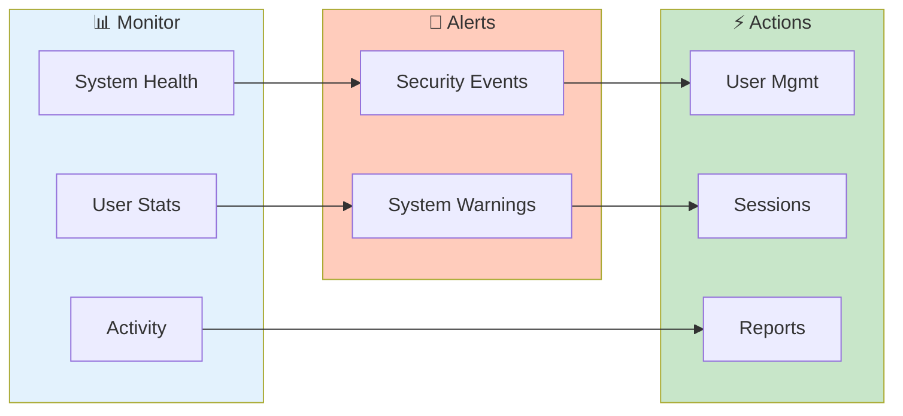

# Admin Dashboard

> **System overview and administrative controls - health, users, sessions, and alerts**

**Admin Only Feature**

---

## Overview

Admin Dashboard provides:
- System health monitoring
- User statistics
- Activity metrics
- Quick admin actions

---

## Admin Dashboard Overview

---

## Accessing Admin Dashboard

1. Login as administrator
2. Go to **Admin** section in sidebar
3. Click **Admin Dashboard**

---

## Dashboard Sections

### System Health

| Metric | Description |
|--------|-------------|
| Status | System operational status |
| Uptime | Time since last restart |
| Memory | Memory usage |
| Sessions | Active user sessions |

### User Statistics

| Metric | Description |
|--------|-------------|
| Total Users | All user accounts |
| Active Today | Logged in today |
| Active Week | Logged in this week |
| Locked | Currently locked accounts |

### Security Status

| Metric | Description |
|--------|-------------|
| 2FA Enabled | Users with 2FA |
| Failed Logins | Recent failures |
| Locked Accounts | Security locks |

---

## Activity Charts

### Login Activity

Graph showing:
- Logins over time
- Success vs failure
- By time of day

### Feature Usage

Chart showing:
- Most used features
- User engagement
- Session duration

### Error Trends

| Period | Errors |
|--------|--------|
| Last hour | 5 |
| Last day | 42 |
| Last week | 156 |

---

## Quick Actions

### User Management

| Action | Description |
|--------|-------------|
| Add User | Create new user |
| View All | Open user list |
| Unlock All | Unlock all locked |

### System

| Action | Description |
|--------|-------------|
| Clear Cache | Reset system cache |
| Export Logs | Download system logs |
| Restart | Restart application |

### Security

| Action | Description |
|--------|-------------|
| View Audit | Open audit logs |
| Security Report | Generate report |

---

## Alerts

### Active Alerts

| Alert Type | Example |
|------------|---------|
| 🔴 Critical | Multiple failed logins |
| 🟡 Warning | High memory usage |
| 🔵 Info | Maintenance scheduled |

### Alert Configuration

1. Click **Configure Alerts**
2. Set thresholds
3. Enable/disable alerts
4. Configure notifications

---

## Session Management

### Active Sessions

| Column | Description |
|--------|-------------|
| User | Username |
| Started | Session start |
| Last Active | Last activity |
| IP | Client IP address |
| Actions | Terminate option |

### Terminate Sessions

1. Select session(s)
2. Click **Terminate**
3. Users logged out

### Global Session Clear

1. Click **End All Sessions**
2. Confirm action
3. All users logged out

---

## Configuration

### System Settings

Access key settings:
- Authentication config
- Session timeouts
- Feature toggles

### Security Settings

Configure:
- Password policies
- 2FA requirements
- Lockout policies

### Links to Config

- [Configuration Reference](../reference/configuration.md)
- Environment variables
- Config files

---

## Reports

### Generate Reports

| Report | Content |
|--------|---------|
| User Activity | Login history, actions |
| Security | Failed logins, 2FA status |
| Usage | Feature usage, sessions |
| Audit | Complete audit trail |

### Export Options

- PDF (formatted report)
- CSV (raw data)
- JSON (structured)

---

## Maintenance

### Scheduled Tasks

| Task | Schedule |
|------|----------|
| Session Cleanup | Hourly |
| Log Rotation | Daily |
| Cache Clear | Weekly |

### Manual Maintenance

| Action | Description |
|--------|-------------|
| Clear Cache | Reset all caches |
| Compact DB | Optimize storage |
| Prune Logs | Remove old logs |

---

## Monitoring

### System Metrics

| Metric | Current |
|--------|---------|
| CPU | 45% |
| Memory | 2.1 GB |
| Disk | 68% |
| Network | Normal |

### Performance

| Metric | Value |
|--------|-------|
| Avg Response | 245ms |
| Active Queries | 3 |
| Cache Hit Rate | 94% |

---

## Notifications

### Admin Alerts

Receive alerts for:
- Failed login attempts
- Account lockouts
- System errors
- Security events

### Configure Notifications

1. Click **Notifications**
2. Enable/disable types
3. Set delivery method

---

## Related

- [User Management](user-management.md) - Manage users
- [Security Setup](security-setup.md) - Security config
- [Audit Logs](audit-logs.md) - Activity logs

---

*Admin Dashboard requires administrator role.*

---

*Last Updated: 2026-02-20*
