# Security Setup

> **Configure authentication and security features - 2FA, passwords, sessions, and encryption**

**Admin Only Feature**

---

## Overview

Security Setup covers:
- Two-factor authentication
- Backup codes
- Password policies
- Session security
- Credential storage

---

## Security Configuration Flow

```mermaid
flowchart LR
    subgraph Auth["🔐 Auth"]
        A[2FA Setup]
        B[Password Policy]
    end

    subgraph Session["⏱️ Session"]
        C[Timeouts]
        D[Lockout]
    end

    subgraph Storage["🔒 Storage"]
        E[Encryption]
        F[Credentials]
    end

    A --> C
    B --> D
    C --> E
    D --> F

    style Auth fill:#e3f2fd
    style Session fill:#fff9c4
    style Storage fill:#c8e6c9
```

---

## Two-Factor Authentication

### System-Wide 2FA

#### Enable for All Users

1. Go to **Security Settings**
2. Enable **Require 2FA**
3. Set grace period
4. Users prompted on login

#### Grace Period

Allow time for setup:
- 7 days (default)
- 14 days
- Immediate

### Per-User 2FA

#### Check Status

In User Management:
- ✅ 2FA enabled
- ❌ 2FA disabled
- ⏳ Setup pending

#### Force Enable

1. Select user
2. Click **Require 2FA**
3. User must setup

#### Reset 2FA

If user loses authenticator:
1. Select user
2. Click **Reset 2FA**
3. User re-enrolls

---

## Backup Codes

### Code Generation

When 2FA enabled:
- 10 backup codes generated
- Each code single-use
- Store securely

### Regenerate Codes

1. User: Profile → Security → Regenerate
2. Admin: User Management → Reset Codes

### Code Usage Tracking

| Event | Logged |
|-------|--------|
| Code generated | ✓ |
| Code used | ✓ |
| Codes regenerated | ✓ |

---

## Password Policies

### Configure Requirements

| Setting | Options |
|---------|---------|
| Minimum Length | 8-32 characters |
| Require Uppercase | Yes/No |
| Require Numbers | Yes/No |
| Require Symbols | Yes/No |
| History Depth | 0-24 passwords |

### Password Expiry

| Setting | Options |
|---------|---------|
| Expiry Period | 30-365 days |
| Warning Before | 7-30 days |
| Grace Period | 0-14 days |

### Complexity Scoring

Enable scoring:
- Weak: Below minimum
- Fair: Meets minimum
- Strong: Exceeds requirements
- Excellent: Maximum security

---

## Session Security

### Session Timeout

| Setting | Description |
|---------|-------------|
| Idle Timeout | Auto-logout after inactivity |
| Max Duration | Maximum session length |
| Remember Me | Extended session option |

### Session Options

| Setting | Default |
|---------|---------|
| Idle Timeout | 30 minutes |
| Max Duration | 24 hours |
| Remember Me | 7 days |

### Session Invalidation

Sessions invalidated on:
- Password change
- Admin termination
- Security lockout
- Timeout reached

---

## Lockout Policy

### Failed Login Lockout

| Setting | Default |
|---------|---------|
| Max Attempts | 5 |
| Lockout Duration | 15 minutes |
| Progressive | Yes (doubles) |

### Unlock Options

1. **Wait**: Automatic after duration
2. **Admin Unlock**: Immediate
3. **Self-Service**: Via security questions

---

## Credential Storage

### Encryption

| Aspect | Method |
|--------|--------|
| Algorithm | AES-128 (industry standard) |
| Key Derivation | PBKDF2 with strong iteration count |
| Compliance | Meets enterprise security standards |

*For detailed cryptographic specifications, see [Operations Guide](../../operations/security-internals.md).*

### Stored Credentials

| Type | Storage |
|------|---------|
| User Passwords | Hashed only |
| API Keys | Encrypted |
| SSH Credentials | Encrypted, session-only |

### Master Password

Not stored:
- Derived from user password
- Used for encryption
- Never transmitted

---

## Security Questions

### Configure Questions

Default questions available:
- Mother's maiden name
- First pet's name
- City of birth
- First car
- Favorite book

### Custom Questions

1. Go to **Security Settings**
2. Click **Questions**
3. Add custom questions
4. Enable for users

### Recovery Requirements

| Setting | Options |
|---------|---------|
| Questions Required | 3-5 |
| Correct Answers | All/Most |
| Case Sensitive | No (default) |

---

## Audit Settings

### Logged Events

| Event | Default |
|-------|---------|
| Login success | ✓ |
| Login failure | ✓ |
| Password change | ✓ |
| 2FA changes | ✓ |
| Admin actions | ✓ |

### Retention

| Setting | Options |
|---------|---------|
| Retention Period | 30-365 days |
| Archive Old Logs | Yes/No |
| Tamper Detection | Enabled |

See [Audit Logs](audit-logs.md) for details.

---

## API Security

### API Key Management

| Setting | Description |
|---------|-------------|
| Key Format | UUID + secret |
| Key Expiry | Configurable |
| Rate Limiting | Requests per minute |

### Rate Limits

| Endpoint | Limit |
|----------|-------|
| Login | 10/min |
| Password Reset | 5/min |
| API Calls | 100/min |

---

## Security Checklist

### Initial Setup

- [ ] Configure password policy
- [ ] Enable 2FA requirement
- [ ] Set session timeouts
- [ ] Configure lockout policy
- [ ] Review audit settings

### Ongoing

- [ ] Review audit logs weekly
- [ ] Check for locked accounts
- [ ] Update security questions
- [ ] Rotate admin passwords
- [ ] Test recovery procedures

---

## Troubleshooting

### Problem: Users can't enable 2FA

- Check authenticator app compatibility
- Verify time sync on devices
- Try manual code entry

### Problem: Lockouts too frequent

- Increase max attempts
- Extend lockout duration
- Check for brute force

### Problem: Recovery not working

- Verify security questions set
- Check answer matching
- Review rate limits

---

## Related

- [User Management](user-management.md) - User accounts
- [Audit Logs](audit-logs.md) - Security logging
- [Admin Dashboard](dashboard.md) - Overview

---

*Security configuration requires administrator role.*

---

*Last Updated: 2026-02-20*
