# User Management


> **Manage users, roles, and permissions - create accounts, assign roles, reset passwords**

**Admin Only Feature**

---

## Overview

User Management allows administrators to:
- Create user accounts
- Assign roles
- Reset passwords
- Manage 2FA
- Monitor activity

---

## User Management Flow

```mermaid
flowchart LR
    subgraph Create["➕ Create"]
        A[Add User]
        B[Set Role]
        C[Temp Password]
    end

    subgraph Manage["⚙️ Manage"]
        D[Edit Details]
        E[Reset Password]
        F[2FA Settings]
    end

    subgraph Monitor["👁️ Monitor"]
        G[Activity]
        H[Sessions]
        I[Audit]
    end

    A --> B --> C
    C --> D
    D --> E
    E --> F
    F --> G --> H --> I

    style Create fill:#e3f2fd
    style Manage fill:#fff9c4
    style Monitor fill:#c8e6c9
```



---

## Accessing User Management

1. Login as administrator
2. Go to **Admin** section in sidebar
3. Click **User Management**

---

## User List

### User Table

| Column | Description |
|--------|-------------|
| Username | Login identifier |
| Email | Contact email |
| Role | User role |
| Status | Active/Locked/Disabled |
| Created | Account creation |
| Last Login | Most recent login |
| 2FA | 2FA enabled status |

### Sorting & Filtering

- Click headers to sort
- Search by username/email
- Filter by role/status

---

## Creating Users

### Add New User

1. Click **Add User**
2. Fill in details:

| Field | Required | Description |
|-------|----------|-------------|
| Username | Yes | Unique identifier |
| Email | Yes | Contact email |
| Role | Yes | User role |
| Temp Password | Yes | Initial password |

3. Click **Create**

### Initial Setup

New user receives:
- Temporary password
- Must change on first login
- Optional: Setup 2FA prompt

---

## User Roles

### Available Roles

| Role | Permissions |
|------|-------------|
| Admin | Full access, user management |
| User | Standard features |
| Viewer | Read-only access |

### Role Details

**Admin:**
- All user capabilities
- User management
- System configuration
- Audit log access

**User:**
- Log viewing and search
- Export data
- Bookmarks and settings
- AI analysis

**Viewer:**
- Read-only log viewing
- No export
- No configuration

---

## Editing Users

### Modify User

1. Click user row
2. Edit details in panel
3. Click **Save**

### Editable Fields

- Email address
- Role
- Status
- Password (reset)

### Non-Editable

- Username (after creation)
- Created date
- Activity history

---

## Password Management

### Reset Password

1. Select user
2. Click **Reset Password**
3. Enter new temporary password
4. User must change on next login

### Force Password Change

1. Select user
2. Check **Force Change**
3. User prompted on next login

### Password Policy

Configure in settings:
- Minimum length
- Complexity requirements
- Expiry period
- History (no reuse)

---

## Two-Factor Authentication

### View 2FA Status

| Status | Meaning |
|--------|---------|
| ✅ Enabled | 2FA active |
| ❌ Disabled | No 2FA |
| 🔄 Pending | Setup in progress |

### Reset 2FA

If user loses access:
1. Select user
2. Click **Reset 2FA**
3. User re-enrolls on next login

### Require 2FA

1. Select user(s)
2. Click **Require 2FA**
3. Users must setup 2FA

---

## Account Status

### Status Options

| Status | Description |
|--------|-------------|
| Active | Normal access |
| Locked | Temporary lock (failed logins) |
| Disabled | Admin disabled |
| Expired | Password expired |

### Lock/Unlock

1. Select user
2. Click **Lock** or **Unlock**
3. Status updated immediately

### Disable Account

1. Select user
2. Click **Disable**
3. User cannot login
4. Re-enable anytime

---

## Bulk Operations

### Select Multiple

1. Check multiple users
2. Or **Select All**
3. Bulk actions available

### Available Actions

- Reset passwords
- Change role
- Enable/disable
- Require 2FA

---

## Activity Monitoring

### User Activity

View per user:
- Login history
- Actions performed
- Sessions active

### Active Sessions

1. Select user
2. View **Sessions** tab
3. See active sessions
4. Terminate if needed

### Session Termination

1. Select session
2. Click **Terminate**
3. User logged out

---

## Import/Export

### Export Users

1. Click **Export**
2. Choose format (CSV)
3. Download user list

### Import Users

1. Click **Import**
2. Upload CSV file
3. Review and confirm
4. Users created

### CSV Format

```csv
username,email,role
user1,user1@example.com,user
user2,user2@example.com,viewer
```

---

## Audit Trail

### User Changes

All changes logged:
- Who made change
- What changed
- When changed
- Previous value

### View History

1. Select user
2. Click **History**
3. View change log

---

## Best Practices

### Account Creation

- Use email addresses for username
- Assign minimum required role
- Enable 2FA requirement

### Maintenance

- Review accounts regularly
- Remove inactive users
- Audit role assignments

### Security

- Regular password rotation
- Monitor failed logins
- Review audit logs

---

## Related

- [Security Setup](security-setup.md) - 2FA, backup codes
- [Audit Logs](audit-logs.md) - Activity tracking
- [Admin Dashboard](dashboard.md) - System overview

---

*User Management requires administrator role.*

---

*Last Updated: 2026-02-20*
