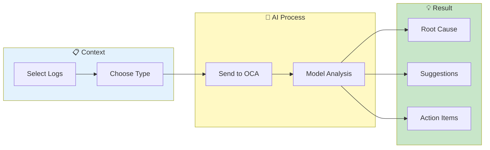

# AI-Powered Analysis


> **Get intelligent insights using Oracle Code Assist (OCA) - root cause analysis, incident response, and pattern explanation**

---

## Overview

AI Analysis provides:
- Root cause identification
- Error summarization
- Pattern explanation
- Troubleshooting suggestions

Powered by Oracle Code Assist (OCA) with multiple models.

---

## AI Analysis Flow



---

## Setup

### Configure API Key

**Option 1: Profile Settings**
1. Go to **Profile** → **AI Settings**
2. Enter your OCA API key
3. Click **Save**

**Option 2: Environment Variable**
```bash
export OCA_API_KEY="your-oca-api-key"
```

### Key Storage

- Encrypted with industry-standard encryption (AES-based)
- Stored in session only
- Never logged or transmitted plaintext

*See [Security Setup](../admin/security-setup.md) for encryption details.*

---

## Available Models

| Model | Best For |
|-------|----------|
| `oca/llama4` | General purpose |
| `oca/grok3` | Advanced reasoning |
| `oca/grok4-fast-reasoning` | Quick analysis |
| `oca/grok-code-fast-1` | Code analysis |

Select model in AI Settings or per-request.

---

## Analysis Types

### Root Cause Analysis

Deep investigation of errors:
- Identifies underlying cause
- Traces error chain
- Suggests fixes

**Best for:** Complex failures, cascading errors

### Incident Response

Quick SRE triage:
- Severity assessment (P0-P3)
- Impact summary
- Immediate actions
- Escalation guidance

**Best for:** On-call response, initial assessment

### Error Summary

Aggregated error overview:
- Error categories
- Counts per type
- Affected services
- Time patterns

**Best for:** Shift handoff, status reports

### Trace Analysis

Request flow investigation:
- Service path
- Timing breakdown
- Failure points
- Dependencies

**Best for:** Distributed debugging

### Performance Analysis

Bottleneck identification:
- Slow operations
- Resource constraints
- Optimization suggestions

**Best for:** Latency investigation

### Custom Analysis

User-defined prompt:
- Flexible queries
- Specific questions
- Domain knowledge

**Best for:** Specialized analysis

---

## Using AI Analysis

### Select Context

1. **From Log Viewer:**
   - Select log lines
   - Right-click → "AI Analyze"

2. **From Pattern Clustering:**
   - Select pattern cluster
   - Click "Analyze Pattern"

3. **Manual Selection:**
   - Go to AI Analyst tab
   - Paste or select logs
   - Click "Analyze"

### Choose Analysis Type

1. Select from dropdown
2. Or use "Custom" with your prompt

### View Results

- Formatted response
- Sections by topic
- Code examples (if applicable)
- Action items highlighted

---

## Context Management

### Context Limits

| Limit | Value |
|-------|-------|
| Max lines | 500 |
| Max characters | 800,000 |

### Context Truncation

If context exceeds limits:
- Automatic truncation
- Priority to recent/relevant
- Warning shown

### Reduce Context

1. Apply time filters first
2. Use specific search patterns
3. Select fewer lines

---

## Privacy & Security

### Data Handling

| Aspect | Implementation |
|--------|----------------|
| Transmission | HTTPS only |
| Storage | Not stored by AI |
| Logging | No log content logged |
| Audit | Usage tracked (admin) |

### Sensitive Data

Before sending to AI:
1. Review selected context
2. Check for credentials
3. Remove if present
4. Or use exclude patterns

### Audit Trail

Admins can view:
- AI usage per user
- Analysis types
- Context size
- No log content

---

## Best Practices

### For Better Results

| Practice | Why |
|----------|-----|
| Include error messages | Core context |
| Add timestamps | Timing info |
| Include stack traces | Full context |
| Provide background | Domain context |

### For Faster Results

| Practice | Why |
|----------|-----|
| Smaller context | Less processing |
| Specific questions | Focused response |
| Pre-filter logs | Relevant data only |

---

## Troubleshooting

### Problem: No response

- Check API key valid
- Verify network connectivity
- Check OCA service status
- Reduce context size

### Problem: Generic response

- Provide more context
- Use more specific analysis type
- Add custom prompt details
- Include error messages

### Problem: Rate limited

- Wait and retry
- Reduce request frequency
- Contact admin for limits

---

## Export Results

### Save Analysis

1. View analysis result
2. Click **Export**
3. Choose format (Markdown, PDF)
4. Download

### Share Results

- Copy formatted text
- Export as Markdown
- Include in incident reports

---

## Related

- [Pattern Clustering](pattern-clustering.md) - Find patterns to analyze
- [Search & Filtering](../core-features/search-filtering.md) - Select context
- [Trace Visualization](trace-visualization.md) - Visual analysis

---

*AI Analysis requires valid OCA API key.*

---

*Last Updated: 2026-02-20*
