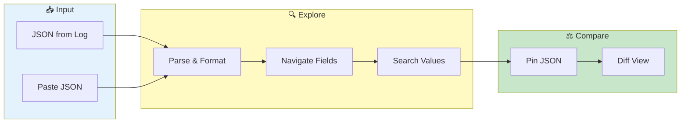

# JSON Workbench


> **Parse, explore, and diff JSON log data - 4-5x faster parsing than standard libraries**

---

## Overview

JSON Workbench provides:
- JSON parsing and formatting
- Field exploration
- Value searching
- JSON diff comparison
- Pinning for comparison

---

## JSON Workbench Flow



---

## Accessing JSON Workbench

### From Log Viewer

1. Click a log line containing JSON
2. Click **"View JSON"** button
3. Or right-click → "View JSON"

### From Search Results

1. Click JSON indicator in results
2. Opens in workbench

### Direct Access

1. Go to **JSON Workbench** tab
2. Paste JSON directly
3. Click **Parse**

---

## JSON Viewer

### Parsed View

Formatted JSON with:
- Syntax highlighting
- Collapsible nodes
- Type indicators
- Path display

### Navigation

| Action | Result |
|--------|--------|
| Click node | Expand/collapse |
| Click key | Show path |
| Click value | Copy value |
| Hover | Show type |

### Path Display

Shows JSONPath to selected node:
```
$.response.data[0].id
```

Click to copy path.

---

## Field Exploration

### Field List

All fields extracted:

| Field | Type | Sample |
|-------|------|--------|
| `status` | string | "success" |
| `code` | number | 200 |
| `data` | array | [...] |

### Field Search

1. Enter field name in search
2. Matching fields highlighted
3. Click to navigate

### Type Filtering

Filter by data type:
- [ ] Strings
- [ ] Numbers
- [ ] Booleans
- [x] Objects
- [x] Arrays

---

## Value Searching

### Search Within JSON

1. Enter search term
2. All matching values highlighted
3. Navigate matches

### Search Examples

| Search | Finds |
|--------|-------|
| `error` | Any value containing "error" |
| `500` | Number 500 or string "500" |
| `true` | Boolean true values |

---

## JSON Diff

### Compare Two JSONs

1. Load first JSON
2. Click **Pin** to save
3. Load second JSON
4. Click **Compare**

### Diff View

Shows differences:
- 🟢 **Added** - New in second
- 🔴 **Removed** - Missing from second
- 🟡 **Changed** - Value differs

### Diff Example

```diff
{
  "status": "success",
- "code": 200,
+ "code": 500,
  "data": {
-   "count": 10,
+   "count": 0,
+   "error": "Internal error"
  }
}
```

---

## Pinning

### Pin JSON

1. Load JSON
2. Click **Pin** button
3. JSON saved for comparison

### Pin Information

| Field | Description |
|-------|-------------|
| Source | Pod/container |
| Line | Line number |
| Timestamp | Log timestamp |
| Content | Parsed JSON |

### Manage Pins

- View all pinned JSONs
- Remove individual pins
- Clear all pins

---

## Export

### Export Options

| Format | Description |
|--------|-------------|
| JSON | Raw JSON |
| Pretty JSON | Formatted |
| CSV | Flattened fields |
| YAML | YAML conversion |

### Export Steps

1. Load JSON
2. Click **Export**
3. Choose format
4. Download

---

## Use Cases

### Inspect Log Payload

1. Find log with JSON
2. Open in workbench
3. Explore nested fields
4. Find relevant data

### Compare Requests

1. Pin successful request JSON
2. Load failed request JSON
3. Compare differences
4. Identify changes

### Extract Fields

1. Load JSON log line
2. Navigate to field
3. Copy value or path
4. Use in search filters

### Validate Structure

1. Load JSON
2. Check for expected fields
3. Verify types
4. Identify missing data

---

## Performance

### Large JSON

For very large JSON objects:
- Initial render may be slow
- Collapse deeply nested nodes
- Use field search

### Memory

Pinned JSONs use memory:
- Clear when done
- Limit concurrent pins

---

## Troubleshooting

### Problem: Parse error

- Check JSON validity
- Look for truncation
- Verify encoding

### Problem: Missing fields

- Expand all nodes
- Use field search
- Check nesting level

### Problem: Diff not showing

- Ensure both JSONs valid
- Check structure similarity
- Clear and re-pin

---

## Related

- [Log Viewing](../core-features/log-viewing.md) - Log inspection
- [Pipe Commands](pipe-commands.md) - `jq` processing
- [Search & Filtering](../core-features/search-filtering.md) - Pattern search

---

*JSON Workbench uses optimized parsing for fast performance (4-5x faster than standard).*

---

*Last Updated: 2026-02-20*
