# Network Graph


> **Visualize service-to-service connections - topology, traffic flow, and connection health**

---

## Overview

Network Graph shows:
- Service topology
- Communication patterns
- Traffic flow
- Connection health

---

## Network Graph Workflow

```mermaid
flowchart LR
    subgraph Data["📥 Data"]
        A[Envoy Logs]
        B[Trace Headers]
    end

    subgraph Build["🔨 Build"]
        C[Parse Connections]
        D[Build Graph]
    end

    subgraph View["📊 View"]
        E[Nodes: Services]
        F[Edges: Traffic]
        G[Colors: Health]
    end

    A --> C
    B --> C
    C --> D --> E
    D --> F
    D --> G

    style Data fill:#e3f2fd
    style Build fill:#fff9c4
    style View fill:#c8e6c9
```



---

## Accessing Network Graph

1. Load log data
2. Go to **Log Inspector** tab
3. Click **Network Graph** tab

---

## Graph Elements

### Nodes

Each node represents:
- **Service**: Detected service name
- **Size**: Relative traffic volume
- **Color**: Health status

### Edges

Connections show:
- **Direction**: Arrow indicates flow
- **Thickness**: Traffic volume
- **Color**: Error rate

### Legend

| Color | Meaning |
|-------|---------|
| 🟢 Green | Healthy |
| 🟡 Yellow | Warnings |
| 🔴 Red | Errors |
| ⚪ Gray | Unknown |

---

## Graph Construction

### Data Sources

Built from:
- Istio/Envoy access logs
- Trace headers
- Request/response patterns

### Detection Method

1. Parse upstream/downstream hosts
2. Identify service names
3. Count requests/errors
4. Build graph structure

---

## Interaction

### Navigation

| Action | Result |
|--------|--------|
| Drag | Pan view |
| Scroll | Zoom |
| Click node | Select service |
| Click edge | Select connection |

### Selection

Selected node shows:
- Service name
- Pod count
- Request count
- Error rate
- Connected services

Selected edge shows:
- Source → Target
- Request count
- Error count
- Avg latency

---

## Filtering

### By Service

1. Click **Filter** button
2. Select services to include
3. Graph updates

### By Time

1. Set time range
2. Graph shows only that period
3. Useful for incident analysis

### By Error Rate

1. Click **Show Errors Only**
2. Only connections with errors shown
3. Quick problem identification

---

## Layout Options

### Automatic Layout

| Layout | Description |
|--------|-------------|
| Force | Physics-based |
| Hierarchical | Top-down |
| Circular | Ring arrangement |

### Manual Positioning

1. Drag nodes to reposition
2. Layout persists in session
3. Click **Reset** to restore

---

## Graph Metrics

### Summary Statistics

| Metric | Description |
|--------|-------------|
| Services | Number of services |
| Connections | Number of edges |
| Total Requests | Sum of all requests |
| Error Rate | Overall error percentage |

### Per-Service Metrics

| Metric | Description |
|--------|-------------|
| Inbound | Requests received |
| Outbound | Requests made |
| Errors | Error count |
| Latency | Average response time |

---

## Use Cases

### Understand Architecture

1. Load all pods
2. View network graph
3. See service interactions
4. Document topology

### Find Error Paths

1. Enable error highlighting
2. Identify red edges
3. Trace error source
4. Investigate involved services

### Traffic Analysis

1. View edge thickness
2. Identify high-traffic paths
3. Find potential bottlenecks
4. Capacity planning

### Incident Investigation

1. Set time to incident period
2. View graph for that time
3. Identify affected services
4. Trace failure propagation

---

## Export

### Export Graph

| Format | Use |
|--------|-----|
| PNG | Share image |
| SVG | High quality |
| JSON | Graph data |

### Export Steps

1. Configure view
2. Click **Export**
3. Choose format
4. Download

### Export Data

```json
{
  "nodes": [
    {"id": "service-a", "requests": 1000, "errors": 5},
    {"id": "service-b", "requests": 800, "errors": 2}
  ],
  "edges": [
    {"from": "service-a", "to": "service-b", "count": 500}
  ]
}
```

---

## Configuration

### Service Mapping

Map pod names to display names:

```json
{
  "order-service-*": "Order Service",
  "payment-*": "Payment Gateway"
}
```

See [Service Mapping](../reference/service-mapping.md).

### Display Options

| Option | Description |
|--------|-------------|
| Show labels | Service names |
| Show metrics | Request counts |
| Animate traffic | Flow animation |

---

## Performance

### Large Graphs

For many services:
- Group similar services
- Filter to relevant subset
- Use hierarchical layout

### Caching

Graph is cached:
- Session-scoped
- Multi-user safe
- Clears on data change

---

## Troubleshooting

### Problem: No graph shown

- Verify logs contain service info
- Check for Envoy access logs
- Ensure data is loaded

### Problem: Missing connections

- Check time range includes traffic
- Verify log format parsing
- Look for trace headers

### Problem: Graph cluttered

- Filter to fewer services
- Use hierarchical layout
- Zoom and pan

---

## Related

- [Trace Visualization](trace-visualization.md) - Individual traces
- [Cross-Pod Search](../core-features/cross-pod-search.md) - Multi-pod analysis
- [Dashboard](../core-features/dashboard.md) - Overview metrics

---

*Network Graph requires Istio/Envoy access logs with service information.*

---

*Last Updated: 2026-02-20*
