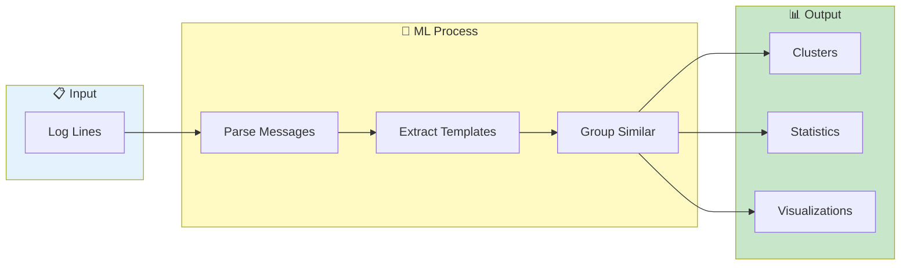

# Pattern Clustering


> **Automatically group similar log messages using ML - extract templates, reduce noise, identify trends**

---

## Overview

Pattern Clustering:
- Groups similar log messages
- Extracts common templates
- Reduces noise
- Identifies trends

Uses ML-based log template mining to identify patterns (Drain3 algorithm).

---

## Clustering Flow



---

## Accessing Pattern Clustering

1. Load log data
2. Go to **Log Inspector** tab
3. Click **Pattern Analysis** tab
4. Click **Run Analysis**

---

## How It Works

### Template Extraction

The algorithm identifies variable parts:

**Input logs:**
```
ERROR: Connection to host1:3306 timeout after 5000ms
ERROR: Connection to host2:3306 timeout after 3000ms
ERROR: Connection to host3:3306 timeout after 8000ms
```

**Extracted template:**
```
ERROR: Connection to <*>:<*> timeout after <*>ms
```

### Clustering Process

1. Parse all log lines
2. Extract message content
3. Identify variable tokens
4. Group by template
5. Calculate statistics

---

## Analysis Results

### Cluster Summary

| Column | Description |
|--------|-------------|
| Template | Extracted pattern |
| Count | Number of matches |
| % | Percentage of total |
| First | First occurrence |
| Last | Last occurrence |
| Pods | Pods affected |

### Cluster Details

Click a cluster to see:
- Full template
- Sample log lines
- Time distribution
- Pod distribution
- Variable values

---

## Using Patterns

### Drill Down

1. Click pattern cluster
2. View all matching lines
3. Apply as filter
4. Navigate to logs

### Add to Search

1. Right-click pattern
2. Select "Add to Search"
3. Pattern becomes search filter

### Add to Exclude

1. Right-click pattern
2. Select "Add to Exclude"
3. Matches hidden from view

---

## Configuration

### Minimum Cluster Size

Ignore small clusters:
- Default: 5 occurrences
- Adjustable in settings

### Similarity Threshold

How similar messages must be:
- Strict: Near-exact matches
- Loose: More variation allowed

### Token Types

Configure what's variable:
- Numbers: `<NUM>`
- IPs: `<IP>`
- UUIDs: `<UUID>`
- Paths: `<PATH>`

---

## Visualization

### Cluster Distribution

Pie chart showing:
- Top clusters
- Relative sizes
- "Other" for small clusters

### Time Distribution

Timeline showing:
- When patterns occur
- Frequency over time
- Spikes and trends

### Pod Distribution

Bar chart showing:
- Patterns per pod
- Helps identify hotspots

---

## Use Cases

### Find Error Patterns

1. Run pattern analysis
2. Sort by count
3. Identify frequent errors
4. Focus investigation

### Reduce Noise

1. Find repetitive patterns
2. Add to exclude filters
3. View cleaner logs

### Detect Anomalies

1. Run analysis periodically
2. Compare pattern distributions
3. New patterns = changes

### Track Trends

1. Note pattern counts
2. Compare over time
3. Increasing = worsening
4. Decreasing = improving

---

## Performance

### Analysis Time

| Lines | Typical Time |
|-------|--------------|
| 10K | < 1 second |
| 100K | 2-5 seconds |
| 1M | 10-30 seconds |

### Stop Analysis

For long-running analysis:
1. Click **Stop** button
2. Partial results shown
3. Can resume later

### Caching

Results are cached:
- Reuse within session
- Clear cache to re-analyze
- Auto-clear on new data

---

## Export

### Export Patterns

1. Click **Export Patterns**
2. Choose format (JSON, CSV)
3. Includes:
   - All templates
   - Counts
   - Sample lines

### Export for Monitoring

Export patterns for:
- Log monitoring setup
- Alert configuration
- Documentation

---

## Limitations

### Not Clustered

| Type | Reason |
|------|--------|
| Unique messages | No pattern |
| JSON logs | Different structure |
| Stack traces | Line numbers vary |

### Accuracy

Clustering is heuristic:
- May group different errors
- Review manually when critical
- Adjust threshold if needed

---

## Related

- [Smart Squash](../core-features/smart-squash.md) - Inline grouping
- [Search & Filtering](../core-features/search-filtering.md) - Pattern search
- [AI Analysis](ai-analysis.md) - Intelligent analysis

---

*Pattern Clustering uses Drain3 algorithm for template mining.*

---

*Last Updated: 2026-02-20*
