# Pipe Commands


> **Unix-style log processing in the browser - grep, awk, sed, jq, and more**

---

## Overview

Pipe Commands let you:
- Filter and transform logs
- Use familiar Unix syntax
- Chain multiple commands
- Get instant results

---

## Pipe Processing Flow

```mermaid
flowchart LR
    subgraph Input["📋 Logs"]
        A[Filtered Lines]
    end

    subgraph Pipe["🔧 Pipe Commands"]
        B["| grep ERROR"]
        C["| cut -d' ' -f1"]
        D["| sort | uniq -c"]
    end

    subgraph Output["📊 Output"]
        E[Processed Result]
    end

    A --> B --> C --> D --> E

    style Input fill:#e3f2fd
    style Pipe fill:#fff9c4
    style Output fill:#c8e6c9
```



---

## Enabling Pipe Mode

1. Go to log viewer
2. Check **"Pipe"** checkbox
3. Pipe input appears below search
4. Enter commands starting with `|`

---

## Basic Syntax

### Single Command

```bash
| grep ERROR
```

### Chained Commands

```bash
| grep ERROR | head 10
```

### With Arguments

```bash
| grep -i timeout
```

---

## Available Commands

### Text Filtering

| Command | Description | Example |
|---------|-------------|---------|
| `grep` | Match pattern | `\| grep ERROR` |
| `grep -v` | Exclude pattern | `\| grep -v DEBUG` |
| `grep -i` | Case insensitive | `\| grep -i error` |
| `grep -E` | Extended regex | `\| grep -E 'a\|b'` |

### Line Selection

| Command | Description | Example |
|---------|-------------|---------|
| `head` | First N lines | `\| head 100` |
| `tail` | Last N lines | `\| tail 50` |
| `head -n` | First N lines | `\| head -n 20` |

### Sorting & Dedup

| Command | Description | Example |
|---------|-------------|---------|
| `sort` | Sort lines | `\| sort` |
| `sort -r` | Reverse sort | `\| sort -r` |
| `uniq` | Remove duplicates | `\| uniq` |
| `uniq -c` | Count occurrences | `\| uniq -c` |

### Field Extraction

| Command | Description | Example |
|---------|-------------|---------|
| `cut -d -f` | Extract field | `\| cut -d' ' -f1` |
| `cut -f 1-3` | Field range | `\| cut -d',' -f1-3` |
| `cut -f 2-` | Field to end | `\| cut -d':' -f2-` |
| `cut -f 1,3,5` | Multiple fields | `\| cut -d' ' -f1,3,5` |
| `awk` | Print field | `\| awk '{print $1}'` |

### Table Formatting

| Command | Description | Example |
|---------|-------------|---------|
| `column` | Align columns | `\| column` |
| `column -t` | Auto-detect table | `\| column -t` |
| `column -s` | Input separator | `\| column -s ','` |
| `column -o` | Output separator | `\| column -t -o ' \| '` |

### Transformation

| Command | Description | Example |
|---------|-------------|---------|
| `sed` | Replace text | `\| sed 's/old/new/'` |
| `sed g` | Replace all | `\| sed 's/old/new/g'` |

### Counting

| Command | Description | Example |
|---------|-------------|---------|
| `wc` | Lines, words, chars | `\| wc` |
| `wc -l` | Line count only | `\| wc -l` |
| `wc -w` | Word count only | `\| wc -w` |
| `wc -c` | Character count | `\| wc -c` |
| `wc -lw` | Combined flags | `\| wc -lw` |

### Statistics

| Command | Description | Example |
|---------|-------------|---------|
| `stats` | Statistical summary | `\| stats` |
| `histogram` | Distribution chart | `\| histogram` |
| `histogram -b` | Custom buckets | `\| histogram -b 10` |

### JSON Processing

| Command | Description | Example |
|---------|-------------|---------|
| `jq '.'` | Pretty print | `\| jq '.'` |
| `jq '.field'` | Extract field | `\| jq '.status'` |
| `jq 'select()'` | Filter | `\| jq 'select(.error)'` |

---

## Command Details

### grep

Filter lines by pattern.

```bash
# Basic match
| grep ERROR

# Case insensitive
| grep -i error

# Inverse match (exclude)
| grep -v DEBUG

# Extended regex
| grep -E 'error|warn'
```

### cut

Extract fields from lines. Supports single fields, ranges, and open-ended ranges.

```bash
# Space delimiter, first field
| cut -d' ' -f1

# Equals delimiter, second field
| cut -d'=' -f2

# Colon delimiter, fields 1-3 (range)
| cut -d':' -f1-3

# Field 3 to end (open-ended)
| cut -d',' -f3-

# Fields 1 to 3 (start from beginning)
| cut -d',' -f-3

# Mixed specification
| cut -d',' -f1,3-5,8

# Multiple specific fields
| cut -d' ' -f1,3,7
```

> **Note:** Fields are output in ascending order. Duplicate fields are automatically deduplicated.

### awk

Print specific fields (whitespace delimited).

```bash
# First field
| awk '{print $1}'

# First and third fields
| awk '{print $1, $3}'
```

> **Note:** Custom delimiters (`-F`) not supported. Use whitespace only.

### sed

Replace text in lines.

```bash
# Replace first occurrence (literal string, not regex)
| sed 's/old/new/'

# Replace all occurrences
| sed 's/old/new/g'
```

> **Note:** Uses literal string matching, not regex.

### wc

Word count - count lines, words, and characters.

```bash
# All counts (lines, words, chars)
| wc

# Line count only
| wc -l

# Word count only
| wc -w

# Character count only
| wc -c

# Combined flags (lines and words)
| wc -lw
```

> **Note:** Default output shows lines, words, and characters space-separated.

### column

Format input into aligned columns for tabular display.

```bash
# Basic column alignment
| column

# Table mode (auto-detect whitespace columns)
| column -t

# Custom input separator
| column -s ','

# Custom output separator
| column -t -s ',' -o ' | '
```

**Options:**
- `-t` - Table mode: auto-detect columns based on whitespace
- `-s <sep>` - Input separator (default: whitespace in table mode)
- `-o <sep>` - Output separator (default: 2 spaces)

### stats

Show statistical summary.

```bash
| stats
# Output:
# Total Lines: 1,547
# Trim Min/Max: 45 / 234
# Mean w/o 5% tails: 128.4
# Median: 127
# P95: 198
# P99: 221
```

### histogram

Show value distribution.

```bash
| histogram
# Output:
# [100-110): ████████████ (234)
# [110-120): ████████ (156)
# [120-130): ████ (89)

| histogram -b 5
# Uses 5 buckets instead of default
```

### jq

JSON processing.

```bash
# Pretty print
| jq '.'

# Extract field
| jq '.status'

# Nested field
| jq '.response.code'

# Filter
| jq 'select(.error)'

# Comparison
| jq 'select(.code > 400)'
```

---

## Example Pipelines

### Count Errors by Type

```bash
| grep ERROR | cut -d':' -f2 | sort | uniq -c | sort -r
```

### Find Top IPs

```bash
| grep sourceIP | cut -d'=' -f2 | sort | uniq -c | sort -r | head 10
```

### Filter and Transform

```bash
| grep timeout | sed 's/ms//' | stats
```

### JSON Field Extraction

```bash
| grep '{' | jq '.status' | sort | uniq -c
```

### Error Distribution

```bash
| grep ERROR | histogram
```

### Format CSV as Table

```bash
| grep data | cut -d',' -f1-4 | column -t -s ',' -o ' | '
```

### Count and Format Results

```bash
| grep ERROR | cut -d':' -f2 | sort | uniq -c | column -t
```

---

## Performance

### Tips

| Tip | Impact |
|-----|--------|
| Filter early | Less data to process |
| Avoid `.*` at start | Faster matching |
| Use specific patterns | Fewer matches |
| Limit with head/tail | Faster display |

### Limits

| Aspect | Limit |
|--------|-------|
| Output lines | 10,000 |
| Processing time | 30 seconds |
| Memory | Session-scoped |

---

## Troubleshooting

### Problem: No output

- Check pattern matches anything
- Try without pipe first
- Verify log format

### Problem: Syntax error

- Check command spelling
- Verify argument format
- Check quote matching

### Problem: Unexpected results

- Check command order
- Verify delimiter characters
- Test each step separately

---

## Related

- [Search & Filtering](../core-features/search-filtering.md) - Basic search
- [Pipe Command Reference](../reference/pipe-command-ref.md) - Full reference
- [SQL Playground](sql-playground.md) - SQL queries

---

*Pipe commands operate on currently filtered log lines.*

---

*Last Updated: 2026-02-20*
