# SQL Playground


> **Query log metadata with DuckDB SQL - 20-35x faster analytical queries**

---

## Overview

SQL Playground provides:
- SQL queries on log data
- Fast analytical queries
- Aggregations and joins
- Export results

Powered by DuckDB embedded database.

---

## SQL Query Flow

```mermaid
flowchart LR
    subgraph Input["📋 Data"]
        A[Log Metadata]
    end

    subgraph Query["🔍 Query"]
        B[Write SQL]
        C[DuckDB Execute]
    end

    subgraph Output["📊 Output"]
        D[Results Table]
        E[Export CSV/JSON]
    end

    A --> B --> C --> D --> E

    style Input fill:#e3f2fd
    style Query fill:#fff9c4
    style Output fill:#c8e6c9
```



---

## Accessing SQL Playground

1. Load log data
2. Go to **Log Inspector** tab
3. Click **SQL Playground** tab

---

## Available Tables

### pod_logs

Main metadata table:

| Column | Type | Description |
|--------|------|-------------|
| pod_name | VARCHAR | Pod name |
| container | VARCHAR | Container name |
| service | VARCHAR | Service name |
| start_time | TIMESTAMP | First log time |
| end_time | TIMESTAMP | Last log time |
| line_count | INTEGER | Number of lines |
| file_path | VARCHAR | Source file |

### Example Query

```sql
SELECT service, COUNT(*) as pods, SUM(line_count) as total_lines
FROM pod_logs
GROUP BY service
ORDER BY total_lines DESC;
```

---

## Query Interface

### Editor

- Syntax highlighting
- Auto-completion
- Multi-line support
- Query history

### Execute

1. Enter SQL query
2. Click **Run** or press `Ctrl+Enter`
3. Results displayed below

### Results

| Feature | Description |
|---------|-------------|
| Table view | Formatted results |
| Column sorting | Click headers |
| Pagination | Navigate pages |
| Export | Download results |

---

## Common Queries

### Service Overview

```sql
SELECT
    service,
    COUNT(*) as pod_count,
    SUM(line_count) as total_lines,
    MIN(start_time) as earliest,
    MAX(end_time) as latest
FROM pod_logs
GROUP BY service
ORDER BY total_lines DESC;
```

### Time Coverage

```sql
SELECT
    pod_name,
    start_time,
    end_time,
    end_time - start_time as duration
FROM pod_logs
ORDER BY start_time;
```

### Find Large Pods

```sql
SELECT pod_name, line_count
FROM pod_logs
WHERE line_count > 10000
ORDER BY line_count DESC;
```

### Recent Activity

```sql
SELECT *
FROM pod_logs
WHERE end_time >= CURRENT_TIMESTAMP - INTERVAL '1 hour'
ORDER BY end_time DESC;
```

### Service Time Range

```sql
SELECT
    service,
    MIN(start_time) as service_start,
    MAX(end_time) as service_end
FROM pod_logs
GROUP BY service;
```

---

## SQL Functions

### DuckDB Built-ins

| Function | Description | Example |
|----------|-------------|---------|
| `COUNT()` | Count rows | `COUNT(*)` |
| `SUM()` | Sum values | `SUM(line_count)` |
| `AVG()` | Average | `AVG(line_count)` |
| `MIN()/MAX()` | Extremes | `MIN(start_time)` |
| `DATE_DIFF()` | Time difference | `DATE_DIFF('minute', start_time, end_time)` |

### String Functions

| Function | Description |
|----------|-------------|
| `LIKE` | Pattern match |
| `CONTAINS()` | Substring check |
| `UPPER()/LOWER()` | Case conversion |

### Date Functions

| Function | Description |
|----------|-------------|
| `DATE_TRUNC()` | Truncate to unit |
| `EXTRACT()` | Get date part |
| `CURRENT_TIMESTAMP` | Now |

---

## Query Examples

### Pods Per Hour

```sql
SELECT
    DATE_TRUNC('hour', start_time) as hour,
    COUNT(*) as pods
FROM pod_logs
GROUP BY 1
ORDER BY 1;
```

### Filter by Service Pattern

```sql
SELECT *
FROM pod_logs
WHERE service LIKE 'payment%'
ORDER BY start_time;
```

### Join with Self

```sql
SELECT
    a.pod_name,
    b.pod_name as overlapping_pod
FROM pod_logs a
JOIN pod_logs b ON a.service = b.service
    AND a.pod_name < b.pod_name
    AND a.start_time <= b.end_time
    AND a.end_time >= b.start_time;
```

---

## Performance

### Query Speed

DuckDB provides:
- Columnar storage
- Vectorized execution
- Parallel processing
- Fast aggregations

### Typical Performance

| Query Type | Typical Time |
|------------|--------------|
| Simple SELECT | < 10ms |
| Aggregation | < 50ms |
| Complex JOIN | < 200ms |

### Tips

| Tip | Impact |
|-----|--------|
| Use WHERE early | Less data processed |
| Limit results | Faster display |
| Avoid `SELECT *` | Only needed columns |

---

## Export Results

### Export Options

| Format | Description |
|--------|-------------|
| CSV | Spreadsheet format |
| JSON | Structured data |
| Parquet | Columnar format |

### Export Steps

1. Run query
2. Click **Export**
3. Choose format
4. Download file

---

## Query History

### Recent Queries

- Automatically saved
- Searchable
- Click to reload

### Save Query

1. Write query
2. Click **Save**
3. Name the query
4. Access from saved list

---

## Limitations

### Not Available

| Feature | Alternative |
|---------|-------------|
| Full text search | Use log viewer search |
| INSERT/UPDATE | Read-only |
| External tables | Load via UI |

### Data Scope

- Only metadata (not log content)
- Current session data
- Cleared on session end

---

## Troubleshooting

### Problem: Table not found

- Ensure data is loaded
- Check table name spelling
- Run `SHOW TABLES`

### Problem: Query slow

- Add WHERE clauses
- Limit result size
- Simplify joins

### Problem: Syntax error

- Check SQL syntax
- Verify column names
- Use DuckDB syntax

---

## Related

- [Time Navigation](../core-features/time-navigation.md) - Time filtering
- [Dashboard](../core-features/dashboard.md) - Visual metrics
- [Pipe Commands](pipe-commands.md) - Text processing

---

*SQL Playground uses DuckDB for 20-35x faster analytical queries.*

---

*Last Updated: 2026-02-20*
