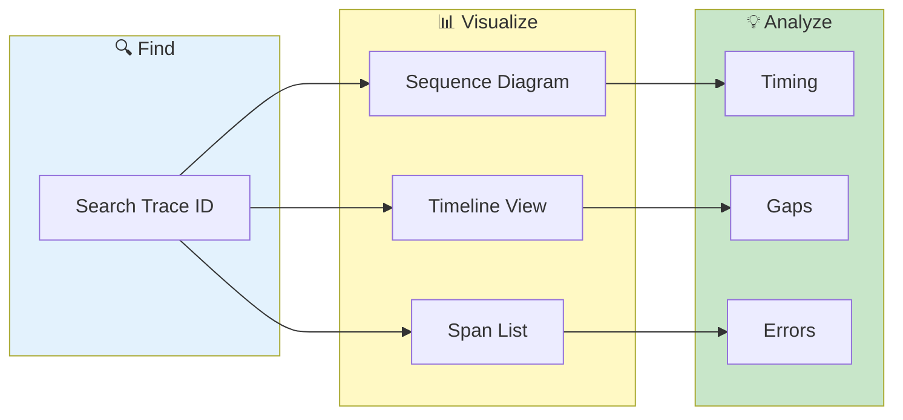

# Trace Visualization


> **Track requests across multiple services - sequence diagrams, timelines, and span analysis**

---

## Overview

Trace Visualization helps you:
- Follow request flow
- See service interactions
- Identify bottlenecks
- Debug distributed issues

---

## Trace Visualization Flow



---

## Trace ID Detection

### Automatic Detection

VKInsight detects trace IDs from:

| Header | Format |
|--------|--------|
| X-Request-ID | UUID |
| X-B3-TraceId | Hex (16/32 chars) |
| traceparent | W3C format |
| trace_id | Various formats |

### Manual Search

If trace ID not auto-detected:
1. Search for trace ID value
2. Results grouped by trace

---

## Visualization Modes

### Sequence Diagram

Mermaid-generated diagram showing:
- Service-to-service calls
- Request/response flow
- Timing information

**Example:**
```
Client -> Gateway: GET /api/orders
Gateway -> OrderService: getOrders()
OrderService -> Database: SELECT
Database --> OrderService: results
OrderService --> Gateway: [200] orders
Gateway --> Client: [200] response
```

### Timeline View

Horizontal swimlane chart:
- Each service as a lane
- Events as bars
- Duration shown
- Gaps visible

### Chronological List

All trace events in order:
- Timestamp
- Service/Pod
- Event type
- Duration

---

## Using Trace Visualization

### Find a Trace

1. **From Search Results:**
   - Search across pods
   - Click trace ID in results
   - View trace visualization

2. **From Cross-Pod Search:**
   - Select "Trace View" tab
   - Click a trace ID
   - See visualization

3. **Direct Search:**
   - Enter trace ID in search
   - Navigate to Trace Viz tab

### Navigate Trace

| Action | Result |
|--------|--------|
| Click event | Show log details |
| Hover | Show timing info |
| Click service | Filter to service |
| Zoom | Expand time range |

---

## Trace Analysis

### Timing Analysis

For each span:
- Start time
- End time
- Duration
- Self time (excluding children)

### Gap Detection

Identify delays:
- Time between spans
- Highlighted as gaps
- Click for details

### Error Detection

Errors shown with:
- Red color coding
- Error message
- Stack trace (if available)

---

## Trace Metrics

### Summary Statistics

| Metric | Description |
|--------|-------------|
| Total Duration | End-to-end time |
| Services | Number of services |
| Spans | Number of events |
| Errors | Error count |

### Per-Service Metrics

| Service | Calls | Avg Time | Errors |
|---------|-------|----------|--------|
| Gateway | 1 | 245ms | 0 |
| OrderSvc | 1 | 180ms | 0 |
| Database | 1 | 15ms | 0 |

---

## Configuration

### Trace ID Patterns

Add custom trace ID patterns:
```json
{
  "patterns": [
    {
      "name": "Custom Trace",
      "regex": "my-trace-\\d{10}",
      "field": "x-my-trace"
    }
  ]
}
```

### Service Name Mapping

Map pod names to friendly names:
```json
{
  "order-service-*": "Order Service",
  "payment-*": "Payment"
}
```

---

## Use Cases

### Debug Slow Request

1. Find slow request trace ID
2. View timeline
3. Identify longest span
4. Drill into that service

### Find Error Source

1. Get error trace ID
2. View sequence diagram
3. Find red (error) span
4. Click for details

### Understand Flow

1. Pick sample trace
2. View sequence diagram
3. Document service interactions
4. Share with team

### Compare Traces

1. Export trace A
2. Export trace B
3. Compare durations
4. Identify differences

---

## Export

### Export Trace

| Format | Use |
|--------|-----|
| PNG | Share diagram |
| JSON | Programmatic use |
| Markdown | Documentation |

### Export Steps

1. Generate visualization
2. Click **Export**
3. Choose format
4. Download

---

## Limitations

### Requirements

- Trace IDs in logs
- Multiple pods loaded
- Same time range

### Coverage

Works best with:
- Istio/Envoy access logs
- Structured logging
- Consistent trace propagation

May not work with:
- Legacy applications
- Missing trace context
- Different trace systems

---

## Related

- [Cross-Pod Search](../core-features/cross-pod-search.md) - Find traces
- [Network Graph](network-graph.md) - Service topology
- [Time Navigation](../core-features/time-navigation.md) - Time filtering

---

*Trace Visualization requires logs with trace ID headers.*

---

*Last Updated: 2026-02-20*
