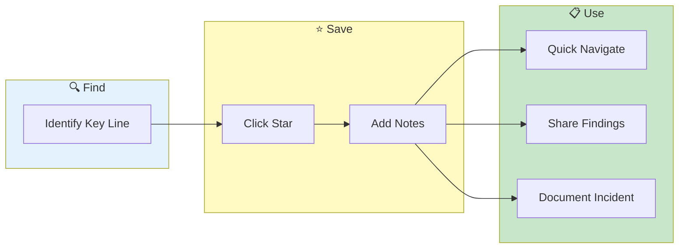

# Bookmarks


> **Save important log lines for later reference - document findings as you investigate**

---

## Overview

Bookmarks let you:
- Save significant findings
- Add notes and context
- Navigate quickly to saved lines

**Note:** Bookmarks are session-scoped. They persist during your session but are cleared on logout or tab close. See [Bookmarks Roadmap](../roadmap/bookmarks-roadmap.md) for planned enhancements including export/import and persistence.

---

## Bookmark Workflow



---

## Creating Bookmarks

### Click Star Icon

1. Hover over log line
2. Click the star icon
3. Line is bookmarked

### Right-Click Menu

1. Right-click any log line
2. Select **"Toggle Bookmark"**
3. Line is bookmarked

---

## Bookmark Information

### Stored Data

Each bookmark saves:

| Field | Description |
|-------|-------------|
| Line Content | Full log message |
| Line Number | Original position |
| Timestamp | Log timestamp |
| Pod | Source pod name |
| Container | Source container |
| Context | Surrounding lines |
| Notes | Your annotations |

### Pod Source Indicator

Bookmarks show their source:
```
[pod-service-a] ERROR: Connection timeout
[pod-service-b] WARN: Retry attempt
```

---

## Viewing Bookmarks

### Bookmarks Panel

1. Click **Bookmarks** tab
2. View all saved bookmarks
3. Click to navigate to line

### Bookmark List

| Column | Description |
|--------|-------------|
| Icon | Bookmark indicator |
| Time | Timestamp |
| Pod | Source pod |
| Message | Log content preview |
| Notes | Your annotations |

### Filter Bookmarks

- Search within bookmarks
- Filter by pod
- Sort by time or creation

---

## Managing Bookmarks

### Add Notes

1. Click bookmark
2. Click **Add Note**
3. Enter annotation
4. Save

### Edit Notes

1. Click bookmark
2. Click note text
3. Modify
4. Save

### Remove Bookmark

1. Click bookmarked line
2. Click the star (now filled)
3. Bookmark removed

Or:
1. In Bookmarks panel
2. Click the remove button
3. Confirm removal

### Clear All Bookmarks

1. Go to Bookmarks panel
2. Click **Clear All**
3. Confirm action

---

## Context Preservation

### Surrounding Lines

Bookmarks capture context:
- 5 lines before (configurable)
- 5 lines after (configurable)
- Helps understand situation

### View Context

1. Click bookmark
2. Click **Show Context**
3. See surrounding lines

---

## Use Cases

### Incident Documentation

1. Bookmark key error lines
2. Add notes explaining findings
3. Navigate between key evidence
4. Use for incident report

### Track Investigation

1. Bookmark lines as you investigate
2. Add notes with your findings
3. Navigate using bookmark list
4. Clear when done

### Share Findings

1. Bookmark relevant lines
2. Add context notes
3. Share line numbers and pods with team

---

## Planned Enhancements

The following features are planned for future releases:
- Export bookmarks (JSON, CSV, Markdown)
- Import bookmarks
- Keyboard shortcut (`B`)
- Categories and tagging
- Cross-session persistence

See [Bookmarks Roadmap](../roadmap/bookmarks-roadmap.md) for details.

---

## Related

- [Bookmarks Roadmap](../roadmap/bookmarks-roadmap.md) - Planned enhancements
- [Log Viewing](log-viewing.md) - Viewer features
- [Bulk Export](../enterprise/bulk-export.md) - Export logs

---

*Last Updated: 2026-02-20*
