# Cross-Pod Search


> **Search across all loaded pods simultaneously - find patterns, trace requests, identify distributed issues**

---

## Overview

Cross-Pod Search lets you:
- Search all pods at once
- Find patterns across services
- Track requests across pods
- Identify distributed issues

---

## Cross-Pod Search Flow

```mermaid
flowchart LR
    subgraph Input["🔍 Search"]
        A[Enter Pattern]
        B[Select Scope]
    end

    subgraph Process["⚙️ Process"]
        C[Parallel Search]
        D[ripgrep 6-8x]
    end

    subgraph Results["📊 Results"]
        E[Summary View]
        F[Timeline View]
        G[Trace View]
    end

    A --> C
    B --> C
    C --> D
    D --> E
    D --> F
    D --> G

    style Input fill:#e3f2fd
    style Process fill:#fff9c4
    style Results fill:#c8e6c9
```



---

## Accessing Cross-Pod Search

1. Go to **Log Inspector** tab
2. Select **Cross-Pod Search** mode (toggle)
3. All pods are now searchable

---

## Search Interface

### Search Box

Same as single-pod search:
- Plain text or regex
- Case sensitive option
- Multiple patterns (OR)

### Scope Selection

| Option | Description |
|--------|-------------|
| All Pods | Search everything |
| Selected Services | Filter by service |
| Selected Pods | Specific pods only |
| Time Range | Narrow by time |

---

## Results Display

### Summary Table

| Column | Description |
|--------|-------------|
| Pod | Pod name |
| Matches | Number of matches |
| First | First match time |
| Last | Last match time |
| Preview | Sample match |

### Result Views

| View | Description |
|------|-------------|
| Summary | Match counts per pod |
| Timeline | Chronological across pods |
| Full Logs | Complete matching lines |
| Trace | Grouped by trace ID |

---

## Timeline View

### Features

- All matches in time order
- Color-coded by pod
- Click to expand context
- Scroll to navigate

### Reading Timeline

```
10:30:45.123 [pod-a] ERROR Connection timeout
10:30:45.456 [pod-b] ERROR Upstream unavailable
10:30:45.789 [pod-a] WARN  Retry attempt 1
10:30:46.123 [pod-c] ERROR Service unreachable
```

### Correlation

See how events across pods relate:
- Same trace ID
- Similar timestamps
- Cascading failures

---

## Trace Grouping

### Automatic Trace Detection

VKInsight detects trace IDs:
- B3 headers
- X-Request-ID
- OpenTelemetry
- Custom patterns

### Trace View

1. Click **Trace View** tab
2. Results grouped by trace ID
3. See request flow across pods

### Example

```
Trace: abc123-def456
├── [pod-a] 10:30:45 Received request
├── [pod-b] 10:30:45 Forwarding to service-c
├── [pod-c] 10:30:46 Processing request
└── [pod-a] 10:30:46 Response sent
```

---

## Performance

### Search Backends

| Backend | Platform | Speed |
|---------|----------|-------|
| ripgrep | Linux | 6-8x faster |
| Python | All | Standard |

### Optimization Tips

| Tip | Impact |
|-----|--------|
| Narrow time range first | Major improvement |
| Filter to relevant services | Reduces scope |
| Be specific with patterns | Fewer matches |
| Use time range filter | 20-35x faster |

### Performance Indicators

Status bar shows:
- Pods being searched
- Estimated time
- Progress percentage

---

## Use Cases

### Find Distributed Errors

Search for errors across all services:
1. Pattern: `ERROR|Exception`
2. View: Timeline
3. Identify cascading failures

### Track Request Flow

Follow a request through services:
1. Get trace ID from initial request
2. Search for trace ID
3. View: Trace
4. See complete flow

### Identify Common Issues

Find patterns across pods:
1. Pattern: `timeout|connection refused`
2. View: Summary
3. See which pods affected most

### Time Correlation

Find events at specific time:
1. Set time range (narrow)
2. Search: `.*` (all lines)
3. View: Timeline
4. See all activity in window

---

## Exporting Results

### Export Options

| Format | Contents |
|--------|----------|
| CSV | Tabular data |
| JSON | Structured results |
| Text | Plain log lines |

### Export Steps

1. Run search
2. Click **Export** button
3. Choose format
4. Download file

---

## Related

- [Search & Filtering](search-filtering.md) - Search basics
- [Trace Visualization](../advanced/trace-visualization.md) - Visual traces
- [Single Pod View](single-pod-view.md) - Focus on one pod

---

*Cross-pod search requires data loaded from multiple pods.*

---

*Last Updated: 2026-02-20*
