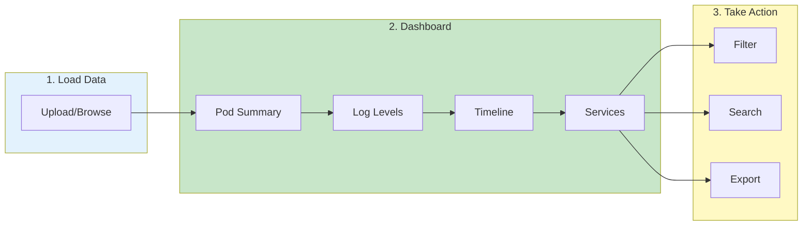

# Dashboard

> **Your command center for loaded log data - see metrics, distributions, and insights at a glance**

---

## Overview

The Dashboard provides **instant visibility** into your loaded log data:

- **Pod Summary** - Total pods, lines, time range at a glance
- **Log Level Distribution** - Visual breakdown of ERROR, WARN, INFO, DEBUG
- **Time Distribution** - Activity patterns over time
- **Service Overview** - Per-service metrics and error counts
- **Quick Filters** - Click any metric to drill down instantly

---

## Dashboard Flow

---

## 📊 Accessing Dashboard

The Dashboard tab is the first view after loading data:

1. Load log data from any source
2. Click the **Dashboard** tab
3. View summary metrics

---

## 📈 Dashboard Sections

### Pod Summary

| Metric | Description | Example |
|--------|-------------|---------|
| Total Pods | Number of pod log files loaded | 47 pods |
| Total Lines | Combined line count across all pods | 2.3M lines |
| Time Range | Earliest to latest timestamp | 2h 15m span |
| Services | Unique service names detected | 12 services |

### Log Level Distribution

Visual breakdown of log levels:

| Level | Color | Description |
|-------|-------|-------------|
| 🔴 **ERROR** | Red | Critical issues requiring attention |
| 🟡 **WARN** | Yellow | Warnings and alerts |
| 🔵 **INFO** | Blue | Informational messages |
| ⚪ **DEBUG** | Gray | Debug-level details |

### Time Distribution

Chart showing log volume over time:

| Axis | Shows |
|------|-------|
| X-axis | Time intervals (configurable granularity) |
| Y-axis | Log line count |
| Color | Log level distribution |

### Service Overview

| Column | Description |
|--------|-------------|
| Service | Service name |
| Pods | Number of pods |
| Lines | Total log lines |
| Errors | Error count (clickable) |
| Time Range | Coverage period |

---

## 🎯 Key Insights

### Error Hotspots

Quickly identify:
- Services with highest error rates
- Time periods with error spikes
- Pods requiring immediate attention

### Coverage Gaps

Detect:
- Missing time ranges
- Pods with incomplete logs
- Services without recent data

### Volume Trends

Understand:
- Log volume patterns
- Peak activity times
- Unusual volume changes

---

## ⚡ Dashboard Actions

### Quick Filters

Click any metric to filter instantly:

| Click On | Action |
|----------|--------|
| Service name | Filter to that service |
| Error count | Show only ERROR level logs |
| Time period | Narrow time range |
| Pod name | Drill down to single pod |

### Export Summary

1. Click **Export** button
2. Choose format (CSV, JSON)
3. Download summary data

### Refresh Data

- Click **Refresh** to reload metrics
- Auto-refresh available (configurable)

---

## ⚙️ Customization

### Configure Widgets

1. Click **Settings** (gear icon)
2. Toggle widget visibility
3. Reorder widgets (drag and drop)
4. Save layout

### Time Granularity

Choose time bucket size:

| Granularity | Best For |
|-------------|----------|
| 1 minute | Short incidents, detailed analysis |
| 5 minutes | Medium timeframes |
| 15 minutes | Hourly patterns |
| 1 hour | Daily overview |
| 1 day | Long-term trends |

---

## 🔧 Troubleshooting

| Problem | Cause | Solution |
|---------|-------|----------|
| No metrics showing | No data loaded | Load log data first |
| Slow dashboard load | Large dataset | Use time filters to reduce scope |
| Charts not rendering | Browser issue | Refresh page or try different browser |
| Missing services | Detection failed | Check pod naming patterns |
| Stale metrics | Cache issue | Click Refresh button |

---

## 📚 Related

- [Log Viewing](log-viewing.md) - Explore individual logs
- [Cross-Pod Search](cross-pod-search.md) - Search across all pods
- [Pod Overlap](pod-overlap.md) - Analyze time coverage
- [Time Navigation](time-navigation.md) - Filter by time range

---

*Dashboard updates automatically when filters change.*

---

*Last Updated: 2026-02-20*
