# Log Availability

> **Check data presence and coverage across pods - validate before you investigate**

---

## Overview

Log Availability helps you:
- Verify data completeness
- Find missing logs
- Check collection status
- Validate debug bundles

---

## Availability Check Flow

```mermaid
flowchart LR
    subgraph Load["📥 Load"]
        A[Log Data]
    end

    subgraph Check["🔍 Check"]
        B[Pod Count]
        C[Time Coverage]
        D[Quality Metrics]
    end

    subgraph Validate["✅ Validate"]
        E[Complete]
        F[Gaps Found]
        G[Issues]
    end

    A --> B --> C --> D
    D --> E
    D --> F
    D --> G

    style Load fill:#e3f2fd
    style Check fill:#fff9c4
    style Validate fill:#c8e6c9
```

---

## Accessing Log Availability

1. Load data from any source
2. Go to **Log Inspector** tab
3. Click **Log Availability** tab

---

## Availability Dashboard

### Summary Metrics

| Metric | Description |
|--------|-------------|
| Total Pods | Number of pods found |
| With Data | Pods with log lines |
| Empty | Pods with no data |
| Coverage | Overall time coverage |

### Per-Pod Status

| Status | Meaning |
|--------|---------|
| ✅ Available | Pod has log data |
| ⚠️ Partial | Limited data/time range |
| ❌ Empty | No log data |
| ⏳ Loading | Still processing |

---

## Availability Table

### Columns

| Column | Description |
|--------|-------------|
| Pod | Pod name |
| Status | Availability status |
| Lines | Number of log lines |
| First | Earliest timestamp |
| Last | Latest timestamp |
| Duration | Time coverage |
| Size | Data size |

### Sorting

Click column headers to sort:
- By name
- By status
- By line count
- By time range

### Filtering

Filter the view:
- Show only with data
- Show only empty
- Filter by service

---

## Checking Completeness

### Expected vs Actual

Compare loaded data to expectations:

| Check | How |
|-------|-----|
| Pod count | Match expected pods |
| Time range | Covers incident period |
| Services | All services present |
| Log levels | DEBUG/INFO present |

### Identifying Issues

| Issue | Indicator |
|-------|-----------|
| Missing pod | Pod not in list |
| Truncated logs | Unexpected end time |
| Partial collection | Lower than expected count |
| Corrupted data | Parse errors shown |

---

## Time Coverage Analysis

### Coverage Visualization

Timeline showing:
- Per-pod coverage bars
- Common time range
- Gaps highlighted

### Finding Gaps

1. Look for empty time ranges
2. Check gap duration
3. Identify affected pods
4. Investigate cause

---

## Data Quality Indicators

### Parse Success Rate

| Metric | Description |
|--------|-------------|
| Parsed | Lines with valid timestamp |
| Unparsed | Lines without timestamp |
| Errors | Parse failures |

### Level Distribution

Check log level presence:
- ERROR logs available
- WARN logs available
- INFO logs available
- DEBUG logs available

If level missing, collection may be filtered.

---

## Use Cases

### Validate Debug Bundle

1. Load debug bundle
2. Check Log Availability
3. Verify all expected pods present
4. Confirm time range covers incident

### Diagnose Collection Issues

1. Compare expected vs actual pods
2. Check for truncated logs
3. Look for unusual gaps
4. Report collection problems

### Pre-Analysis Checklist

Before investigating:
1. ✓ All relevant pods loaded
2. ✓ Time range covers incident
3. ✓ No unexpected gaps
4. ✓ Log levels available

---

## Troubleshooting

### Problem: Pod shows empty

**Possible causes:**
- Pod not logging during time range
- Log file empty or corrupted
- Wrong directory/file selected
- File encoding issue

**Solutions:**
- Verify source file has content
- Check file encoding
- Try different time range

### Problem: Unexpected gaps

**Possible causes:**
- Pod restart during period
- Log rotation occurred
- Collection interrupted
- Time sync issues

**Solutions:**
- Check pod lifecycle
- Verify collection process
- Look for rotation files

### Problem: Low line count

**Possible causes:**
- Log level filtering at source
- Recent pod startup
- Low traffic period
- Partial file

**Solutions:**
- Check source log level config
- Verify file completeness
- Load additional files

---

## Export

### Export Availability Report

1. Click **Export Report**
2. Choose format
3. Includes:
   - All pods and status
   - Time coverage
   - Quality metrics

---

## Related

- [Pod Overlap](pod-overlap.md) - Time overlap analysis
- [Loading Data](../getting-started/loading-data.md) - Data import
- [Dashboard](dashboard.md) - Overview metrics

---

*Log Availability is essential for validating data before analysis.*

---

*Last Updated: 2026-02-20*
