# Log Viewing


> **Explore and inspect log data with the interactive viewer - optimized for files up to 1 million lines**

---

## Data Flow Pipeline

```mermaid
flowchart LR
    subgraph Input["📥 Input"]
        Raw[Raw Log Files<br/><i>1M+ lines</i>]
    end

    subgraph Processing["⚙️ Processing"]
        Parse[Parse & Extract<br/><i>Timestamps, Levels</i>]
        Index[Optimized Index<br/><i>Fast Lookups</i>]
    end

    subgraph Filter["🔍 Filtering"]
        Time[Time Range]
        Search[Search Pattern]
        Level[Log Level]
    end

    subgraph Display["📺 Display"]
        Viewer[Log Viewer<br/><i>Virtual Scrolling</i>]
        Highlight[Match Highlighting]
        Context[Context Panel]
    end

    subgraph Actions["📤 Actions"]
        Bookmark[⭐ Bookmark]
        Export[📤 Export]
        AI[🤖 AI Analysis]
    end

    Raw --> Parse --> Index
    Index --> Time --> Search --> Level
    Level --> Viewer
    Viewer --> Highlight --> Context
    Context --> Bookmark
    Context --> Export
    Context --> AI

    style Input fill:#e3f2fd
    style Processing fill:#fff8e1
    style Filter fill:#e8f5e9
    style Display fill:#f3e5f5
    style Actions fill:#ffccbc
```



**How it works:** Raw logs are parsed and indexed → Filters reduce the dataset → Virtual scrolling displays results efficiently → Actions let you save, export, or analyze.

---

## Log Viewer Interface

### Main Components

| Component | Description |
|-----------|-------------|
| Toolbar | Search, filters, view options |
| Log Display | Scrollable log lines |
| Status Bar | Line count, position |
| Context Panel | Selected line details |

### Line Display

Each log line shows:
- **Line Number** - Original file position
- **Timestamp** - Extracted time (if available)
- **Level** - Log level badge (ERROR, WARN, INFO, DEBUG)
- **Message** - Log content
- **Source** - Pod/container (in cross-pod view)

---

## Display Options

### View Modes

| Mode | Description |
|------|-------------|
| Compact | One line per entry |
| Expanded | Multi-line with details |
| Raw | No formatting |

### Color Coding

| Level | Color | Meaning |
|-------|-------|---------|
| ERROR | Red | Critical issues |
| WARN | Orange | Warnings |
| INFO | Blue | Information |
| DEBUG | Gray | Debug details |

### Font Settings

- **Size**: `Ctrl+Scroll` to zoom (10-24px)
- **Family**: Monospace (fixed)
- **Wrap**: Toggle word wrap

---

## Line Interaction

### Select Line

- **Click** - Select and highlight
- **Double-click** - Smart word selection
- **Shift+Click** - Select range

### Context Menu (Right-Click)

| Action | Description |
|--------|-------------|
| Copy Line | Copy to clipboard |
| Copy JSON | Copy parsed JSON |
| Add to Search | Use as search pattern |
| Add to Exclude | Exclude this pattern |
| Set as Start Time | Filter from this time |
| Set as End Time | Filter to this time |
| Toggle Bookmark | Save/unsave line |
| View JSON | Open in JSON viewer |

### Keyboard in Viewer

| Key | Action |
|-----|--------|
| `Ctrl+Scroll` | Zoom in/out |
| `Ctrl+C` | Copy selected |
| `Ctrl+A` | Select all |

---

## Smart Features

### Stack Trace Grouping

Multi-line exceptions are automatically grouped:
```
java.lang.NullPointerException: message
    at com.example.Class.method(Class.java:42)
    at com.example.Class.caller(Class.java:15)
    ... 10 more
```

Click to expand/collapse.

### JSON Detection

Embedded JSON is auto-detected and formatted:
```json
{"status": "error", "code": 500, "message": "Internal error"}
```

Click to open in JSON viewer.

### Timestamp Parsing

Supports 15+ timestamp formats:
- ISO 8601: `2024-12-24T10:30:45.123Z`
- Unix epoch: `1703414445123`
- Custom formats (configurable)

---

## Filtering in Viewer

### Quick Filter Bar

Type to filter visible lines:
1. Enter pattern in filter box
2. Lines matching are highlighted
3. Non-matching lines dimmed or hidden

### Log Level Filter

Toggle visibility by level:
- [ ] ERROR
- [ ] WARN
- [x] INFO
- [x] DEBUG

### Time Scrubber

Drag to navigate time range:
- Left handle: Start time
- Right handle: End time
- Scrubber: Current position

---

## Performance Features

### Virtual Scrolling

Handles large files efficiently:
- Only visible lines rendered
- Smooth scrolling
- Low memory usage

### Lazy Loading

Lines load on demand:
- Initial chunk loaded first
- Additional chunks on scroll
- Progress indicator shown

---

## Export Options

### Copy to Clipboard

1. Select lines
2. `Ctrl+C` or right-click → Copy
3. Paste elsewhere

### Download Selection

1. Select lines
2. Right-click → Download
3. Choose format (text, JSON)

---

## Related

- [Search & Filtering](search-filtering.md) - Find specific logs
- [Single Pod View](single-pod-view.md) - Focus on one pod
- [JSON Workbench](../advanced/json-workbench.md) - Analyze JSON

---

*The log viewer is optimized for files up to 1 million lines.*

---

*Last Updated: 2026-02-20*
