# Multi-Container Support


> **Analyze pods with multiple containers - main apps, sidecars, init containers, and more**

---

## Overview

Kubernetes pods can have multiple containers:
- Main application container
- Sidecar containers (Istio, logging)
- Init containers
- Helper containers

VKInsight handles all container types seamlessly.

---

## Container Analysis Flow

```mermaid
flowchart LR
    subgraph Load["📥 Load"]
        A[Pod Logs]
    end

    subgraph Detect["🔍 Detect"]
        B[Parse Filenames]
        C[Identify Containers]
    end

    subgraph Analyze["📊 Analyze"]
        D[View Individual]
        E[Compare Side-by-Side]
        F[Correlate Events]
    end

    A --> B --> C
    C --> D
    C --> E
    C --> F

    style Load fill:#e3f2fd
    style Detect fill:#fff9c4
    style Analyze fill:#c8e6c9
```



---

## Container Detection

### Automatic Detection

When loading pod logs, VKInsight:
1. Parses filename patterns
2. Identifies container names
3. Groups by pod

### Naming Patterns

| Pattern | Container Detection |
|---------|---------------------|
| `pod-name-container-main.log` | Container: main |
| `pod-name_container_sidecar.log` | Container: sidecar |
| `pod-name-logs.log` | Container: default |

---

## Viewing Containers

### Container Selector

In Single Pod View:
1. Select pod from dropdown
2. Container dropdown appears
3. Choose specific container
4. Or select "All Containers"

### Container Indicators

When viewing all containers:
```
[main]    10:30:45 INFO Application started
[istio]   10:30:45 INFO Envoy starting
[main]    10:30:46 INFO Processing request
[istio]   10:30:46 INFO Outbound connection
```

---

## Filtering by Container

### Single Container View

1. Select pod
2. Choose specific container
3. Only that container's logs shown

### Multiple Container View

1. Select pod
2. Choose "All Containers"
3. Filter using container checkboxes

### Container Filter Dropdown

| Option | Shows |
|--------|-------|
| All Containers | Everything |
| main | Main app only |
| istio-proxy | Sidecar only |
| Custom... | Your selection |

---

## Container-Specific Analysis

### Compare Container Activity

View side-by-side:
1. Load all containers
2. Set same time range
3. Compare activity patterns

### Trace Across Containers

Follow request from:
1. Ingress (istio-proxy)
2. Application (main)
3. Egress (istio-proxy)
4. External service

### Correlate Container Events

Look for patterns:
- Sidecar error → App failure
- App request → Sidecar outbound
- Init container → App startup

---

## Common Container Types

### Main Application

Primary workload container:
- Application logs
- Business logic
- Error messages

### Istio Proxy (Envoy)

Service mesh sidecar:
- Access logs
- Connection events
- Circuit breaker status

### Init Containers

Startup containers:
- Initialization logs
- Config setup
- Dependency checks

### Sidecar Helpers

Auxiliary containers:
- Log shippers
- Config watchers
- Health checkers

---

## Envoy Access Logs

### Automatic Parsing

VKInsight parses Envoy logs:
- Request method
- Path
- Response code
- Duration
- Upstream/downstream

### Envoy Fields

| Field | Description |
|-------|-------------|
| Method | HTTP method |
| Path | Request path |
| Status | Response code |
| Duration | Request time |
| Upstream | Target service |
| Downstream | Source service |

---

## Search Across Containers

### Cross-Container Search

Search all containers:
1. Select "All Containers"
2. Enter search pattern
3. Results from all containers

### Container-Scoped Search

Search specific container:
1. Select target container
2. Enter search pattern
3. Only that container searched

---

## Performance Considerations

### Large Multi-Container Pods

For pods with many containers:
- Load specific containers first
- Use container filter
- Narrow time range

### Memory Usage

Each container adds memory:
- Filter to relevant containers
- Use time filtering
- Clear unused data

---

## Export Options

### Export by Container

1. Select container filter
2. Click Export
3. Only filtered data exported

### Export All Containers

1. Select "All Containers"
2. Click Export
3. Container indicated in output

### Export Format

```json
{
  "pod": "service-a-abc123",
  "container": "main",
  "line": "10:30:45 INFO Request processed",
  "timestamp": "2024-12-24T10:30:45Z"
}
```

---

## Use Cases

### Debug Istio Routing

1. Load istio-proxy logs
2. Search for routing errors
3. Correlate with app container
4. Identify mesh issues

### Trace Full Request

1. Load all containers
2. Find request in envoy
3. Follow to app container
4. Track response

### Init Container Issues

1. Look for init containers
2. Check initialization logs
3. Identify startup failures
4. Fix configuration

---

## Related

- [Single Pod View](single-pod-view.md) - Pod inspection
- [Cross-Pod Search](cross-pod-search.md) - Multi-pod analysis
- [Trace Visualization](../advanced/trace-visualization.md) - Request tracing

---

*Multi-container support requires properly named log files.*

---

*Last Updated: 2026-02-20*
