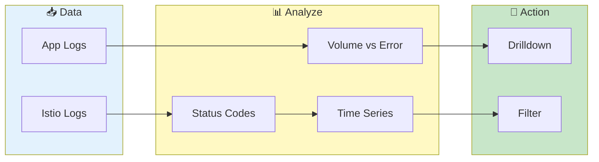

# Pod Analytics

> **Unified view of Application and Istio Proxy logs with visual analytics - scatter plots, time series, and drilldown**

---

## Overview

Pod Analytics provides:
- Combined view of all container types
- Volume vs Error scatter analysis
- Log level distribution breakdown
- HTTP status code tracking (Istio)
- Quick filtering and drilldown

---

## Analytics Flow

---

## Accessing Pod Analytics

1. Load log data from sidebar
2. Go to **Log Inspector** page
3. Click **Pod Logs & Analytics** tab

---

## Container Type Filter

Filter logs by container type:

| Filter | Shows |
|--------|-------|
| All Containers | Application + Istio Proxy logs |
| Application Only | Standard application container logs |
| Istio Proxy Only | Envoy sidecar access logs |

### Container Detection

VKInsight automatically detects container types:
- **istio-proxy**: Always classified as Istio
- **ingress/envoy/gateway**: Classified by content (HTTP data vs log levels)
- **Other containers**: Classified as Application

---

## Application Logs Section

### Volume vs Error Analysis

Scatter plot visualization:
- **X-axis**: Log volume (total lines)
- **Y-axis**: Error count
- **Color**: Service name
- **Hover**: Pod details

Helps identify:
- High-error pods (top of chart)
- High-volume pods (right of chart)
- Correlation between volume and errors

### Quick Filters

| Filter | Description |
|--------|-------------|
| Show Errors | Display only pods with ERROR > 0 |
| Show Warnings | Display only pods with WARN > 0 |

### Pod Table

| Column | Description |
|--------|-------------|
| Service Name | Kubernetes service |
| Pod Name | Full pod identifier |
| Container Name | Container within pod |
| Start Time | First log timestamp |
| End Time | Last log timestamp |
| Duration | Time span of logs |
| DEBUG | Debug level count |
| INFO | Info level count |
| WARN | Warning level count |
| ERROR | Error level count |
| TRACE | Trace level count |
| Total Lines | Total log lines |

### Drilldown

1. Click any row in the pod table
2. Pod is selected for drilldown
3. Switch to **Log Inspector** tab
4. View detailed logs for selected pod

---

## Istio Proxy Section

### Status Codes Overview

For Istio access logs, view HTTP status distribution:

| Status | Meaning |
|--------|---------|
| 2xx | Successful requests |
| 3xx | Redirects |
| 4xx | Client errors |
| 5xx | Server errors |

### Time Series Analysis

#### Load Time Series

1. Select **Time Bucket** (1, 5, 15, 30, or 60 minutes)
2. Click **Load Time Series**
3. Wait for parsing (progress shown)
4. View granular time-bucketed data

#### Filters

| Filter | Description |
|--------|-------------|
| Select Services | Filter by service name |
| Select Pods | Filter by pod name |
| Select Status Codes | Filter by HTTP status |

#### Chart Types

**With Time Series Data:**
- Line chart showing status codes over time
- Per-minute granularity
- Hover for exact values

**Without Time Series Data:**
- Scatter plot showing aggregated data
- Quick overview without parsing

### Pod Table (Istio)

Similar to Application table but includes:

| Column | Description |
|--------|-------------|
| 1xx | Informational responses |
| 2xx | Successful responses |
| 3xx | Redirects |
| 4xx | Client errors |
| 5xx | Server errors |
| Total Lines | Total access log entries |

---

## Log Level Breakdown

### Application Logs

Bar chart showing distribution:
- DEBUG, INFO, WARN, ERROR, TRACE
- Per-pod breakdown
- Color-coded by level

### Istio Access Logs

Pie chart showing:
- Status code distribution
- Request count per category

---

## Use Cases

### Error Investigation

1. Set filter to **Application Only**
2. Check **Show Errors** filter
3. View Volume vs Error chart
4. Identify high-error pods
5. Click to drilldown

### Traffic Analysis

1. Set filter to **Istio Proxy Only**
2. Load Time Series data
3. Select 5-minute buckets
4. View status codes over time
5. Identify error spikes

### Service Health Check

1. Use **All Containers** view
2. Sort by ERROR column
3. Review pods with high error counts
4. Check Duration for gaps

### Performance Correlation

1. View Volume vs Error chart
2. Look for vertical clusters (many errors, low volume)
3. These indicate service issues
4. Horizontal spread indicates healthy scaling

---

## Performance

### Data Loading

| Data Size | Load Time |
|-----------|-----------|
| <10 pods | < 1 second |
| 10-50 pods | 1-3 seconds |
| 50-100 pods | 3-10 seconds |

### Time Series Parsing

| Files | Parse Time |
|-------|------------|
| <10 files | < 5 seconds |
| 10-50 files | 5-30 seconds |
| >50 files | 30-120 seconds |

### Optimization Tips

1. **Use container filter** - Reduce displayed data
2. **Apply quick filters** - Focus on errors/warnings
3. **Select fewer pods** - Limit time series parsing

---

## Troubleshooting

### Problem: No data shown

**Causes:**
- No logs loaded
- All data filtered out
- Container type mismatch

**Solutions:**
1. Check sidebar for loaded data
2. Try "All Containers" filter
3. Clear quick filters

### Problem: Time series fails

**Causes:**
- No Istio proxy logs
- Files not accessible
- Parsing timeout

**Solutions:**
1. Verify Istio logs exist
2. Check file permissions
3. Try smaller time bucket

### Problem: Chart not rendering

**Causes:**
- Too much data
- Browser memory
- Missing columns

**Solutions:**
1. Apply filters first
2. Refresh page
3. Load fewer pods

---

## Related

- [Dashboard](dashboard.md) - Overview metrics
- [Log Viewing](log-viewing.md) - Detailed log inspection
- [Pod Overlap](pod-overlap.md) - Time coverage analysis
- [Single Pod View](single-pod-view.md) - Focused analysis

---

*Pod Analytics uses hybrid container detection for accurate classification.*

---

*Last Updated: 2026-02-20*
