# Pod Overlap Analysis


> **Analyze time coverage across multiple pods - find gaps, overlaps, and correlate pod lifetimes**

---

## Overview

Pod Overlap Analysis helps you:
- Understand time coverage
- Find gaps in logging
- Identify pod restarts
- Correlate pod lifetimes

---

## Overlap Analysis Flow

```mermaid
flowchart LR
    subgraph Load["📥 Load"]
        A[Multiple Pods]
    end

    subgraph Analyze["📊 Analyze"]
        B[Timeline View]
        C[Gap Detection]
        D[Overlap Detection]
    end

    subgraph Insight["💡 Insight"]
        E[Coverage Report]
        F[Restart Detection]
    end

    A --> B --> C --> D
    D --> E
    D --> F

    style Load fill:#e3f2fd
    style Analyze fill:#fff9c4
    style Insight fill:#c8e6c9
```



---

## Accessing Pod Overlap

1. Load multiple pods
2. Go to **Log Inspector** tab
3. Click **Pod Overlap** tab

---

## Overlap Visualization

### Timeline View

Visual representation showing:
- Each pod as a horizontal bar
- Bar length = time coverage
- Gaps show no data
- Overlaps show concurrent data

### Example

```
Pod A:     ████████████████████████████████
Pod B:          ████████████████████
Pod C:                    ████████████████████
           |-------|-------|-------|-------|
          10:00   10:15   10:30   10:45   11:00
```

---

## Overlap Metrics

### Summary Statistics

| Metric | Description |
|--------|-------------|
| Total Pods | Number of pods analyzed |
| Full Coverage | Time all pods have data |
| Partial Coverage | Time some pods have data |
| Gaps | Time no pods have data |
| Overlap | Time multiple pods active |

### Per-Pod Details

| Column | Description |
|--------|-------------|
| Pod | Pod name |
| Start | First log timestamp |
| End | Last log timestamp |
| Duration | Coverage duration |
| Lines | Line count |
| Overlaps With | Other pods in same time |

---

## Gap Detection

### Identifying Gaps

Gaps appear as empty spaces:
- Between pod coverage
- Within single pod
- Across all pods

### Gap Causes

| Cause | Indication |
|-------|------------|
| Pod restart | Gap in single pod |
| No activity | Gap in all pods |
| Log rotation | Missing time range |
| Collection issue | Unexpected gaps |

### Gap Analysis

Click a gap to see:
- Gap start time
- Gap end time
- Gap duration
- Affected pods

---

## Overlap Detection

### Finding Overlaps

Overlaps show concurrent activity:
- Same time range
- Multiple pods
- Potential correlation

### Overlap Analysis

Click overlap region to see:
- Overlapping pods
- Common time range
- Line counts per pod
- Jump to logs

---

## Use Cases

### Incident Timeline

1. Load relevant pods
2. View overlap timeline
3. Identify when all pods were active
4. Find gaps during incident

### Pod Restart Detection

1. View single pod timeline
2. Look for gaps
3. Gaps indicate potential restarts
4. Correlate with events

### Coverage Validation

1. Load expected pods
2. Check all have coverage
3. Identify missing data
4. Address collection issues

### Cross-Service Analysis

1. Load pods from multiple services
2. See service overlaps
3. Understand request flow timing
4. Identify timing issues

---

## Filtering

### Time Range

1. Set time range in toolbar
2. Overlap view updates
3. Focus on specific period

### Pod Selection

1. Filter to specific pods
2. View subset overlap
3. Reduce visual noise

---

## Export

### Export Overlap Data

1. Click **Export** in Overlap tab
2. Choose format (CSV, JSON)
3. Download includes:
   - Pod timelines
   - Gap information
   - Overlap data

### Export Chart

1. Click chart export icon
2. Download as PNG/SVG
3. Include in reports

---

## Related

- [Log Availability](log-availability.md) - Check data presence
- [Dashboard](dashboard.md) - Overview metrics
- [Time Navigation](time-navigation.md) - Time filtering

---

*Pod Overlap requires multiple pods with timestamp data.*

---

*Last Updated: 2026-02-20*
