# Search & Filtering


> **Find exactly what you need in your log data - powerful search with regex, exclusions, and time filtering**

---

## Search & Filter Workflow

```mermaid
flowchart LR
    subgraph Search["🔍 Search"]
        A[Text/Regex]
        B[Multiple Patterns]
    end

    subgraph Filter["🎯 Filter"]
        C[Time Range]
        D[Log Levels]
        E[Exclude Noise]
    end

    subgraph Results["📊 Results"]
        F[Highlighted Matches]
        G[Match Navigation]
    end

    A --> C
    B --> C
    C --> D --> E
    E --> F --> G

    style Search fill:#e3f2fd
    style Filter fill:#fff9c4
    style Results fill:#c8e6c9
```



---

## Quick Search

### Basic Search

1. Click search box or press `Ctrl+F`
2. Type your search term
3. Press `Enter` to search

### Navigation

| Key | Action |
|-----|--------|
| `Enter` | Go to next match |
| `Shift+Enter` | Go to previous match |
| `Escape` | Clear search |

---

## Search Options

### Match Types

| Option | Description | Example |
|--------|-------------|---------|
| Plain text | Exact substring match | `Connection failed` |
| Regex | Regular expression | `error.*timeout` |
| Case sensitive | Match exact case | `ERROR` (not `error`) |

### Enable Regex

1. Check **"Regex"** checkbox
2. Enter pattern
3. Use standard regex syntax

**Common Patterns:**
```regex
error.*timeout     # error followed by timeout
\d{4}-\d{2}-\d{2}  # Date pattern
HTTP\s+[45]\d{2}   # HTTP 4xx/5xx errors
```

---

## Multiple Patterns

### Add Search Patterns

1. Click **"Add Pattern"** button
2. Enter additional pattern
3. Patterns are OR'd (matches any)

### Example

Find errors OR warnings:
- Pattern 1: `ERROR`
- Pattern 2: `WARN`
- Result: Lines matching either

---

## Exclude Patterns

### Purpose

Hide matching lines (noise reduction).

### Usage

1. Click **"Exclude"** tab
2. Add patterns to exclude
3. Click **"Add Exclude Pattern"**

### Common Excludes

| Pattern | Hides |
|---------|-------|
| `healthcheck` | Health check logs |
| `GET /health` | Health endpoint |
| `DEBUG` | Debug-level messages |
| `metrics` | Metric collection |

---

## Log Level Filtering

### Quick Level Filter

Toggle levels in toolbar:
- [x] ERROR
- [x] WARN
- [ ] INFO
- [ ] DEBUG

### Level Priority

Levels are hierarchical:
1. ERROR (highest)
2. WARN
3. INFO
4. DEBUG (lowest)

---

## Time Filtering

### Time Range Picker

1. Click **time range** in toolbar
2. Select start and end times
3. Only logs in range shown

### Quick Ranges

| Option | Description |
|--------|-------------|
| Last 15 min | Recent activity |
| Last hour | Short session |
| Last 24 hours | Day's logs |
| Custom | Pick specific range |

### Relative Time

Set relative to current view:
- "Start from here" (right-click)
- "End at here" (right-click)

---

## Service/Pod Filtering

### Filter by Service

1. Open **Service Filter** dropdown
2. Check services to include
3. Uncheck to exclude

### Filter by Pod

1. Open **Pod Filter** dropdown
2. Select specific pods
3. Multiple selection allowed

### Filter by Container

For multi-container pods:
1. Expand pod in filter
2. Select specific containers

---

## Quick Filters

### Predefined Filters

Click to apply common patterns:

| Filter | Pattern |
|--------|---------|
| Errors | `ERROR|FATAL|Exception` |
| Slow Requests | `duration.*[5-9]\d{3}` |
| Failed Auth | `401|403|unauthorized` |
| Timeouts | `timeout|timed out` |

### Custom Quick Filters

See [Quick Filters Reference](../reference/quick-filters.md) for configuration.

---

## Filter Combinations

### AND vs OR Logic

| Combination | Logic |
|-------------|-------|
| Multiple search patterns | OR |
| Search + Exclude | AND NOT |
| Search + Level | AND |
| Search + Time | AND |

### Example

Find errors in last hour, excluding health checks:
1. Search: `ERROR`
2. Time: Last 1 hour
3. Exclude: `healthcheck`

Result: Errors AND in time range AND NOT healthcheck

---

## Search Performance

### Performance Tips

| Tip | Impact |
|-----|--------|
| Use time filters first | Narrows scope early |
| Be specific | Reduces matches |
| Avoid `.*` at start | Faster regex |
| Use ripgrep (Linux) | 6-8x speedup |

### Database-Accelerated Filtering

Time-based filtering uses an optimized database engine:
- 20-35x faster for time ranges
- Automatic when available
- No configuration needed

*See [Operations Guide](../../operations/performance-guide.md) for technical details.*

---

## Saving Searches

### Save Current Search

1. Configure your search/filters
2. Click **Save Search** (star icon)
3. Name your search
4. Access from Saved Searches

### Load Saved Search

1. Click **Saved Searches** dropdown
2. Select saved search
3. Filters applied automatically

---

## Related

- [Cross-Pod Search](cross-pod-search.md) - Multi-pod searching
- [Time Navigation](time-navigation.md) - Time-based filtering
- [Pipe Commands](../advanced/pipe-commands.md) - Unix-style processing

---

*Search results are highlighted in the log viewer.*

---

*Last Updated: 2026-02-20*
