# Single Pod View

> **Deep-dive into logs from a specific pod - focused analysis with full context and no cross-pod noise**

---

## Overview

Single Pod View provides:
- Focused analysis of one pod
- Full log context
- Detailed line inspection
- No cross-pod noise

---

## Single Pod Workflow

```mermaid
flowchart LR
    subgraph Select["🎯 Select"]
        A[Choose Pod]
        B[Choose Container]
    end

    subgraph Analyze["🔍 Analyze"]
        C[Search]
        D[Filter Levels]
        E[Time Range]
    end

    subgraph Action["📋 Action"]
        F[Bookmark]
        G[Export]
        H[JSON View]
    end

    A --> B --> C
    C --> D --> E
    E --> F
    E --> G
    E --> H

    style Select fill:#e3f2fd
    style Analyze fill:#fff9c4
    style Action fill:#c8e6c9
```

---

## Accessing Single Pod View

### From Dashboard

1. Click a pod name in the pod list
2. Opens Single Pod View automatically

### From Cross-Pod Search

1. Click a result in cross-pod search
2. Select **"View in Single Pod"**
3. Opens with context preserved

### Manual Selection

1. Go to **Log Inspector** tab
2. Select **Single Pod View** mode
3. Choose pod from dropdown
4. Choose container (if multiple)

---

## Interface Elements

### Pod Selector

| Field | Description |
|-------|-------------|
| Service | Filter by service |
| Pod | Select specific pod |
| Container | Choose container |

### Log Viewer

Full-featured viewer with:
- Line numbers
- Timestamps
- Log levels
- Syntax highlighting

### Context Panel

When a line is selected:
- Full line content
- Parsed JSON (if applicable)
- Timestamp details
- Navigation controls

---

## Navigation

### Scrolling

| Method | Action |
|--------|--------|
| Mouse wheel | Scroll up/down |
| Page Up/Down | Jump pages |
| Scroll bar | Drag to position |

### Jump to Line

1. Press `Ctrl+G` (if implemented) or use toolbar
2. Enter line number
3. View jumps to line

### Time Navigation

1. Click time in timestamp column
2. Or use time scrubber
3. View centers on time

---

## Filtering in Single Pod

### Search Within Pod

1. Use search box
2. Searches only this pod
3. Results highlighted in context

### Level Filtering

Toggle log levels:
- Show/hide ERROR
- Show/hide WARN
- Show/hide INFO
- Show/hide DEBUG

### Time Range

1. Set time range
2. Only lines in range shown
3. Preserves line numbers

---

## Line Actions

### Right-Click Menu

| Action | Description |
|--------|-------------|
| Copy Line | Copy to clipboard |
| View JSON | Parse as JSON |
| Add to Search | Search for this |
| Add to Exclude | Exclude this pattern |
| Bookmark | Save this line |
| Set Time Range | Use as boundary |

### Bookmarking

1. Click star icon
2. Or right-click → Bookmark
3. Line saved to bookmarks

### Copy with Context

1. Select lines
2. Right-click → Copy with Context
3. Includes surrounding lines

---

## Context Expansion

### Stack Trace Expansion

Multi-line exceptions are grouped:
1. Click collapsed stack trace
2. Expands to show full trace
3. Click again to collapse

### JSON Expansion

Inline JSON detection:
1. Click JSON indicator
2. Opens in JSON viewer
3. Formatted and searchable

---

## Multi-Container Support

### Viewing Multiple Containers

If pod has multiple containers:
1. Container dropdown shows all
2. Select one container
3. Or select "All Containers"

### Container Indicators

When viewing all containers:
- Lines tagged with container name
- Color-coded by container
- Filter by container available

---

## Performance Features

### Large File Handling

For files over 100K lines:
- Virtual scrolling enabled
- Only visible lines rendered
- Smooth performance

### Incremental Loading

1. Initial chunk loads first
2. More loads on scroll
3. Progress shown in status bar

---

## Export Options

### Export Current View

1. Click **Export** button
2. Choose scope:
   - All lines
   - Filtered lines
   - Selected lines
3. Choose format (text, JSON, CSV)
4. Download

### Copy to Clipboard

1. Select lines
2. `Ctrl+C` or right-click
3. Paste elsewhere

---

## Related

- [Cross-Pod Search](cross-pod-search.md) - Multi-pod view
- [Log Viewing](log-viewing.md) - Viewer features
- [Bookmarks](bookmarks.md) - Save important lines

---

*Single Pod View shows original line numbers from the source file.*

---

*Last Updated: 2026-02-20*
