# Smart Squash


> **Intelligently collapse repetitive log messages - reduce noise while preserving context**

---

## Overview

Smart Squash:
- Groups consecutive identical messages
- Shows count and time range
- Reduces visual noise
- Preserves context

---

## Squash Workflow

```mermaid
flowchart LR
    subgraph Before["📋 Before"]
        A[100 Identical Lines]
    end

    subgraph Squash["🔄 Squash"]
        B[Compare Messages]
        C[Group Matches]
    end

    subgraph After["✨ After"]
        D["🔄 (x100) Summary"]
        E[Click to Expand]
    end

    A --> B --> C --> D --> E

    style Before fill:#ffccbc
    style Squash fill:#fff9c4
    style After fill:#c8e6c9
```



---

## Enabling Smart Squash

### Toggle Squash

1. Go to log viewer toolbar
2. Click **"Squash"** checkbox
3. Repetitive lines collapse

### When to Use

| Scenario | Use Squash? |
|----------|-------------|
| Repetitive errors | Yes |
| Health check spam | Yes |
| Normal flow debugging | No |
| Pattern investigation | No |

---

## How It Works

### Message Comparison

Squash compares message content:
- Ignores timestamps
- Ignores varying numbers (like IDs)
- Focuses on message structure

### Example

**Before Squash:**
```
2024-12-24 10:00:01 ERROR: Connection timeout
2024-12-24 10:00:02 ERROR: Connection timeout
2024-12-24 10:00:03 ERROR: Connection timeout
... 97 more identical lines ...
2024-12-24 10:01:40 INFO: Retrying connection
```

**After Squash:**
```
🔄 (x100) [10:00:01→10:01:40] ERROR: Connection timeout
2024-12-24 10:01:40 INFO: Retrying connection
```

---

## Squash Indicators

### Visual Markers

| Element | Meaning |
|---------|---------|
| 🔄 | Squashed group |
| (xN) | Number of occurrences |
| [start→end] | Time range |

### Expanded Information

Click squashed line to see:
- Total count
- First occurrence time
- Last occurrence time
- Time span
- Sample of original lines

---

## Configuration

### Minimum Count

Only squash if N+ repetitions:
- Default: 3
- Configurable in settings

### Message Similarity

Similarity threshold for matching:
- Strict: Exact match only
- Fuzzy: Minor variations allowed

### Ignore Patterns

Fields to ignore when comparing:
- Timestamps (always)
- Request IDs (configurable)
- UUIDs (configurable)

---

## Interaction

### Expand Squashed Group

1. Click the squashed line
2. All original lines shown
3. Click again to collapse

### Search in Squashed

Searching still finds:
- Patterns in squashed lines
- Shows "N matches in squashed group"
- Click to expand and see all

### Copy Squashed

Right-click options:
- Copy summary (squashed format)
- Copy all (expanded format)
- Copy first/last only

---

## Log Level Handling

### Level Preservation

Squash respects log levels:
- ERROR lines squashed together
- WARN lines squashed separately
- Different levels not mixed

### Level Transition

When level changes, squash breaks:
```
🔄 (x50) [10:00:01→10:00:50] ERROR: Connection timeout
🔄 (x3)  [10:00:51→10:00:53] WARN: Attempting retry
🔄 (x10) [10:00:54→10:01:03] ERROR: Retry failed
```

---

## Use Cases

### Reduce Error Spam

When same error repeats thousands of times:
1. Enable Squash
2. See count and duration
3. Understand scope without scrolling

### Find Transitions

See when behavior changes:
- Squashed groups show steady state
- Individual lines show transitions
- Easy to spot pattern breaks

### Performance Analysis

Identify repetitive operations:
- High repeat counts indicate loops
- Time ranges show duration
- Helps identify bottlenecks

---

## Limitations

### Not Squashed

| Type | Reason |
|------|--------|
| Stack traces | Unique line numbers |
| JSON logs with unique IDs | Content differs |
| Single occurrences | Nothing to group |

### Accuracy

Squash may group:
- Different errors with same message
- Check expanded view when critical

---

## Performance Impact

### Benefits

| Metric | Impact |
|--------|--------|
| Scroll speed | Faster |
| Memory use | Lower |
| Visual clarity | Higher |

### Rendering

Squashed view renders faster:
- Fewer DOM elements
- Faster scroll
- Responsive UI

---

## Related

- [Log Viewing](log-viewing.md) - Viewer features
- [Search & Filtering](search-filtering.md) - Find patterns
- [Pattern Clustering](../advanced/pattern-clustering.md) - Advanced grouping

---

*Smart Squash is message-based, not line-number-based.*

---

*Last Updated: 2026-02-20*
