# Time Navigation


> **Filter and navigate logs by time - the most effective way to improve search performance**

---

## Time Navigation Flow

```mermaid
flowchart LR
    subgraph Select["⏱️ Select Range"]
        A[Quick Ranges]
        B[Custom Picker]
        C[Context Menu]
    end

    subgraph Filter["🔍 Filter"]
        D[DuckDB Optimization]
        E[20-35x Faster]
    end

    subgraph Analyze["📊 Analyze"]
        F[Time Distribution]
        G[Correlation]
    end

    A --> D
    B --> D
    C --> D
    D --> E --> F --> G

    style Select fill:#e3f2fd
    style Filter fill:#fff9c4
    style Analyze fill:#c8e6c9
```



---

## Time Range Selection

### Time Picker

1. Click **time range** in toolbar
2. Select start time
3. Select end time
4. Click **Apply**

### Quick Ranges

| Option | Description |
|--------|-------------|
| Last 5 min | Most recent |
| Last 15 min | Short window |
| Last 1 hour | Typical session |
| Last 24 hours | Full day |
| All time | No restriction |

### Custom Range

1. Select **Custom** option
2. Enter specific start datetime
3. Enter specific end datetime
4. Format: `YYYY-MM-DD HH:MM:SS`

---

## Time Scrubber

### Visual Timeline

The time scrubber shows:
- Full time range bar
- Current view window
- Log density (activity)

### Using the Scrubber

| Action | Result |
|--------|--------|
| Drag left edge | Adjust start time |
| Drag right edge | Adjust end time |
| Drag middle | Move window |
| Click anywhere | Center on time |

### Density Visualization

Height indicates log volume:
- High peaks = many logs
- Low areas = fewer logs
- Color = log level distribution

---

## Context Menu Time Actions

### Set Start Time

1. Right-click any log line
2. Select **"Set as Start Time"**
3. View filters from this time

### Set End Time

1. Right-click any log line
2. Select **"Set as End Time"**
3. View filters to this time

### Center on Time

1. Right-click any log line
2. Select **"Center on Time"**
3. View centers on this timestamp

---

## Time-Based Search

### Search Within Time Range

Time range applies to all searches:
1. Set time range first
2. Then enter search pattern
3. Only matches in range returned

### Time-Filtered Cross-Pod Search

1. Set narrow time range
2. Run cross-pod search
3. Much faster results

---

## DuckDB Time Filtering

### Automatic Optimization

When time range is set:
- DuckDB queries metadata first
- Only relevant pods loaded
- 20-35x faster for narrow ranges

### How It Works

```
Without DuckDB:
Load all pods → Filter in memory → Slow

With DuckDB:
Query metadata → Load only relevant pods → Fast
```

### Requirements

- DuckDB installed (in requirements.txt)
- Time range specified
- Multiple pods loaded

---

## Timezone Handling

### Display Timezone

Configure in Profile:
1. Go to **Profile** → **Preferences**
2. Set **Timezone**
3. All times displayed in your zone

### Supported Formats

VKInsight parses:
- ISO 8601: `2024-12-24T10:30:45.123Z`
- ISO with offset: `2024-12-24T10:30:45+00:00`
- Unix epoch: `1703414445123`
- Various date formats

### Time Normalization

All times normalized internally:
- Stored as UTC
- Displayed in user timezone
- Comparisons work across zones

---

## Time Correlation

### Across Pods

In cross-pod view:
- All pods aligned by time
- Timeline shows all events
- Easy to spot correlations

### Time Skew Detection

If pod times don't match:
- Warning shown
- Adjust offset manually
- Report to admin

---

## Time-Based Analytics

### Distribution Chart

Shows log volume over time:
- Spikes indicate incidents
- Gaps indicate missing data
- Trends visible at glance

### Time Buckets

Configure granularity:
- Per minute
- Per 5 minutes
- Per hour
- Per day

---

## Use Cases

### Incident Investigation

1. Get incident start time
2. Set range: 5 min before to 30 min after
3. Search for errors
4. Correlate across pods

### Narrow to Specific Event

1. Find event in logs
2. Right-click → Set as Start Time
3. Find end event
4. Right-click → Set as End Time
5. View focused time window

### Compare Time Periods

1. Export data from time period A
2. Change to time period B
3. Compare externally

---

## Troubleshooting

### Problem: Times look wrong

- Check timezone setting in Profile
- Verify source log timezone
- Look for time skew between pods

### Problem: Time filter returns no results

- Expand time range
- Check if logs exist in that period
- Verify time format recognition

### Problem: Performance still slow

- Narrow time range further
- Verify DuckDB is available
- Check number of matching pods

---

## Related

- [Search & Filtering](search-filtering.md) - Combined filtering
- [Dashboard](dashboard.md) - Time distribution charts
- [Log Availability](log-availability.md) - Check coverage

---

*Time filtering is the most effective way to improve search performance.*

---

*Last Updated: 2026-02-20*
