# Bulk Export Viewer


> **Analyze and visualize bulk export configurations with interactive flowcharts and policy analysis**

---

## Overview

Bulk Export Viewer provides:

- **Configuration Analysis** - Parse and validate export configs
- **Policy Visualization** - Interactive Mermaid flowcharts
- **Sofia/Blockly Support** - Oracle policy format analysis
- **Validation** - Automatic error detection

---

## What is Sofia/Blockly?

| Format | Description | Use Case |
|--------|-------------|----------|
| **Sofia** | Oracle's policy definition language | Define export rules and conditions |
| **Blockly** | Visual block-based policy builder | Create policies via drag-and-drop UI |
| **XML Export** | Serialized policy configuration | Transport and backup of policies |

These formats define how data is exported from Oracle systems, including:
- Routing rules
- Transformation policies
- Condition evaluation
- Action execution

---

## Viewer Workflow

```mermaid
flowchart TB
    subgraph Input["📥 Input"]
        A[XML Config]
        B[Debug Bundle]
    end

    subgraph Parse["🔍 Parse"]
        C[XML Parser]
        D[Policy Extractor]
    end

    subgraph Analyze["📊 Analyze"]
        E[Tree View]
        F[Flowchart]
        G[Validation]
    end

    subgraph Output["📤 Output"]
        H[PNG/SVG]
        I[Mermaid]
        J[PDF]
    end

    A --> C
    B --> C
    C --> D
    D --> E
    D --> F
    D --> G
    F --> H
    F --> I
    F --> J

    style Input fill:#e3f2fd
    style Parse fill:#fff9c4
    style Analyze fill:#c8e6c9
    style Output fill:#f3e5f5
```



---

## 🚀 Accessing Bulk Export Viewer

1. Go to sidebar
2. Click **Bulk Export Viewer**
3. Or navigate from pages menu

---

## 📥 Loading Configurations

### From File

1. Click **Load Configuration**
2. Select XML file
3. Configuration parsed automatically

### From Debug Bundle

If bundle contains export configs:
1. Load debug bundle
2. Navigate to Bulk Export Viewer
3. Configs auto-detected

### Supported Formats

| Format | Extension | Description |
|--------|-----------|-------------|
| XML Config | `.xml` | Raw configuration files |
| Sofia Export | `.sofia.xml` | Sofia policy definitions |
| Blockly Export | `.blockly.xml` | Blockly visual policies |

---

## 🌳 Configuration View

### Tree View

Hierarchical structure of your configuration:

```
Export Configuration
├── Global Settings
│   ├── Version: 2.1
│   └── Namespace: production
├── Policies
│   ├── Policy A
│   │   ├── Conditions (3)
│   │   └── Actions (2)
│   └── Policy B
│       ├── Conditions (1)
│       └── Actions (4)
└── Routes
    ├── Route 1: HTTP → Queue
    └── Route 2: Queue → Storage
```

### Detail Panel

Selected item details:
- Properties and values
- Validation status (✅ Valid / ❌ Invalid)
- Dependencies and references

---

## 📊 Visualization

### Flowchart Generation

1. Select policy or flow
2. Click **Generate Flowchart**
3. Mermaid diagram displayed

### Example Flowchart


### Flowchart Options

| Option | Values | Description |
|--------|--------|-------------|
| Orientation | Top-down, Left-right | Layout direction |
| Detail level | Summary, Detailed | Amount of info shown |
| Highlight | Active paths | Emphasize certain flows |

---

## 🔍 Policy Analysis

### Policy List

| Column | Description |
|--------|-------------|
| Name | Policy identifier |
| Type | Policy type (transform, route, filter) |
| Status | Active/Inactive |
| Rules | Number of rules |

### Policy Details

For each policy:

| Property | Example |
|----------|---------|
| Conditions | `field == 'value' AND status != 'draft'` |
| Actions | `transform(field, 'uppercase')` |
| Priority | 100 (higher = first) |
| Dependencies | Requires Policy A |

### Automatic Validation

Checks performed:

| Check | Issue Detected |
|-------|----------------|
| ✅ Conditions | Missing or invalid conditions |
| ✅ Actions | Invalid action references |
| ✅ Dependencies | Circular dependencies |
| ✅ Routes | Unreachable rules |
| ✅ Syntax | XML/policy syntax errors |

---

## 🔎 Search & Filter

### Search Policies

1. Enter search term
2. Matches names, conditions, actions
3. Results filtered in real-time

### Filter by Type

- Export policies
- Routing rules
- Transformations
- Filters

---

## 📤 Export

### Export Visualization

| Format | Description | Best For |
|--------|-------------|----------|
| PNG | Raster image | Documentation |
| SVG | Vector graphic | Scalable diagrams |
| Mermaid | Source code | Version control |
| PDF | Full report | Sharing/printing |

### Export Steps

1. Generate visualization
2. Click **Export**
3. Choose format
4. Download file

---

## 💼 Use Cases

### Understand Export Flow

1. Load configuration
2. Generate flowchart
3. Trace data flow visually
4. Document for team review

### Validate Configuration

1. Load configuration
2. Review validation results
3. Fix reported issues
4. Re-validate until clean

### Document Policies

1. Generate flowcharts for each policy
2. Export as images (PNG/SVG)
3. Include in documentation
4. Share with stakeholders

### Debug Export Issues

1. Load problematic config
2. Trace through flowchart
3. Identify failure point
4. Correct configuration

---

## 🔧 Troubleshooting

| Problem | Cause | Solution |
|---------|-------|----------|
| Parse error | Invalid XML | Validate XML syntax first |
| Empty visualization | No policies found | Check config has policy definitions |
| Slow rendering | Large configuration | Filter to subset of policies |
| Missing conditions | Parse incomplete | Check XML encoding (UTF-8) |
| Circular dependency | Policy A → B → A | Remove circular reference |

### Common XML Issues

```xml
<!-- Wrong: Missing closing tag -->
<policy name="test">

<!-- Correct: Properly closed -->
<policy name="test"></policy>

<!-- Wrong: Invalid characters -->
<condition>value < 10</condition>

<!-- Correct: Escaped characters -->
<condition>value &lt; 10</condition>
```

---

## 📚 Related

- [Bulk Export](bulk-export.md) - Export data
- [Resource Inspector](resource-inspector.md) - K8s resources
- [Configuration](../reference/configuration.md) - Settings

---

*Bulk Export Viewer uses Mermaid for flowchart generation.*

---

*Last Updated: 2026-02-20*
