# Bulk Export


> **Export filtered log data in various formats - share findings, create reports, integrate with other tools**

---

## Overview

Bulk Export allows you to:
- Export filtered results
- Choose output format
- Include/exclude metadata
- Share findings

---

## Export Workflow

```mermaid
flowchart LR
    subgraph Filter["🔍 Filter"]
        A[Apply Filters]
        B[Select Scope]
    end

    subgraph Configure["⚙️ Configure"]
        C[Choose Format]
        D[Set Metadata]
    end

    subgraph Export["📤 Export"]
        E[Text/JSON/CSV]
        F[Download]
    end

    A --> B --> C --> D --> E --> F

    style Filter fill:#e3f2fd
    style Configure fill:#fff9c4
    style Export fill:#c8e6c9
```



---

## Accessing Bulk Export

### From Log Viewer

1. Apply desired filters
2. Click **Export** button
3. Configure options
4. Download

### From Search Results

1. Run cross-pod search
2. Click **Export Results**
3. Choose format
4. Download

---

## Export Options

### Scope

| Option | Description |
|--------|-------------|
| Current View | Visible lines only |
| Filtered | All filtered results |
| Selected | Only selected lines |
| All | Entire dataset |

### Format

| Format | Best For |
|--------|----------|
| Text | Simple sharing |
| JSON | Structured data |
| CSV | Spreadsheet analysis |
| NDJSON | Line-delimited JSON |

### Metadata

Include/exclude:
- [ ] Line numbers
- [x] Timestamps
- [x] Pod names
- [ ] File paths
- [x] Log levels

---

## Format Details

### Text Format

Plain text with original formatting:
```
2024-12-24T10:30:45.123Z ERROR Connection timeout
2024-12-24T10:30:46.456Z WARN Retrying connection
```

### JSON Format

Structured array:
```json
[
  {
    "timestamp": "2024-12-24T10:30:45.123Z",
    "level": "ERROR",
    "message": "Connection timeout",
    "pod": "service-a-abc123"
  }
]
```

### CSV Format

Tabular data:
```csv
timestamp,level,message,pod
2024-12-24T10:30:45.123Z,ERROR,Connection timeout,service-a-abc123
```

### NDJSON Format

One JSON object per line:
```json
{"timestamp": "2024-12-24T10:30:45.123Z", "level": "ERROR", "message": "Connection timeout"}
{"timestamp": "2024-12-24T10:30:46.456Z", "level": "WARN", "message": "Retrying connection"}
```

---

## Export Process

### Configure Export

1. Select scope
2. Choose format
3. Set metadata options
4. Click **Export**

### Progress Tracking

- Progress bar shown
- Lines processed count
- Estimated time
- Cancel option

### Download

- Browser download starts
- Or save to server path
- Filename auto-generated

---

## Filename Convention

Auto-generated names:
```
istioinsight_export_2024-12-24_103045.json
```

Pattern: `istioinsight_export_{date}_{time}.{format}`

Custom naming:
1. Click filename field
2. Enter custom name
3. Extension auto-added

---

## Size Limits

### Export Limits

| Limit | Value |
|-------|-------|
| Max lines | 1,000,000 |
| Max size | 500 MB |
| Timeout | 10 minutes |

### Large Exports

For very large exports:
- Use filters to reduce
- Export in chunks
- Use NDJSON for streaming

---

## Use Cases

### Incident Report

1. Filter to incident time
2. Include errors only
3. Export as text
4. Attach to report

### Analysis Sharing

1. Apply relevant filters
2. Export as JSON
3. Share with team
4. Import elsewhere

### Audit Documentation

1. Select audit period
2. Include all metadata
3. Export as CSV
4. Archive for records

### External Tools

1. Export as NDJSON
2. Import to Splunk/ELK
3. Or use with jq
4. Further analysis

---

## Compression

### Enable Compression

For large exports:
1. Check **Compress**
2. Export as `.gz`
3. Smaller download

### Supported

- Gzip (`.gz`)
- Auto-extract on load

---

## Scheduled Export

> **Planned Feature** - Scheduled/automatic export functionality is planned for a future release.

### Auto-Export (Planned)

When available, you will be able to configure:
- Daily/weekly schedule
- Predefined filters
- Storage location
- Retention policy

---

## Troubleshooting

### Problem: Export timeout

**Causes:**
- Too much data
- Slow processing
- Network issues

**Solutions:**
- Narrow filters
- Reduce scope
- Try again

### Problem: File too large

**Causes:**
- No filters applied
- All metadata included
- Verbose format

**Solutions:**
- Apply filters
- Reduce metadata
- Use NDJSON

### Problem: Download fails

**Causes:**
- Browser limits
- Network issue
- Session timeout

**Solutions:**
- Try smaller export
- Check connection
- Refresh and retry

---

## Related

- [Bulk Export Viewer](bulk-export-viewer.md) - View exports
- [Search & Filtering](../core-features/search-filtering.md) - Filter data
- [Bookmarks](../core-features/bookmarks.md) - Save findings

---

*Bulk Export supports files up to 500 MB.*

---

*Last Updated: 2026-02-20*
