# ISDE Fetcher

> **Fetch debug data from Oracle's Integrated Service Delivery Environment - connect, browse, download, and auto-load**

---

## Overview

ISDE Fetcher allows you to:
- Connect to ISDE servers
- Browse SR debug data
- Download log files
- Auto-load into VKInsight

**Oracle Internal Feature**

---

## ISDE Fetch Flow

```mermaid
flowchart LR
    subgraph Connect["🔐 Connect"]
        A[Enter Credentials]
        B[Select Server]
    end

    subgraph Browse["📂 Browse"]
        C[Enter SR Number]
        D[List Files]
    end

    subgraph Load["📥 Load"]
        E[Download]
        F[Extract]
        G[Auto-Load]
    end

    A --> B --> C --> D --> E --> F --> G

    style Connect fill:#e3f2fd
    style Browse fill:#fff9c4
    style Load fill:#c8e6c9
```

---

## Prerequisites

### Network Access

- VPN connection to Oracle network
- Access to ISDE servers

### Credentials

- ISDE SSH username
- ISDE SSH password
- Stored securely in credential store

---

## Accessing ISDE Fetcher

1. Go to **Log Inspector** page
2. Click **ISDE Fetcher** tab
3. Or use sidebar navigation

---

## Connection Setup

### Enter Credentials

1. **Server**: Select ISDE server
   - Primary: `isde-primary.oracle.com`
   - Secondary: `isde-secondary.oracle.com`

2. **Username**: Your ISDE username

3. **Password**: Your ISDE password

### Credential Storage

- Click **Save Credentials** to store
- Encrypted with Fernet (PBKDF2)
- Auto-fill on future visits
- Clear with **Forget Credentials**

### Test Connection

1. Click **Test Connection**
2. Verify success message
3. Troubleshoot if failed

---

## Fetching SR Data

### Enter SR Number

1. Enter SR number (e.g., `3-12345678901`)
2. Click **Search**
3. Available files listed

### SR File List

| Column | Description |
|--------|-------------|
| Filename | File name |
| Size | File size |
| Date | Upload date |
| Type | File type |

### Select Files

1. Check files to download
2. Or click **Select All**
3. Click **Download**

---

## Download Options

### Download Location

- **Temp Directory**: Auto-cleanup
- **Custom Path**: Specify location

### After Download

| Option | Description |
|--------|-------------|
| Auto-load | Load immediately |
| Extract | Extract archives |
| Keep | Just download |

### Progress Tracking

- Progress bar shown
- File-by-file status
- Cancel option available

---

## Auto-Load

When auto-load is enabled:
1. Files downloaded
2. Archives extracted
3. Logs parsed
4. Data available immediately

---

## Troubleshooting

### Problem: Connection refused

**Causes:**
- VPN not connected
- Wrong server
- Firewall blocking

**Solutions:**
- Connect to Oracle VPN
- Try alternate server
- Check firewall rules

### Problem: Authentication failed

**Causes:**
- Wrong credentials
- Account locked
- Expired password

**Solutions:**
- Verify credentials
- Reset password
- Contact ISDE support

### Problem: SR not found

**Causes:**
- Wrong SR number
- Access permissions
- SR not uploaded

**Solutions:**
- Verify SR number format
- Check SR ownership
- Confirm debug data uploaded

### Problem: Download timeout

**Causes:**
- Large files
- Network issues
- Server load

**Solutions:**
- Download fewer files
- Try off-peak hours
- Use different server

---

## Security Considerations

### Credential Handling

- Encrypted in session
- Not logged
- Cleared on logout

### Data Transfer

- SSH encrypted tunnel
- SFTP protocol
- Secure authentication

### Session Cleanup

On logout:
- Credentials cleared
- Temp files removed
- Session terminated

---

## Best Practices

### Before Fetching

1. Have SR number ready
2. Know approximate time range
3. Identify relevant services

### File Selection

- Download only needed files
- Large archives take time
- Check file dates

### After Fetching

- Verify data loaded
- Check time coverage
- Start analysis

---

## Related

- [Loading Data](../getting-started/loading-data.md) - Other load methods
- [Server Browser](server-browser.md) - Generic SSH/SFTP
- [Credential Storage](../admin/security-setup.md) - Security details

---

*ISDE Fetcher is an Oracle internal feature.*

---

*Last Updated: 2026-02-20*
