# Resource Inspector


> **Analyze Kubernetes resource configurations - find misconfigurations, correlate with logs**

---

## Overview

Resource Inspector helps you:
- View Kubernetes resources
- Analyze configurations
- Find misconfigurations
- Correlate with logs

---

## Resource Analysis Flow

```mermaid
flowchart LR
    subgraph Load["📥 Load"]
        A[YAML/JSON Files]
        B[Debug Bundle]
    end

    subgraph Analyze["🔍 Analyze"]
        C[Parse Resources]
        D[Run Checks]
        E[Find Issues]
    end

    subgraph Action["🎯 Action"]
        F[View Details]
        G[Link to Logs]
    end

    A --> C
    B --> C
    C --> D --> E
    E --> F
    E --> G

    style Load fill:#e3f2fd
    style Analyze fill:#fff9c4
    style Action fill:#c8e6c9
```



---

## Accessing Resource Inspector

1. Go to sidebar
2. Click **Resource Inspector**
3. Or navigate from pages menu

---

## Supported Resources

### Workloads

| Resource | Description |
|----------|-------------|
| Deployments | Application deployments |
| StatefulSets | Stateful applications |
| DaemonSets | Node-level pods |
| ReplicaSets | Pod replicas |

### Networking

| Resource | Description |
|----------|-------------|
| Services | Service definitions |
| Ingress | Ingress rules |
| NetworkPolicies | Network rules |

### Configuration

| Resource | Description |
|----------|-------------|
| ConfigMaps | Configuration data |
| Secrets | Sensitive data |
| ServiceAccounts | Pod identities |

### Istio

| Resource | Description |
|----------|-------------|
| VirtualServices | Traffic routing |
| DestinationRules | Service policies |
| Gateways | Ingress gateways |

---

## Loading Resources

### From Debug Bundle

If debug bundle includes K8s resources:
1. Load debug bundle
2. Resources auto-detected
3. View in Resource Inspector

### From Files

1. Click **Load Resources**
2. Select YAML/JSON files
3. Resources parsed

### Supported Formats

- YAML (`.yaml`, `.yml`)
- JSON (`.json`)
- Multi-document YAML

---

## Resource Views

### List View

All resources in table:

| Column | Description |
|--------|-------------|
| Kind | Resource type |
| Name | Resource name |
| Namespace | K8s namespace |
| Created | Creation time |
| Status | Current status |

### Detail View

Click resource for details:
- Full YAML/JSON
- Parsed fields
- Annotations
- Labels

### Tree View

Hierarchical view:
```
Deployment: my-app
├── ReplicaSet: my-app-abc123
│   ├── Pod: my-app-abc123-xyz
│   └── Pod: my-app-abc123-uvw
└── Service: my-app
```

---

## Analysis Features

### Configuration Checks

Automatic checks for:
- Missing resource limits
- No readiness probes
- Privileged containers
- Missing labels

### Findings Panel

| Severity | Description |
|----------|-------------|
| 🔴 Critical | Security issues |
| 🟡 Warning | Best practice violations |
| 🔵 Info | Suggestions |

### Example Findings

```
🟡 Warning: Deployment 'my-app' has no resource limits
   Recommendation: Set CPU and memory limits

🔴 Critical: Pod 'my-app-xyz' runs as root
   Recommendation: Set securityContext.runAsNonRoot: true
```

---

## Correlation

### Link to Logs

1. Select resource
2. Click **View Logs**
3. Filters applied automatically

### Find Related

| Action | Result |
|--------|--------|
| Deployment → Pods | Show pod logs |
| Service → Pods | Show backend logs |
| ConfigMap → Pods | Show using pods |

---

## Search & Filter

### Search Resources

1. Enter search term
2. Matches name, kind, labels
3. Results filtered

### Filter by Type

- [ ] Deployments
- [ ] Services
- [x] ConfigMaps
- [x] Secrets

### Filter by Namespace

Select namespaces:
- default
- istio-system
- kube-system

---

## Export

### Export Resources

| Format | Description |
|--------|-------------|
| YAML | Standard K8s format |
| JSON | JSON format |
| CSV | Tabular summary |

### Export Steps

1. Select resources
2. Click **Export**
3. Choose format
4. Download

---

## Use Cases

### Debug Deployment

1. Load debug bundle
2. Find deployment
3. Check configuration
4. View related pods
5. Correlate with logs

### Security Audit

1. Load all resources
2. Review findings
3. Address critical issues
4. Document changes

### Documentation

1. Load resources
2. Export as YAML
3. Include in docs
4. Track versions

---

## Troubleshooting

### Problem: Resources not found

**Causes:**
- Wrong file format
- Parse error
- Missing in bundle

**Solutions:**
- Check file format
- Validate YAML
- Verify bundle contents

### Problem: Parse error

**Causes:**
- Invalid YAML/JSON
- Unsupported version
- Encoding issue

**Solutions:**
- Validate with `kubectl`
- Check encoding
- Convert format

---

## Related

- [Loading Data](../getting-started/loading-data.md) - Data import
- [Log Viewing](../core-features/log-viewing.md) - View logs
- [Cross-Pod Search](../core-features/cross-pod-search.md) - Find issues

---

*Resource Inspector parses Kubernetes resource YAML/JSON.*

---

*Last Updated: 2026-02-20*
