# Server Browser

> **Browse and download files from remote servers via SSH/SFTP - secure navigation and transfer**

---

## Overview

Server Browser provides:
- Remote file navigation
- File download
- Multi-server support
- Secure connections

---

## Server Browser Flow

```mermaid
flowchart LR
    subgraph Connect["🔐 Connect"]
        A[SSH Credentials]
        B[Select Server]
    end

    subgraph Browse["📂 Browse"]
        C[Navigate Folders]
        D[Filter Files]
    end

    subgraph Download["📥 Download"]
        E[Select Files]
        F[Transfer]
        G[Auto-Load]
    end

    A --> B --> C --> D --> E --> F --> G

    style Connect fill:#e3f2fd
    style Browse fill:#fff9c4
    style Download fill:#c8e6c9
```

---

## Prerequisites

### Access Requirements

- SSH access to target server
- Valid credentials
- Network connectivity

### Authentication

- Username/password
- SSH key (supported)

---

## Accessing Server Browser

1. Go to sidebar
2. Click **Browse Server**
3. Or use data source selector

---

## Connecting

### Enter Connection Details

| Field | Description | Example |
|-------|-------------|---------|
| Host | Server hostname/IP | `server.example.com` |
| Port | SSH port | `22` |
| Username | SSH username | `oracle` |
| Password | SSH password | `****` |

### Connect

1. Fill in details
2. Click **Connect**
3. Wait for connection
4. File browser appears

### Save Connection

- Click **Save Connection**
- Name the connection
- Reuse from dropdown

---

## File Navigation

### Directory Listing

| Column | Description |
|--------|-------------|
| Name | File/folder name |
| Size | File size |
| Modified | Last modified |
| Type | File or directory |

### Navigation

| Action | Method |
|--------|--------|
| Enter folder | Double-click |
| Go up | Click `..` or back button |
| Refresh | Click refresh icon |
| Path | Enter in path bar |

### Quick Navigation

Common paths:
- Home: `~`
- Root: `/`
- Logs: `/var/log`
- Custom: Enter path

---

## File Operations

### Download Files

1. Select files (checkbox)
2. Click **Download**
3. Choose destination
4. Wait for transfer

### Download Options

| Option | Description |
|--------|-------------|
| Auto-load | Load into VKInsight |
| Keep archive | Don't extract |
| Extract to | Specific folder |

### Multiple Files

- Select multiple files
- Download as archive
- Or individual files

---

## Filtering

### File Filters

Filter visible files:
- `*.log` - Log files only
- `pod-*` - Pod logs
- Custom pattern

### Hide System Files

- Hide dotfiles
- Hide system folders
- Show only relevant

---

## Path History

### Recent Paths

- Recent directories saved
- Quick access dropdown
- Clear history option

### Bookmarked Paths

1. Navigate to directory
2. Click **Bookmark**
3. Access from bookmarks

---

## Transfer Status

### Progress Tracking

- File name shown
- Progress bar
- Speed indicator
- Time remaining

### Cancel Transfer

- Click **Cancel**
- Partial file removed
- Connection maintained

### Transfer History

- Recent transfers listed
- Status (success/fail)
- Click to retry failed

---

## Connection Management

### Disconnect

1. Click **Disconnect**
2. Connection closed
3. Re-connect to resume

### Connection Timeout

- Auto-reconnect option
- Timeout warning
- Manual reconnect

### Multiple Servers

- Save multiple connections
- Switch between servers
- Download from multiple

---

## Security

### Credential Storage

- Encrypted with Fernet
- Session-scoped
- Clear on logout

### SSH Security

- Key fingerprint verification
- Encrypted transfer
- No plain-text passwords

### Audit Trail

- Connections logged
- Transfers logged
- Admin visibility

---

## Troubleshooting

### Problem: Connection timeout

**Causes:**
- Network issues
- Server unreachable
- Firewall blocking

**Solutions:**
- Check network
- Ping server
- Verify port open

### Problem: Authentication failed

**Causes:**
- Wrong credentials
- Account locked
- SSH key mismatch

**Solutions:**
- Verify credentials
- Try password auth
- Check authorized_keys

### Problem: Permission denied

**Causes:**
- No read access
- Directory restrictions
- User permissions

**Solutions:**
- Check file permissions
- Use correct user
- Contact admin

### Problem: Transfer failed

**Causes:**
- Connection lost
- Disk full
- File locked

**Solutions:**
- Reconnect and retry
- Check disk space
- Wait and retry

---

## Best Practices

### Before Connecting

1. Verify server accessibility
2. Have credentials ready
3. Know target paths

### During Browsing

- Navigate to log directory
- Filter for relevant files
- Check file sizes

### After Downloading

- Verify file integrity
- Load into VKInsight
- Disconnect when done

---

## Related

- [ISDE Fetcher](isde-fetcher.md) - Oracle ISDE access
- [Loading Data](../getting-started/loading-data.md) - Data import
- [Security Setup](../admin/security-setup.md) - Credential storage

---

*Server Browser uses SSH/SFTP for secure file transfer.*

---

*Last Updated: 2026-02-20*
