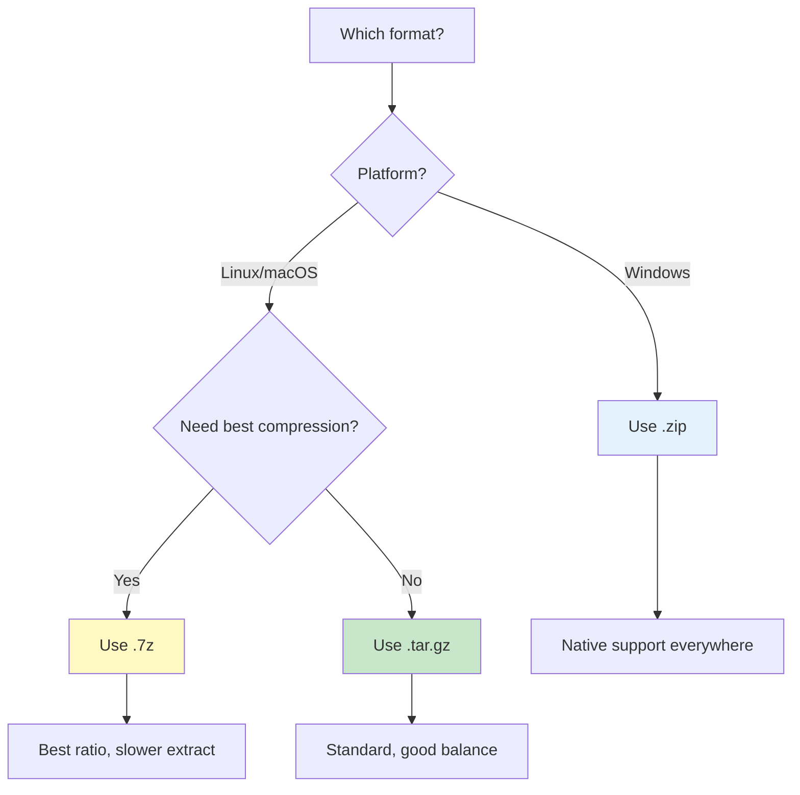

# Archive Formats


> **Supported archive formats, compression ratios, and extraction handling**

---

## Quick Decision Guide



---

## 📦 Supported Formats

| Format | Extensions | Compression | Speed | Best For |
|--------|------------|-------------|-------|----------|
| Gzip Tar | `.tar.gz`, `.tgz` | Good | Fast | Linux debug bundles |
| Zip | `.zip` | Moderate | Fast | Windows, cross-platform |
| 7-Zip | `.7z` | Best | Slow | Large datasets |
| Plain Tar | `.tar` | None | Fastest | Uncompressed archives |

---

## 📊 Compression Comparison

| Original Size | tar.gz | zip | 7z |
|---------------|--------|-----|-----|
| 1 GB logs | ~150 MB | ~180 MB | ~100 MB |
| 5 GB logs | ~750 MB | ~900 MB | ~500 MB |
| 10 GB logs | ~1.5 GB | ~1.8 GB | ~1 GB |

*Actual ratios depend on log content. Text logs compress very well.*

---

## Format Details

### Gzip Tar (`.tar.gz`)

**Most common format** for Linux debug bundles.

```bash
# Create
tar -czf debug_data.tar.gz debugdata/

# List contents
tar -tzf debug_data.tar.gz

# Extract
tar -xzf debug_data.tar.gz
```

| Aspect | Details |
|--------|---------|
| ✅ **Pros** | Standard Linux format, good compression, stream-extractable |
| ❌ **Cons** | Less common on Windows |
| 📦 **Dependency** | Built-in Python support |

### Zip (`.zip`)

**Windows-friendly** format with broad compatibility.

```bash
# Create
zip -r debug_data.zip debugdata/

# List contents
unzip -l debug_data.zip

# Extract
unzip debug_data.zip
```

| Aspect | Details |
|--------|---------|
| ✅ **Pros** | Native Windows support, random access, per-file compression |
| ❌ **Cons** | Lower compression ratio |
| 📦 **Dependency** | Built-in Python support |

### 7-Zip (`.7z`)

**Best compression** for large datasets.

```bash
# Create
7z a debug_data.7z debugdata/

# List contents
7z l debug_data.7z

# Extract
7z x debug_data.7z
```

| Aspect | Details |
|--------|---------|
| ✅ **Pros** | Highest compression, great for large files |
| ❌ **Cons** | Slower extraction, requires py7zr |
| 📦 **Dependency** | `pip install py7zr` required |

---

## ⚠️ Size Limits

| Setting | Default | Config Variable |
|---------|---------|-----------------|
| Max upload size | 2000 MB | `MAX_UPLOAD_SIZE_MB` |
| Max extraction | Unlimited | System disk space |

### Adjusting Limits

```bash
# Increase upload limit to 5 GB
export MAX_UPLOAD_SIZE_MB=5000
streamlit run istioinsight.py
```

---

## 📁 Expected Contents

### Standard Pod Logs

```
archive.tar.gz
└── debugdata/
    ├── pod-service-a-abc123-logs.log
    ├── pod-service-b-def456-logs.log
    └── pod-service-c-ghi789-logs.log
```

### With Metadata

```
archive.tar.gz
└── debugdata/
    ├── logs/
    │   ├── pod-service-a-logs.log
    │   └── pod-service-b-logs.log
    ├── config/
    │   └── service-config.yaml
    └── metadata.json
```

### Nested Archives

VKInsight automatically extracts nested archives:

```
outer.tar.gz
└── inner.tar.gz      ← Auto-extracted
    └── logs/
        └── pod-logs.log
```

---

## 🏷️ File Naming Patterns

VKInsight recognizes these patterns:

| Pattern | Example | Detection |
|---------|---------|-----------|
| `pod-*-logs.log` | `pod-nginx-abc123-logs.log` | Pod name + ID |
| `*-container-*.log` | `app-container-main.log` | Container name |
| `*.log` in `logs/` | `logs/service.log` | Any log in logs folder |
| `*_logs.log` | `nginx_logs.log` | Service logs |

### Container Detection

From filenames:
```
pod-frontend-abc123-envoy-logs.log
    ↓
Pod: frontend-abc123
Container: envoy
```

---

## 📍 Extraction Location

Archives are extracted to:

```
{temp_dir}/istioinsight_extract_{hash}/
```

| Property | Value |
|----------|-------|
| Scope | Session-scoped |
| Cleanup | Automatic on session end |
| Location | System temp directory |

---

## 🔧 Troubleshooting

| Problem | Cause | Solution |
|---------|-------|----------|
| Archive not recognized | Wrong extension | Rename to correct extension |
| Extraction fails | Corrupted file | Re-download archive |
| No logs found | Wrong structure | Check naming patterns |
| 7z not supported | Missing py7zr | `pip install py7zr` |
| Upload too large | Size limit | Increase `MAX_UPLOAD_SIZE_MB` |
| Out of disk space | Large archive | Free disk space |
| Password protected | Not supported | Remove password protection |

### Verify Archive Integrity

```bash
# tar.gz
gzip -t archive.tar.gz && echo "OK"

# zip
unzip -t archive.zip

# 7z
7z t archive.7z
```

---

## 📚 Related

- [Loading Data](loading-data.md) - Import methods
- [Configuration](../reference/configuration.md) - Size limits
- [Troubleshooting](../troubleshooting/common-issues.md) - Common issues

---

*For 7z support, install: `pip install py7zr`*

---

*Last Updated: 2026-02-20*
