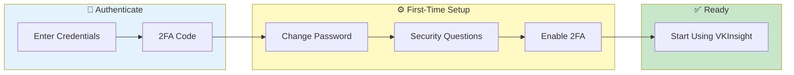

# First Login

> **Complete your initial authentication and configure account security**

---

## Login Flow

---

## 🔐 Login Process

### Step 1: Navigate to Application

Open your browser to the application URL:

| Environment | URL |
|-------------|-----|
| Local | `http://localhost:8501` |
| Production | Your organization's URL |

### Step 2: Enter Credentials

| Field | Description |
|-------|-------------|
| Username | Your assigned username |
| Password | Your password |

### Step 3: Two-Factor Authentication (If Enabled)

If 2FA is configured:

1. Open your authenticator app (Google Authenticator, Authy, etc.)
2. Enter the 6-digit code
3. Click **Verify**

---

## ⚙️ First-Time Setup

On first login, you may be prompted to:

### 1️⃣ Change Default Password

1. Enter your current (temporary) password
2. Create a new password meeting requirements:

| Requirement | Example |
|-------------|---------|
| Minimum 8 characters | `MyP@ss123` |
| At least one uppercase | `M` |
| At least one lowercase | `y` |
| At least one number | `123` |
| At least one special | `@` |

3. Confirm the new password
4. Click **Update Password**

### 2️⃣ Configure Security Questions

For password recovery:

1. Select 3 security questions
2. Provide answers (case-insensitive)
3. Store answers securely

> **Tip:** Choose questions with memorable but private answers.

### 3️⃣ Set Up 2FA (Recommended)

1. Go to **Profile** → **Security**
2. Click **Enable 2FA**
3. Scan QR code with authenticator app
4. Enter verification code
5. **Save backup codes securely** (one-time use)

---

## 🔑 Password Recovery

If you forget your password:

1. Click **Forgot Password?** on login page
2. Enter your username
3. Answer security questions
4. Create a new password

> **Note:** Recovery requires pre-configured security questions. See [Password Recovery](password-recovery.md) for details.

---

## ⏱️ Session Information

| Setting | Default | Description |
|---------|---------|-------------|
| Session timeout | 30 min | Auto-logout after inactivity |
| Remember me | 7 days | Extended session duration |
| Multi-device | Yes | Each device has separate session |

---

## 🔧 Troubleshooting Login

| Problem | Cause | Solution |
|---------|-------|----------|
| Invalid credentials | Wrong username/password | Check spelling (username is case-sensitive) |
| 2FA code rejected | Time sync issue | Ensure device time is correct |
| Account locked | Too many failed attempts | Wait 15 min or contact admin |
| Session expired | Inactivity timeout | Re-login with credentials |

### 2FA Troubleshooting

| Issue | Solution |
|-------|----------|
| Lost authenticator | Use backup code |
| No backup codes | Contact administrator |
| Code keeps failing | Sync device time |

---

## 📚 Next Steps

| Goal | Next Step |
|------|-----------|
| Configure settings | [Profile Setup](profile.md) |
| Load first logs | [Loading Data](loading-data.md) |
| Start analyzing | [Quick Start](quick-start.md) |

---

*See [Security Setup](../admin/security-setup.md) for admin configuration.*

---

*Last Updated: 2026-02-20*
