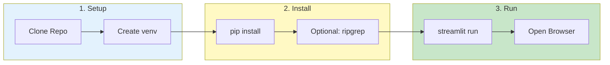

# Installation


> **Get VKInsight up and running on your system in under 15 minutes**

---

## Prerequisites Checklist

Before starting, ensure you have:

- [ ] Python 3.9+ installed (`python --version`)
- [ ] pip package manager (`pip --version`)
- [ ] 4+ GB RAM available
- [ ] 500 MB disk space
- [ ] Modern web browser (Chrome, Firefox, Edge)

---

## Installation Flow



---

## 💻 System Requirements

| Component | Minimum | Recommended | Notes |
|-----------|---------|-------------|-------|
| Python | 3.9+ | 3.11+ | 3.11 has best performance |
| RAM | 4 GB | 8+ GB | More RAM = larger datasets |
| Disk Space | 500 MB | 10+ GB | Space for log data |
| Browser | Chrome 90+ | Latest version | Firefox, Edge also supported |
| OS | Windows 10, Linux, macOS | Linux | Linux enables ripgrep optimization |

---

## 📦 Installation Steps

### Step 1: Clone the Repository

```bash
git clone https://github.com/oracle/istioinsight.git
cd istioinsight_gui
```

### Step 2: Create Virtual Environment (Recommended)

**Linux/macOS:**
```bash
python -m venv venv
source venv/bin/activate
```

**Windows:**
```bash
python -m venv venv
venv\Scripts\activate
```

### Step 3: Install Dependencies

**Full Installation** (all features):
```bash
pip install -r requirements.txt
```

**Minimal Installation** (basic features only):
```bash
pip install -r requirements-minimal.txt
```

| Installation | Features | Size |
|--------------|----------|------|
| Full | All features including AI, ML clustering | ~500 MB |
| Minimal | Core log analysis only | ~150 MB |

### Step 4: Optional Enhancements

#### Install ripgrep (6-8x faster search)

```bash
# Ubuntu/Debian
sudo apt install ripgrep

# macOS
brew install ripgrep

# Windows (via Chocolatey)
choco install ripgrep

# Windows (via Scoop)
scoop install ripgrep
```

#### Install 7z support

```bash
pip install py7zr
```

---

## 🚀 Running the Application

### Standard Launch

```bash
streamlit run istioinsight.py
```

The application opens at `http://localhost:8501`

### Custom Port

```bash
streamlit run istioinsight.py --server.port 8080
```

### Production Mode

```bash
streamlit run istioinsight.py --server.headless true
```

### With Environment Variables

```bash
# Set max upload size
export MAX_UPLOAD_SIZE_MB=5000
streamlit run istioinsight.py
```

---

## 🐳 Docker Deployment

### Quick Start

```bash
docker-compose up -d
```

### Custom Build

```bash
docker build -t vkinsight:latest .
docker run -d -p 8501:8501 --name vkinsight vkinsight:latest
```

### With Volume Mount

```bash
docker run -d \
  -p 8501:8501 \
  -v /path/to/logs:/app/data:ro \
  --name vkinsight \
  vkinsight:latest
```

See [Deployment Guide](../../deploy/README.md) for production deployment.

---

## ✅ Verify Installation

1. Open browser to `http://localhost:8501`
2. You should see the login page
3. Use default credentials (contact admin) or create account

### Verification Checklist

| Check | Expected Result |
|-------|-----------------|
| Browser loads | Login page visible |
| Version shown | v2.6.x in footer |
| No console errors | Browser dev tools clean |

---

## 🔧 Troubleshooting

| Problem | Cause | Solution |
|---------|-------|----------|
| `python: command not found` | Python not installed | Install Python 3.9+ |
| `pip: command not found` | pip not in PATH | Run `python -m pip` instead |
| `ModuleNotFoundError` | Missing dependencies | Run `pip install -r requirements.txt` |
| Port 8501 in use | Another app using port | Use `--server.port 8080` |
| `streamlit: command not found` | Streamlit not installed | Run `pip install streamlit` |
| Browser won't connect | Firewall blocking | Allow port 8501 in firewall |
| Slow startup | Large requirements | Use minimal installation |
| Memory error | Insufficient RAM | Close other apps, increase RAM |

### Check Installation

```bash
# Verify Python version
python --version  # Should be 3.9+

# Verify Streamlit
streamlit --version  # Should be 1.28+

# Verify key packages
python -c "import pandas, duckdb, streamlit; print('OK')"
```

### Reset Installation

```bash
# Remove and recreate venv
deactivate
rm -rf venv
python -m venv venv
source venv/bin/activate  # or venv\Scripts\activate on Windows
pip install -r requirements.txt
```

---

## 📚 Next Steps

| Goal | Next Step |
|------|-----------|
| First time setup | [First Login](first-login.md) |
| Load your logs | [Loading Data](loading-data.md) |
| Start analyzing | [Quick Start](quick-start.md) |
| Deploy to team | [Deployment Guide](../../deploy/README.md) |

---

*See [Troubleshooting](../troubleshooting/common-issues.md) for more help.*

---

*Last Updated: 2026-02-20*
