# Loading Data


> **Import Kubernetes pod logs into VKInsight for analysis**

---

## Data Loading Architecture

```mermaid
flowchart TB
    subgraph Sources["📥 Data Sources"]
        Local[("📁 Local Directory<br/><i>Development, Local Files</i>")]
        Archive[("📦 Archive Upload<br/><i>.tar.gz, .zip, .7z</i>")]
        ISDE[("🔐 ISDE Fetcher<br/><i>Oracle Debug Data</i>")]
        Server[("🖥️ Server Browser<br/><i>SSH/SFTP Access</i>")]
    end

    subgraph Processing["⚙️ VKInsight Processing"]
        Extract[Extract & Decompress]
        Parse[Parse Pod Logs]
        Index[Build DuckDB Index]
    end

    subgraph Ready["✅ Ready for Analysis"]
        Dashboard[📊 Dashboard]
        Search[🔍 Search]
        Analytics[📈 Analytics]
    end

    Local --> Extract
    Archive --> Extract
    ISDE --> Extract
    Server --> Extract

    Extract --> Parse
    Parse --> Index
    Index --> Dashboard
    Index --> Search
    Index --> Analytics

    style Sources fill:#e3f2fd
    style Processing fill:#fff8e1
    style Ready fill:#e8f5e9
```



---

## 🎯 Quick Decision Guide

| Method | Best For | Speed | Requirements |
|--------|----------|-------|--------------|
| 📁 **Local Directory** | Development, local files | ⚡ Fastest | Filesystem access |
| 📦 **Archive Upload** | Debug bundles, exports | 🚀 Fast | `.tar.gz`, `.zip`, `.7z` |
| 🔐 **ISDE Fetcher** | Oracle SRs | 🐢 Depends on network | VPN, SSH credentials |
| 🖥️ **Server Browser** | Remote servers | 🐢 Depends on network | SSH/SFTP access |

---

## 📁 Method 1: Local Directory

### Steps

1. **Select Data Source**: Choose "Local Directory" in sidebar
2. **Enter Path**: Type or browse to directory
   ```
   Example: D:/logs/debugdata/
   ```
3. **Click "Load Data"**

### Expected Structure

```
debugdata/
├── pod-service-a-abc123-logs.log
├── pod-service-b-def456-logs.log
├── pod-service-c-ghi789-logs.log
└── ...
```

### File Naming Patterns

VKInsight recognizes pod logs by pattern:

| Pattern | Example |
|---------|---------|
| `pod-*-logs.log` | `pod-nginx-abc123-logs.log` |
| `*-container-*.log` | `app-container-main.log` |
| Custom patterns | Configurable in settings |

---

## 📦 Method 2: Archive Upload

### Supported Formats

| Format | Extension | Compression | Notes |
|--------|-----------|-------------|-------|
| Gzip Tar | `.tar.gz`, `.tgz` | Good | Most common |
| Zip | `.zip` | Moderate | Windows-friendly |
| 7-Zip | `.7z` | Best | Requires py7zr |

### Steps

1. **Select "Upload Archive"** in sidebar
2. **Drop or select file** (max 2GB default)
3. **Wait for extraction** (progress shown)
4. **Data loads automatically**

### Archive Structure

```
debugdata.tar.gz
└── debugdata/
    ├── pod-logs/
    │   ├── service-a.log
    │   └── service-b.log
    └── metadata/
```

---

## 🔐 Method 3: ISDE Fetcher (Oracle)

For Oracle internal debug data:

1. **Go to ISDE Fetcher tab**
2. **Enter SR number**
3. **Provide SSH credentials**
4. **Select files to fetch**
5. **Download and load**

See [ISDE Fetcher](../enterprise/isde-fetcher.md) for details.

---

## 🖥️ Method 4: Server Browser

For remote server access:

1. **Go to Server Browser tab**
2. **Connect via SSH/SFTP**
3. **Navigate to log directory**
4. **Select and download files**

See [Server Browser](../enterprise/server-browser.md) for details.

---

## ✅ After Loading

Once data loads successfully:

### Data Summary

| Metric | Description |
|--------|-------------|
| **Pods Found** | Number of pod log files |
| **Total Lines** | Combined line count |
| **Time Range** | Earliest to latest timestamp |
| **Services** | Detected service names |

### Next Steps

1. **Dashboard Tab** → View overview metrics
2. **Log Inspector Tab** → Start searching
3. **Apply Filters** → Narrow by time, service, level

---

## ⚡ Performance Tips

| Tip | Impact | How |
|-----|--------|-----|
| Use time filters first | 70% faster | Reduces data loaded |
| Limit to relevant pods | 50% faster | Select specific services |
| Clear old data | Free memory | Click "Clear All Data" |
| Use ripgrep (Linux) | 6-8x faster | Install ripgrep package |
| Use DuckDB filtering | 20-35x faster | Auto-enabled |

---

## 🔧 Troubleshooting

| Problem | Cause | Solution |
|---------|-------|----------|
| No pods found | Wrong directory | Check for `*-logs.log` files |
| Loading is slow | Large dataset | Use time filters |
| Out of memory | Too much data | Reduce pods or time range |
| Parse errors | Invalid log format | Check file encoding (UTF-8) |
| Upload fails | File too large | Increase `MAX_UPLOAD_SIZE_MB` |

### Loading Progress

| Stage | Description |
|-------|-------------|
| Extracting | Decompressing archive |
| Parsing | Reading log files |
| Indexing | Building DuckDB index |
| Ready | Analysis available |

---

## 📚 Next Steps

| Goal | Next Step |
|------|-----------|
| Explore logs | [Log Viewing](../core-features/log-viewing.md) |
| Find issues | [Search & Filtering](../core-features/search-filtering.md) |
| Understand formats | [Archive Formats](archive-formats.md) |

---

*See [Archive Formats](archive-formats.md) for detailed format information.*

---

*Last Updated: 2026-02-20*
