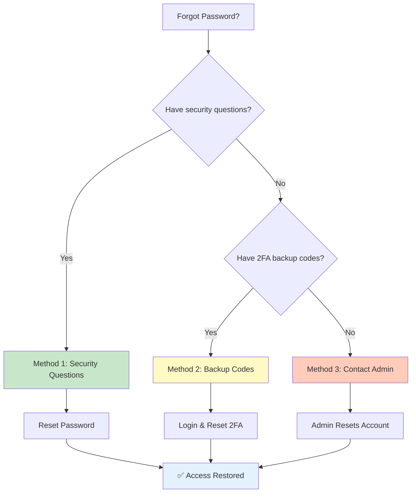

# Password Recovery

> **Reset your password using self-service recovery options**

---

## Recovery Decision Guide

---

## 🔑 Recovery Methods

| Method | Requirements | Time | Availability |
|--------|--------------|------|--------------|
| 🔐 Security Questions | Pre-configured questions | 2 min | Always |
| 📱 Backup Codes | 2FA backup codes | 1 min | If 2FA enabled |
| 👨‍💼 Admin Reset | Administrator action | Varies | Contact admin |

---

## 🔐 Method 1: Security Questions

### Prerequisites

You must have configured security questions in your profile.

### Steps

**1️⃣ Go to Login Page**
- Click **Forgot Password?**

**2️⃣ Enter Username**
- Type your username
- Click **Continue**

**3️⃣ Answer Questions**
- Answer 3 security questions correctly
- Answers are case-insensitive

**4️⃣ Create New Password**
- Enter new password (twice)
- Meet password requirements
- Click **Reset Password**

**5️⃣ Login**
- Use new password immediately

---

## 📱 Method 2: Backup Codes (2FA Users)

If you have 2FA enabled and have backup codes:

1. Go to login page
2. Enter username and password
3. On 2FA screen, click **Use Backup Code**
4. Enter one of your backup codes
5. Access your account
6. Go to **Profile** → **Security** to reset 2FA

> **Note:** Each backup code works only once. Generate new codes after use.

---

## 👨‍💼 Method 3: Admin Reset

If self-service recovery is unavailable:

| Step | Action |
|------|--------|
| 1 | Contact your system administrator |
| 2 | Verify your identity (email, employee ID) |
| 3 | Admin initiates password reset |
| 4 | You receive temporary password |
| 5 | Change password on first login |

---

## 🔧 Troubleshooting

| Problem | Cause | Solution |
|---------|-------|----------|
| Forgot security answers | No self-service | Contact admin for reset |
| No backup codes | 2FA without backup | Contact admin to reset 2FA |
| Account locked | Too many attempts | Wait 15 min or contact admin |
| Username forgotten | N/A | Contact admin with email |

### Account Lockout

| Attempt | Result |
|---------|--------|
| 1-4 | Normal retry |
| 5 | Warning shown |
| 6+ | Account locked 15 minutes |

---

## 🛡️ Security Notes

### Rate Limiting

Password recovery is rate-limited for security:

| Limit | Value |
|-------|-------|
| Attempts per hour | 5 maximum |
| Lockout duration | 15 minutes |
| Response timing | Constant (prevents enumeration) |

### Audit Trail

All recovery attempts are logged:

| Logged Data | Purpose |
|-------------|---------|
| Timestamp | When attempt occurred |
| IP address | Source of request |
| Success/failure | Outcome |
| Admin visibility | Security monitoring |

### Best Practices

| Practice | Why |
|----------|-----|
| Choose memorable answers | Avoid getting locked out |
| Don't use public info | Prevent social engineering |
| Store backup codes | In password manager |
| Update recovery info | Keep questions current |
| Enable 2FA | Additional security layer |

---

## ⚙️ Setting Up Recovery

To enable password recovery for your account:

### Security Questions

1. Go to **Profile** → **Recovery**
2. Select 3 questions
3. Provide answers
4. Save changes

### Backup Codes

1. Enable 2FA first
2. Save the 10 backup codes shown
3. Store in secure location

---

## 📚 Related

- [First Login](first-login.md) - Initial authentication
- [Profile Setup](profile.md) - Configure security questions
- [Security Setup](../admin/security-setup.md) - Admin configuration

---

*Recovery attempts are monitored for security purposes.*

---

*Last Updated: 2026-02-20*
