# Profile Setup

> **Configure your personal settings, security options, and preferences**

---

## Profile Sections

```mermaid
flowchart LR
    subgraph Identity["👤 Identity"]
        A[User Info]
        B[Password]
    end

    subgraph Security["🔐 Security"]
        C[2FA]
        D[Questions]
        E[Sessions]
    end

    subgraph Prefs["⚙️ Preferences"]
        F[Display]
        G[Log Viewer]
        H[AI Settings]
    end

    A --> B --> C --> D --> E --> F --> G --> H

    style Identity fill:#e3f2fd
    style Security fill:#ffccbc
    style Prefs fill:#c8e6c9
```

---

## 🚀 Accessing Profile

1. Click your **username** in the sidebar
2. Select **Profile** from dropdown
3. Or navigate directly to Profile page

---

## 👤 User Information

### View Account Details

| Field | Description | Editable |
|-------|-------------|----------|
| Username | Your login identifier | Admin only |
| Email | Contact email | ✅ Yes |
| Role | User, Admin, or Viewer | Admin only |
| Created | Account creation date | No |
| Last Login | Most recent login time | No |

### Update Information

1. Click **Edit** next to the field
2. Enter new value
3. Click **Save**

> **Note:** Username changes require admin approval.

---

## 🔑 Password Management

### Change Password

1. Go to **Profile** → **Security**
2. Click **Change Password**
3. Enter current password
4. Enter new password (twice)
5. Click **Update**

### Password Requirements

| Requirement | Status |
|-------------|--------|
| Minimum 8 characters | Required |
| One uppercase letter | Required |
| One lowercase letter | Required |
| One number | Required |
| One special character | Required |

### Password Expiry

| Setting | Value |
|---------|-------|
| Expiry warning | 7 days before |
| Grace period | Configurable |
| Extension | Admin can grant |

---

## 🔐 Two-Factor Authentication

### Enable 2FA

1. Go to **Profile** → **Security**
2. Click **Enable 2FA**
3. Scan QR code with authenticator app:
   - Google Authenticator
   - Authy
   - Microsoft Authenticator
4. Enter verification code
5. **Save backup codes securely**

### Backup Codes

| Property | Value |
|----------|-------|
| Codes provided | 10 |
| Usage | One-time each |
| Storage | Password manager recommended |
| Regeneration | Available in settings |

### Disable 2FA

1. Go to **Profile** → **Security**
2. Click **Disable 2FA**
3. Enter current password
4. Confirm action

> **Warning:** Disabling 2FA reduces account security.

---

## ❓ Security Questions

### Set Up Recovery Questions

1. Go to **Profile** → **Recovery**
2. Select 3 questions from the list
3. Provide answers
4. Click **Save**

### Available Questions

| Category | Example |
|----------|---------|
| Personal | What is your mother's maiden name? |
| Childhood | What was your first pet's name? |
| Location | What city were you born in? |
| Preferences | What is your favorite book? |

> **Tip:** Answers are case-insensitive.

---

## ⚙️ Preferences

### 🎨 Display Settings

| Setting | Options | Description |
|---------|---------|-------------|
| Theme | Light, Dark, Auto | UI color scheme |
| Timezone | Any TZ | Time display zone |
| Date Format | MM/DD, DD/MM, ISO | Date formatting |

### 📄 Log Viewer Settings

| Setting | Range | Description |
|---------|-------|-------------|
| Lines per page | 50-500 | Pagination size |
| Font size | 10-20px | Log text size |
| JSON indent | 2, 4 | JSON formatting |
| Word wrap | On/Off | Line wrapping |

### 🎯 Default Filters

Configure default filter behavior:

| Filter | Options |
|--------|---------|
| Default time range | Last 1h, 6h, 24h, 7d |
| Default log level | All, ERROR+WARN, ERROR only |
| Default services | All or specific list |

---

## 📱 Session Management

### View Active Sessions

1. Go to **Profile** → **Sessions**
2. View list of active sessions
3. See device/browser info
4. Terminate sessions if needed

| Column | Description |
|--------|-------------|
| Device | Browser/OS info |
| IP Address | Session origin |
| Last Active | Recent activity |
| Started | Session start time |

### End Other Sessions

For security, you can:
1. Click **End All Other Sessions**
2. Only current session remains active
3. Other devices will need to re-login

---

## 🤖 AI Settings

### Configure OCA API Key

1. Go to **Profile** → **AI Settings**
2. Enter your OCA API key
3. Key is encrypted and stored securely
4. Test connection

### Privacy Options

| Option | Description |
|--------|-------------|
| Enable AI logging | Log analysis requests |
| Context sharing | Share log context with AI |
| Model preference | Default AI model |

---

## 📤 Export Data

### Download Your Data

1. Go to **Profile** → **Data**
2. Click **Export My Data**
3. Download includes:

| Data | Included |
|------|----------|
| Bookmarks | ✅ Yes |
| Saved searches | ✅ Yes |
| Preferences | ✅ Yes |
| Session history | ✅ Yes |

---

## 📚 Related

- [Security Setup](../admin/security-setup.md) - Admin security config
- [Password Recovery](password-recovery.md) - Reset password
- [First Login](first-login.md) - Initial setup

---

*Settings are saved automatically and persist across sessions.*

---

*Last Updated: 2026-02-20*
