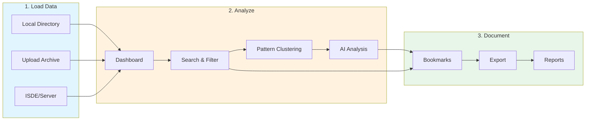

# Quick Start

> **Get analyzing logs in 15 minutes - from zero to insights**

---

## Application Workflow

**The typical flow:** Load your data → Use Dashboard for overview → Search for issues → Cluster patterns → Get AI insights → Bookmark findings → Export results.

---

## 📋 Prerequisites

Before starting, ensure you have:

- [ ] VKInsight installed and running ([Installation](installation.md))
- [ ] Login credentials from your administrator
- [ ] Log data to analyze (local files or archive)

---

## Overview

| Step | Task | Time |
|------|------|------|
| 1 | Login | 2 min |
| 2 | Load Log Data | 3 min |
| 3 | Dashboard Overview | 2 min |
| 4 | Search for Issues | 3 min |
| 5 | Investigate a Finding | 3 min |
| 6 | Export Results | 2 min |
| **Total** | **Complete Guide** | **15 min** |

---

## 1️⃣ Step 1: Login (2 minutes)

1. Open VKInsight in your browser
2. Enter your credentials
3. Complete 2FA if enabled
4. You'll land on the **Log Inspector** page

**First time?** Default credentials are provided by your administrator.

---

## 2️⃣ Step 2: Load Log Data (3 minutes)

### Option A: Local Directory

1. In the sidebar, click **Browse Local**
2. Navigate to your log directory
3. Select the folder containing pod logs
4. Click **Load**

### Option B: Upload Archive

1. Click **Upload Archive** in sidebar
2. Drag & drop your `.tar.gz`, `.zip`, or `.7z` file
3. Wait for extraction
4. Logs appear automatically

### What You'll See

After loading:

| Indicator | Shows |
|-----------|-------|
| Pod count | Number of log files loaded |
| Total lines | Combined line count |
| Time range | Earliest to latest timestamp |

---

## 3️⃣ Step 3: Dashboard Overview (2 minutes)

Click the **Dashboard** tab to see:

| Section | What It Shows |
|---------|---------------|
| Pod Summary | Total pods, lines, time span |
| Log Levels | ERROR, WARN, INFO distribution |
| Error Breakdown | Top error types |
| Timeline | Activity over time |

**Quick Actions:**
- Click any error count → filter to those errors
- Click a pod name → drill down
- Use time scrubber → narrow range

---

## 4️⃣ Step 4: Search for Issues (3 minutes)

### Quick Search

1. Click the **Log Inspector** tab
2. Type in the search box: `ERROR`
3. Press **Enter**
4. Results highlight in the viewer

### Add Filters

Layer multiple filters:

| Filter | Example |
|--------|---------|
| Search | `timeout` |
| Exclude | `DEBUG` |
| Time | Last 1 hour |
| Log Level | ERROR, WARN |

### Cross-Pod Search

Find issues across all pods:

1. Enter search pattern
2. Toggle **Cross-Pod** mode
3. Results show matches from all pods
4. Timeline shows when/where matches occurred

---

## 5️⃣ Step 5: Investigate a Finding (3 minutes)

### Drill Down

1. Click any log line
2. See context (lines before/after)
3. View JSON details (if applicable)

### Use AI Analysis

1. Select interesting log lines
2. Click **AI Analyst** tab
3. Choose analysis type:

| Type | Question Answered |
|------|-------------------|
| **Root Cause** | Why did this happen? |
| **Incident Response** | What should I do? |
| **Error Summary** | What errors exist? |

4. Review AI insights

### Bookmark Important Lines

1. Click the ⭐ star on any line
2. Line is saved to bookmarks
3. Access via **Bookmarks** panel

---

## 6️⃣ Step 6: Export Results (2 minutes)

### Export Filtered Logs

1. Apply your filters
2. Click **Export** button
3. Choose format:

| Format | Best For |
|--------|----------|
| **Text** | Simple sharing |
| **JSON** | Structured data |
| **CSV** | Spreadsheet analysis |

4. Download file

### Share Findings

Export options include:
- Current view only
- All filtered results
- With/without metadata

---

## 🎯 What's Next?

Now that you've completed the basics:

| Goal | Next Step |
|------|-----------|
| Deep investigation | [Incident Investigation](../workflows/incident-investigation.md) |
| Daily monitoring | [Daily Analysis Workflow](../workflows/daily-analysis.md) |
| Learn all features | [Core Features](../core-features/log-viewing.md) |
| Advanced analysis | [Pattern Clustering](../advanced/pattern-clustering.md) |

---

## ⌨️ Quick Reference

### Essential Shortcuts

| Action | How |
|--------|-----|
| Search | Type in search box + Enter |
| Clear filters | Click **Clear All** |
| Time filter | Use time picker or scrubber |
| Drill down | Click any log line |
| Bookmark | Click ⭐ star icon |

### Common Tasks

| Task | Where |
|------|-------|
| See all errors | Dashboard → Error count |
| Find specific text | Log Inspector → Search |
| Analyze patterns | Pattern Analysis tab |
| Get AI help | AI Analyst tab |
| Export data | Export button |

---

## 🔧 Troubleshooting

| Problem | Solution |
|---------|----------|
| No logs showing | Check sidebar for loaded data, clear filters |
| Search too slow | Narrow time range, use specific patterns |
| Can't find errors | Check log level filter includes ERROR |
| Export empty | Ensure filters match some data |

---

## ✅ Summary

In 15 minutes you've learned to:

- [x] Load log data
- [x] Navigate the dashboard
- [x] Search and filter logs
- [x] Investigate findings
- [x] Export results

**You're ready to analyze logs!**

---

## 📚 Related

- [Loading Data](loading-data.md) - All data loading methods
- [Search & Filtering](../core-features/search-filtering.md) - Advanced search
- [AI Analysis](../advanced/ai-analysis.md) - Intelligent insights

---

*This quick start covers the essentials. Explore the full documentation for advanced features.*

---

*Last Updated: 2026-02-20*
