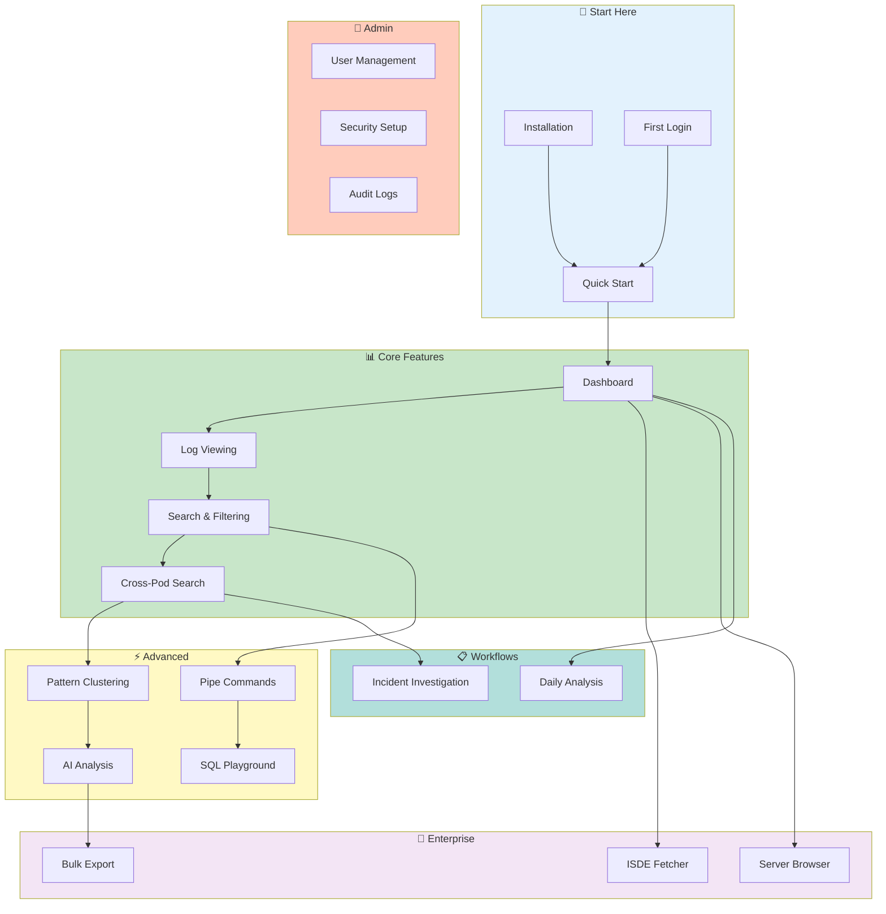

# 📚 VKInsight User Guide

> **Your complete guide to mastering Kubernetes log analysis with VKInsight**

---

## 💡 What You'll Learn

| Challenge | This Guide Teaches You |
|-----------|----------------------|
| Drowning in logs from 50+ pods | **Cross-Pod Search** - Query all pods in seconds |
| "Which pod had that error?" | **Pattern Clustering** - Auto-group similar errors |
| Slow incident response | **AI Analysis** - Get root cause in minutes |
| Can't share findings | **Bookmarks & Export** - Document everything |
| Repetitive log noise | **Smart Squash** - Collapse 100 identical lines into one |
| Need SQL on logs | **DuckDB Integration** - 20-35x faster queries |

**Time to First Analysis:** 10 minutes | **Time to Master:** 4-6 hours

---

## 🎯 Start Based on Your Role

| Role | Start Here | Time |
|------|-----------|------|
| **SRE / On-Call** | [Incident Investigation](workflows/incident-investigation.md) | 15 min |
| **Platform Engineer** | [Quick Start](getting-started/quick-start.md) → [Admin Setup](admin/dashboard.md) | 30 min |
| **DevOps** | [Installation](getting-started/installation.md) → [Deployment](../architecture/core/DEPLOYMENT_SCENARIOS.md) | 45 min |
| **Data Analyst** | [SQL Playground](advanced/sql-playground.md) + [Pipe Commands](advanced/pipe-commands.md) | 20 min |

> **New to VKInsight?** Start with the [Quick Start Guide](getting-started/quick-start.md) - you'll be analyzing logs in 10 minutes.

---

## ⚡ Key Capabilities

| Feature | What It Does | Learn More |
|---------|-------------|-----------|
| 🔍 **Cross-Pod Search** | Search all pods simultaneously with DuckDB speed | [Guide](core-features/cross-pod-search.md) |
| 🤖 **AI Analysis** | Intelligent root cause detection with OCA/Ollama | [Guide](advanced/ai-analysis.md) |
| 📊 **Pattern Clustering** | Auto-group similar log messages using Drain3 | [Guide](advanced/pattern-clustering.md) |
| ⭐ **Bookmarks** | Save important findings with pod context | [Guide](core-features/bookmarks.md) |
| 🔧 **Pipe Commands** | Unix-style processing (grep, awk, jq, stats) | [Guide](advanced/pipe-commands.md) |
| 📈 **SQL Playground** | Query logs with DuckDB SQL | [Guide](advanced/sql-playground.md) |
| 🔄 **Smart Squash** | Collapse repetitive lines with time tracking | [Guide](core-features/smart-squash.md) |
| 🌐 **Trace Visualization** | Service-to-service request flow diagrams | [Guide](advanced/trace-visualization.md) |

---

## 🗺️ Documentation Map

📱 Text version (for mobile/accessibility)

**Learning Path:**
1. **Start Here** → Quick Start, Installation, First Login
2. **Core Features** → Dashboard, Log Viewing, Search, Cross-Pod Search
3. **Advanced** → Pattern Clustering, AI Analysis, Pipe Commands, SQL
4. **Enterprise** → ISDE Fetcher, Server Browser, Bulk Export
5. **Admin** → User Management, Security Setup, Audit Logs
6. **Workflows** → Incident Investigation, Daily Analysis

**Learning Path:** Start with Quick Start → Explore Core Features → Master Advanced capabilities → Use Enterprise features in production.

---

## 📖 Quick Navigation

### 🚀 Getting Started (5 guides)
New to VKInsight? Start here:
- [Quick Start](getting-started/quick-start.md) - Get analyzing in 15 minutes
- [Installation](getting-started/installation.md) - System requirements and setup
- [First Login](getting-started/first-login.md) - Authentication and initial configuration
- [Loading Data](getting-started/loading-data.md) - Import logs from various sources
- [Profile Setup](getting-started/profile.md) - Configure your preferences

### 📊 Core Features (12 guides)
Essential log analysis capabilities:
- [Dashboard](core-features/dashboard.md) - Overview metrics and KPIs
- [Pod Analytics](core-features/pod-analytics.md) - Application and Istio log analysis
- [Log Viewing](core-features/log-viewing.md) - Browse and inspect logs
- [Search & Filtering](core-features/search-filtering.md) - Find what you need
- [Cross-Pod Search](core-features/cross-pod-search.md) - Search across all pods
- [Single Pod View](core-features/single-pod-view.md) - Focused pod analysis
- [Time Navigation](core-features/time-navigation.md) - Filter by time range
- [Smart Squash](core-features/smart-squash.md) - Collapse repetitive lines
- [Bookmarks](core-features/bookmarks.md) - Save important findings
- [Pod Overlap](core-features/pod-overlap.md) - Time coverage analysis
- [Log Availability](core-features/log-availability.md) - Data completeness
- [Multi-Container](core-features/multi-container.md) - Envoy sidecar support

### ⚡ Advanced Features (7 guides)
Power user capabilities:
- [Pattern Clustering](advanced/pattern-clustering.md) - Auto-group similar logs
- [AI Analysis](advanced/ai-analysis.md) - Intelligent log insights
- [Pipe Commands](advanced/pipe-commands.md) - Unix-style processing
- [JSON Workbench](advanced/json-workbench.md) - JSON viewing and diff
- [SQL Playground](advanced/sql-playground.md) - Query with DuckDB
- [Network Graph](advanced/network-graph.md) - Visualize service connections
- [Trace Visualization](advanced/trace-visualization.md) - Request flow diagrams

### 🏢 Enterprise Features (5 guides)
Production deployment capabilities:
- [ISDE Fetcher](enterprise/isde-fetcher.md) - Fetch Oracle debug data
- [Server Browser](enterprise/server-browser.md) - Remote file access
- [Resource Inspector](enterprise/resource-inspector.md) - Kubernetes resource analysis
- [Bulk Export](enterprise/bulk-export.md) - Export filtered logs
- [Bulk Export Viewer](enterprise/bulk-export-viewer.md) - View export configurations

### 📋 Workflows (2 guides)
Step-by-step guides for common tasks:
- [Incident Investigation](workflows/incident-investigation.md) - P1 response playbook
- [Daily Analysis](workflows/daily-analysis.md) - SRE morning routine

### 🔐 Administration (4 guides)
For system administrators:
- [Admin Dashboard](admin/dashboard.md) - System health overview
- [User Management](admin/user-management.md) - Manage users and roles
- [Security Setup](admin/security-setup.md) - 2FA and backup codes
- [Audit Logs](admin/audit-logs.md) - Track user activities

### 📖 Reference (7 guides)
Quick lookup:
- [Feature Selection Guide](reference/feature-selection-guide.md) - Which tool to use
- [Keyboard Shortcuts](reference/keyboard-shortcuts.md) - Speed up your workflow
- [Pipe Commands](reference/pipe-command-ref.md) - grep, awk, jq syntax
- [Configuration](reference/configuration.md) - App settings
- [Quick Filters](reference/quick-filters.md) - Pre-configured patterns
- [Error Messages](reference/error-messages.md) - Troubleshoot errors
- [Service Mapping](reference/service-mapping.md) - Pod-to-service mapping

### 🗓️ Roadmap (1 guide)
Planned enhancements:
- [Bookmarks Roadmap](roadmap/bookmarks-roadmap.md) - Bookmark feature enhancements

### 🔧 Troubleshooting (2 guides)
Problem solving:
- [Common Issues](troubleshooting/common-issues.md) - Frequent problems and solutions
- [Performance](troubleshooting/performance.md) - Optimization tips

---

## 📊 Document Structure

| Section | Purpose | Audience | Guides |
|---------|---------|----------|--------|
| Getting Started | Installation, first steps | New users | 5 |
| Core Features | Daily usage patterns | All users | 12 |
| Advanced | Power features | Experienced users | 7 |
| Enterprise | Production deployment | DevOps, SREs | 5 |
| Workflows | Step-by-step guides | SREs, DevOps | 2 |
| Admin | System administration | Administrators | 4 |
| Reference | Quick lookup | All users | 7 |
| Roadmap | Planned features | All users | 1 |
| Troubleshooting | Problem solving | All users | 2 |

---

## 🆘 Getting Help

| Need | Where to Go |
|------|-------------|
| Found a bug? | [GitHub Issues](https://github.com/anthropics/vkinsight/issues) |
| Feature request? | [Enhancement Roadmap](../ENHANCEMENT_ROADMAP.md) |
| Performance issues? | [Performance Troubleshooting](troubleshooting/performance.md) |
| Common problems? | [Common Issues](troubleshooting/common-issues.md) |
| Documentation feedback? | Contact: vivek.f.kumar@oracle.com |

---

## 📚 Related Documentation

### Project Documentation
- [README.md](../../README.md) - Project overview and quick start
- [Architecture](../architecture/README.md) - System design
- [Deployment Scenarios](../architecture/core/DEPLOYMENT_SCENARIOS.md) - Deployment options
- [Security](../SECURITY.md) - Security practices
- [Changelog](../../CHANGELOG.md) - Version history

### Enterprise Documentation
- [SLA](../SLA.md) - Service level agreements
- [Backup & Recovery](../BACKUP_RECOVERY.md) - Disaster recovery procedures
- [Compliance](../COMPLIANCE.md) - SOC2, GDPR, HIPAA mappings
- [API Integration](../API_INTEGRATION.md) - External integrations

### Quick Reference
- [FAQ](../FAQ.md) - Frequently asked questions
- [Glossary](../GLOSSARY.md) - Term definitions

---

## 📋 Documentation Info

| Attribute | Value |
|-----------|-------|
| **Version** | 2.6.2 |
| **Total Pages** | 48+ |
| **Last Updated** | 2026-02-20 |
| **Compatibility** | Python 3.11+, Streamlit 1.51+ |

*For the single-file version, see [USER_GUIDE.md](../USER_GUIDE.md) (PDF-friendly)*

---

*Last Updated: 2026-02-20*
