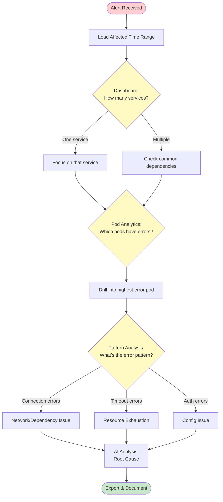

# Incident Investigation Workflow


> **Step-by-step guide for investigating production incidents - triage, scope, root cause, and documentation**

---

## Investigation Flow

```mermaid
flowchart LR
    subgraph Phase1["Phase 1: Triage<br/>5 min"]
        T1[Load Data]
        T2[Check Dashboard]
        T3[Note Severity]
    end

    subgraph Phase2["Phase 2: Scope<br/>5 min"]
        S1[Set Time Range]
        S2[Filter Errors]
        S3[Identify Service]
    end

    subgraph Phase3["Phase 3: Deep Dive<br/>10 min"]
        D1[Single Pod View]
        D2[Cross-Pod Search]
        D3[Pattern Clustering]
        D4[AI Analysis]
    end

    subgraph Phase4["Phase 4: Document<br/>5 min"]
        Doc1[Bookmark Evidence]
        Doc2[Timeline]
        Doc3[Action Items]
    end

    subgraph Phase5["Phase 5: Export<br/>5 min"]
        E1[Export Logs]
        E2[Create Report]
        E3[Share Findings]
    end

    T1 --> T2 --> T3 --> S1
    S1 --> S2 --> S3 --> D1
    D1 --> D2 --> D3 --> D4
    D4 --> Doc1 --> Doc2 --> Doc3
    Doc3 --> E1 --> E2 --> E3

    style Phase1 fill:#ffcdd2
    style Phase2 fill:#fff9c4
    style Phase3 fill:#c8e6c9
    style Phase4 fill:#bbdefb
    style Phase5 fill:#e1bee7
```



---

## Overview

This playbook covers:
1. Initial triage
2. Narrowing the scope
3. Finding root cause
4. Documenting findings
5. Exporting for reports

**Time to complete:** 15-30 minutes depending on complexity

---

## Scenario

You receive an alert:
> **P1 Alert:** Payment service errors spike at 14:30 UTC

Let's investigate.

---

## Phase 1: Initial Triage (5 minutes)

### Step 1.1: Load Recent Data

1. Open VKInsight
2. Load logs from the affected time period
3. Ensure you have:
   - Payment service pods
   - Related services (order, gateway)
   - Istio proxy logs

### Step 1.2: Dashboard Assessment

Go to **Dashboard** tab:

| Check | What to Look For |
|-------|------------------|
| Error count | Spike around 14:30? |
| Affected pods | Which pods have errors? |
| Time distribution | When did it start/peak/end? |

**Actions:**
- Note the affected services
- Identify the error spike window
- Check if isolated or widespread

### Step 1.3: Quick Severity Assessment

Count affected components:
- **1 pod** → Likely pod-specific issue
- **Multiple pods, 1 service** → Service issue
- **Multiple services** → Infrastructure or dependency issue

---

## Phase 2: Narrow the Scope (5 minutes)

### Step 2.1: Set Time Range

1. Open **Time Navigation**
2. Set range: 5 minutes before alert to 30 minutes after
   - Start: `14:25:00`
   - End: `15:00:00`
3. Apply filter

**Why?** DuckDB time filtering is 20-35x faster.

### Step 2.2: Filter to Errors

1. In **Log Inspector**
2. Set **Log Level** filter: ERROR, WARN
3. Or search for: `ERROR|WARN`

### Step 2.3: Identify the Service

Use **Pod Analytics** tab:
1. Set filter to **Application Only**
2. Check **Show Errors** filter
3. View **Volume vs Error** chart
4. Identify the pod with highest error count

---

## Phase 3: Deep Investigation (10 minutes)

### Step 3.1: Single Pod Analysis

1. Click the problem pod in the list
2. Switch to **Log Inspector** tab
3. Pod is now filtered
4. Review error messages

**Look for:**
- First error occurrence
- Error message patterns
- Stack traces
- Upstream service calls

### Step 3.2: Cross-Pod Search

Search for the error pattern across all pods:

1. Enable **Cross-Pod** mode
2. Enter the error message pattern
3. Example: `Connection refused|timeout`
4. View timeline of matches

**Questions to answer:**
- Did other services see the same error?
- Did the error propagate?
- What was the sequence?

### Step 3.3: Find the Root Cause

Use **Pattern Clustering**:

1. Go to **Pattern Analysis** tab
2. Click **Run Analysis**
3. Sort by count
4. Identify top error patterns

**Common patterns:**
- Connection errors → Network/dependency issue
- Timeout errors → Slow dependency or resource exhaustion
- OOM errors → Memory issue
- Authentication errors → Config or credential issue

### Step 3.4: AI-Assisted Analysis

1. Select the key error lines (10-50 lines)
2. Go to **AI Analyst** tab
3. Choose **Root Cause Analysis**
4. Review AI insights:
   - Identified cause
   - Evidence
   - Suggested actions

---

## Phase 4: Document Findings (5 minutes)

### Step 4.1: Bookmark Key Evidence

For each important finding:
1. Click ⭐ on the log line
2. Bookmarks capture:
   - Line content
   - Timestamp
   - Pod source
   - Context

### Step 4.2: Trace the Timeline

Create a mental timeline:

```
14:25 - Normal operation
14:28 - First warning in database service
14:30 - Errors spike in payment service
14:32 - Gateway starts rejecting requests
14:45 - Auto-recovery begins
14:50 - Errors subside
```

### Step 4.3: Identify Action Items

Based on findings:
- [ ] Immediate fix needed?
- [ ] Who to escalate to?
- [ ] What monitoring to add?

---

## Phase 5: Export for Report (5 minutes)

### Step 5.1: Export Filtered Logs

1. Apply final filters (time + errors)
2. Click **Export**
3. Choose **Text** or **JSON**
4. Include:
   - [x] Timestamps
   - [x] Pod names
   - [x] Log levels

### Step 5.2: Create Incident Summary

Export includes:
- All error logs from incident window
- Context for postmortem
- Evidence for RCA

### Step 5.3: Save AI Analysis

1. Copy AI analysis results
2. Include in incident report
3. Reference specific log lines

---

## Incident Report Template

```markdown
## Incident Summary
- **Date/Time:** 2024-12-24 14:30 UTC
- **Duration:** 20 minutes
- **Severity:** P1
- **Affected Services:** Payment, Gateway

## Timeline
- 14:28 - First database timeout
- 14:30 - Payment service errors spike
- 14:32 - Gateway 503 errors
- 14:50 - Auto-recovery

## Root Cause
Database connection pool exhaustion due to
slow query blocking connections.

## Evidence
See attached: istioinsight_export_20241224_1430.json

## Action Items
1. Increase connection pool timeout
2. Add slow query monitoring
3. Review connection pool sizing
```

---

## Decision Tree



---

## Tips for Faster Investigation

| Tip | Why |
|-----|-----|
| Set time range first | 20-35x faster filtering |
| Use Pattern Clustering | Quickly identify error types |
| Cross-pod search | Find propagation |
| Bookmark as you go | Don't lose findings |
| AI for root cause | Get intelligent analysis |

---

## Related Workflows

- [Daily Analysis](daily-analysis.md) - Proactive monitoring
- [Quick Start](../getting-started/quick-start.md) - Basic navigation

---

## Related Features

- [Dashboard](../core-features/dashboard.md) - Initial assessment
- [Cross-Pod Search](../core-features/cross-pod-search.md) - Multi-service search
- [Pattern Clustering](../advanced/pattern-clustering.md) - Error grouping
- [AI Analysis](../advanced/ai-analysis.md) - Root cause identification
- [Bulk Export](../enterprise/bulk-export.md) - Evidence export

---

*This workflow follows SRE best practices for incident investigation.*

---

*Last Updated: 2026-02-20*
